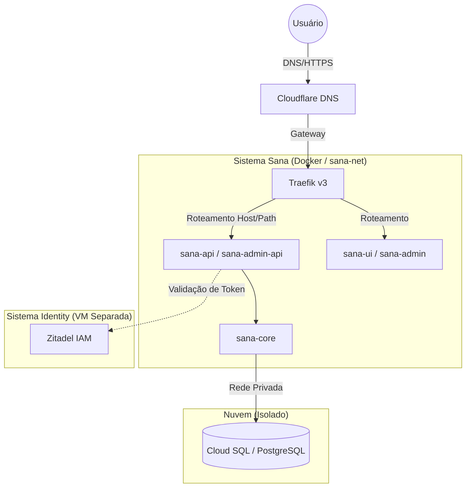

# 🟢 Aula 11.5: Prática CI/CD e Arquitetura Cloud - Estudo de Caso Sana

**Disciplina:** Cloud Computing (Cód. 14189)
**Curso:** Inteligência Artificial e Ciência de Dados, Uniube
**Semana:** 11 | Sexta-feira
**Professor:** Romualdo Mathias Filho
**Tipo:** 📘 Teórica / 🔬 Prática
**Tópicos:** CI/CD, GitOps V3, Docker, Traefik, IA Agentic Coding, Zero Downtime Deployment

---

## 🎯 Objetivo da Aula (Competências)

Ao final desta aula, os alunos serão capazes de:
- [ Compreender a arquitetura de uma aplicação moderna nativa da nuvem com separação de serviços. ]
- [ Entender a implementação do padrão "Zero Downtime Deployment" usando infraestrutura imutável e saúde de containers. ]
- [ Mapear e descrever um pipeline completo de CI/CD (GitOps V3), incluindo automações e Governança de Banco de Dados. ]
- [ Relacionar a infraestrutura em nuvem (IaC) com as novas features de Inteligência Artificial e Agentic Coding. ]

---

## 🔄 Revisão Rápida (5 min)

| **Conceito (Aula Anterior)** | **Conexão com hoje** |
| --- | --- |
| Bancos de Dados na Nuvem (RDS) | Como mantemos o PostgreSQL desacoplado no Cloud SQL e escalamos horizontalmente. |
| Redes e VPC | O isolamento da rede interna dos containers (sana-net) e a exposição segura via Traefik. |
| Agentic Coding e IA | Como o repositório serve de Context Ingestion para Agentes de IA autônomos. |

---

## 📌 1. Visão Geral: O Ecossistema Sana e a Nuvem

O ecossistema que utilizaremos como Estudo de Caso é dividido logicamente entre a aplicação (**Sana**) e a infraestrutura que a suporta (**Nuvem**).

- **O Sistema Sana:** Uma plataforma de microsserviços. O tráfego bate nos Gateways de API (`sana-api`, `sana-admin-api`) que se comunicam internamente com o processamento central (`sana-core`). A autenticação ocorre centralizada por um cluster separado usando o Zitadel IAM (`vm-sana-identity`).
- **O Sistema Nuvem (Infra):** Envolve a infraestrutura de rede e bancos gerenciados. O tráfego externo passa pelo DNS/WAF do **Cloudflare** e atinge nosso Proxy Reverso, o **Traefik v3**. Os dados persistentes ficam seguros no **Cloud SQL** (PostgreSQL gerido), totalmente fora do cluster Docker.

> 💡 **Exemplo prático:** Pense nisso como um prédio (Cloud SQL) com uma portaria muito inteligente (Traefik) e vários escritórios internos que só conversam entre si por ramais fechados (`sana-net`).

### Diagrama de Arquitetura (Traefik & Zero Trust)

> *Legenda: Fluxo de dados no Ecossistema Sana e Nuvem com separação de responsabilidades.*

---

## 📌 2. Organização da Infraestrutura e Portainer

A infraestrutura de nuvem prioriza o **isolamento de responsabilidades** e a **imutabilidade**.

**Topologia de Servidores:**
1. **`vm-sana-core` (10.0.1.2):** O coração da aplicação (Frontends, Backends e agentes de observabilidade).
2. **`vm-sana-identity` (10.0.2.2):** O servidor do IAM e documentação (MkDocs + OAuth2, Fórum NodeBB).
3. **Cloud SQL (10.0.2.200):** Onde os dados vitais estão salvos, desacoplados das VMs para garantir alta disponibilidade.

*(Temos também um ambiente de Homologação/Lab no Proxmox com banco conteinerizado usado como Test Gate).*

Para não quebrar a infraestrutura acidentalmente em deploys, o **Portainer** separa tudo logicamente em **Stacks**:
- `sana-infra`: Traefik v3 e Proxy do Docker (impede que os certificados se percam nos deploys diários).
- `sana-monitoring-core`: Agentes de métricas.
- `sana`: Aplicação principal (8 containers - atualizada a cada deploy).

---

## 📌 3. O Pipeline de Deploy Passo a Passo (GitOps V3)

Como o código sai da máquina do desenvolvedor e vai para o ar sem derrubar os clientes que já estão usando o site?

**Passo 1: Git (O Fluxo de Código)**
Trabalhamos com *Trunk Based Development*. A branch `main` é sagrada. O código entra via Pull Requests. O deploy para produção só é disparado quando fechamos uma "Release" com Tag semântica (ex: `v0.27.0`).

**Passo 2: GitHub Actions (CI/CD)**
O arquivo `.github/workflows/deploy.yml` orquestra a construção das imagens.
- Ele usa o `Docker Buildx` para compilar o Frontend e o Backend em paralelo.
- Ele salva as imagens construídas no GitHub Container Registry (GHCR) atreladas à Tag da Release e `:latest`.

**Passo 3: Orquestração Segura e Migrations**
Antes de substituir os containers e causar inatividade, a Action entra na máquina de produção via SSH e executa as migrações de banco de dados diretamente no container antigo que ainda está rodando. Assim, o banco está pronto para o código novo.

**Passo 4: Produção (Zero Downtime / Rolling Updates)**
Em vez de usar Webhooks demorados do Portainer (que causavam timeouts), o GitOps V3 realiza o deploy via SSH Direto:
1. Snapshots locais são gerados (`docker tag ... :rollback`).
2. Um `docker compose pull` assíncrono baixa as novas imagens do GHCR.
3. É feito um `--force-recreate` via Docker Engine.
4. O Traefik faz um *Healthcheck* (`http://localhost:80/up`): ele só começa a enviar os usuários para o container novo quando este avisa que carregou perfeitamente.

---

## 📌 4. Features de Inteligência Artificial e Governança do Banco

Nosso ecossistema também foi projetado pensando em resiliência e inovação tecnológica contínua, unindo a segurança do banco de dados e as novas interações com Inteligência Artificial:

### Cloud SQL e Governança Zero Touch
- **Desacoplamento e Alta Disponibilidade:** Mantemos nosso banco PostgreSQL isolado (Cloud SQL). Isso permite escalar as instâncias web horizontalmente sem gargalos no storage.
- **Migrations "Zero Touch":** O `sana-core` gerencia as estruturas de dados. Com a injeção do comando `php artisan migrate --force` dentro do processo de boot (`entrypoint.sh`), as tabelas são atualizadas automaticamente durante os deploys. **Nenhuma intervenção humana no banco é necessária**, reduzindo os erros operacionais.

### Alimentação e Integração de Agentes de IA (Agentic Coding)
A infraestrutura foi pensada para facilitar a automação através de IAs Autônomas (Agentic Coding). 
- **Context Ingestion:** O repositório SANA detém documentações estratégicas e scripts legíveis que atuam como base de contexto para Agentes de IA.
- **Infrastructure as Code (IaC):** Essa estrutura legível e estrita de IaC (com separação entre Stacks de CI e CD) ajuda IAs orquestradoras e assistentes de desenvolvimento a entenderem limites seguros.
- **Automação Segura:** Permite que a IA realize automações no banco de dados e na infraestrutura garantindo imutabilidade e resiliência (como nos fluxos de validação do `.env` e dos schemas do banco).

---

## 📋 Resumo Estrutural (Variáveis Chave)

| **Variável** | **Definição em Uma Frase** |
| --- | --- |
| `IMAGE_TAG` | Garante a imutabilidade; a mesma imagem vai rodar em Lab e Prod. |
| `SANA_DOMAIN` | Define dinamicamente o roteamento do Traefik (`lab.sana...` ou `sana...`). |
| `CF_DNS_API_TOKEN` | Permite gerar certificados SSL wildcard diretamente com o Cloudflare. |
| `APP_KEY` / `ZITADEL_SERVICE_TOKEN` | Segredos sensíveis de segurança isolados por ambiente. |

---

## ❓ Banco de Questões

> 🔒 Esta seção é visível apenas no Obsidian do professor. Não publicada.

### Questão 1: Prática (Múltipla Escolha — Nível: Intermediário)
**Enunciado:** A infraestrutura do Sana foi adaptada para facilitar o "Agentic Coding" (Programação via Agentes de IA). Qual característica da arquitetura permite que as IAs autônomas operem de forma segura no ambiente?

- [ ] A) O uso exclusivo de instâncias locais para o banco de dados.
- [ ] B) A utilização do Portainer como única ferramenta de deploy, eliminando scripts de IaC.
- [x] C) A separação clara entre Stacks e o uso de Infrastructure as Code (IaC) com documentação estratégica (Context Ingestion), definindo limites seguros de atuação para a IA. ✅
- [ ] D) A execução manual de migrations no banco Cloud SQL.

**Justificativa:** A base de conhecimento e a separação de responsabilidades (IaC, Stacks) orientam as IAs, servindo como Context Ingestion e garantindo que atuem sem ferir a resiliência do sistema.

---

### Questão 2: Teórica (Dissertativa — Nível: Avançado)
**Enunciado:** Explique o conceito de "Migrations Zero Touch" no contexto do ecossistema Sana e como ele se integra ao pipeline GitOps V3 para garantir "Zero Downtime".

**Resposta esperada:** Migrations Zero Touch refere-se à automação total das alterações no banco de dados sem intervenção humana. No Sana, isso ocorre através da injeção de comandos de migration (`migrate --force`) antes ou durante o boot do novo container. Isso se integra ao GitOps V3 porque, aliado ao Healthcheck do Traefik, assegura que o novo container só receba tráfego (Zero Downtime) após atestar que tanto o código quanto a estrutura do Cloud SQL estão prontos e compatíveis, minimizando riscos operacionais.

---

## 📚 Referências Bibliográficas e Citações

- Documentação Interna da Organização: `material_aula_sana.md`.
- Docker Documentation. *Best practices for writing Dockerfiles*.
- Traefik Labs. *Traefik v3 Routing Configuration*.

---
*Última atualização: 2026-04-24 | Status: publicado*
