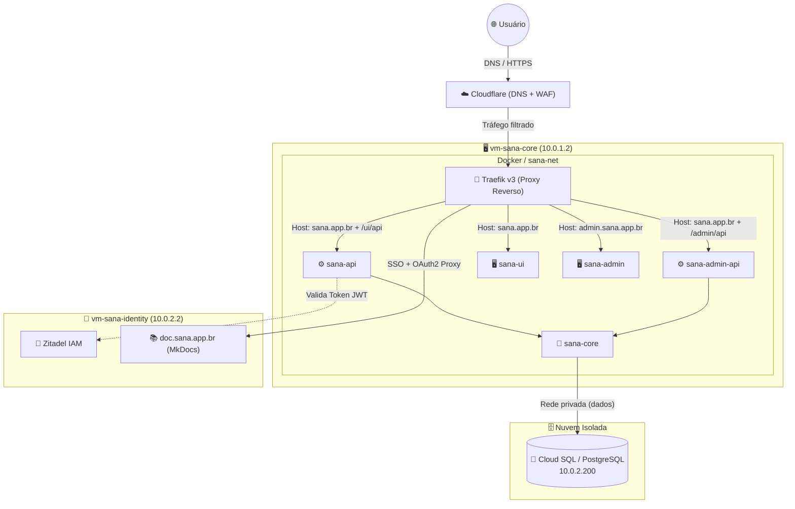
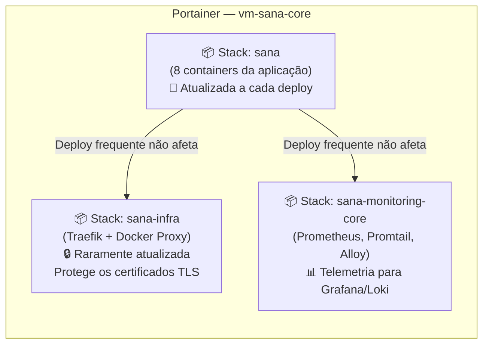
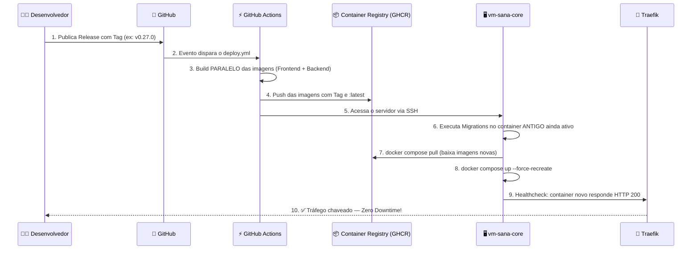
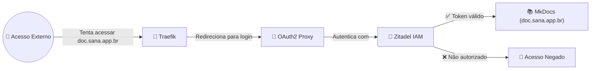

# 🟢 Aula 11.5: Prática CI/CD e Arquitetura Cloud — Estudo de Caso Sana

**Disciplina:** Cloud Computing (Cód. 14189)
**Curso:** Inteligência Artificial e Ciência de Dados — Uniube
**Semana:** 11 | Sexta-feira
**Professor:** Romualdo Mathias Filho
**Tipo:** 📘 Teórica + 🔬 Prática
**Tópicos:** GitOps, CI/CD, Docker, Traefik, Portainer, Zero Downtime, IA Agentic Coding

---

> 💬 *"Hoje vamos mergulhar profundamente na infraestrutura real do sistema Sana, entendendo como ele se integra à nuvem e como orquestramos a entrega contínua com zero downtime."*

---

## 🎯 Objetivo da Aula (Competências)

Ao final desta aula, os alunos serão capazes de:

- Compreender a arquitetura de uma aplicação moderna nativa da nuvem com separação de serviços.
- Entender o padrão **Zero Downtime Deployment** usando infraestrutura imutável e Healthchecks de containers.
- Mapear e descrever um pipeline completo de CI/CD (GitOps V3), incluindo automações e Governança de Banco de Dados.
- Relacionar a infraestrutura em nuvem (IaC) com as novas possibilidades da Inteligência Artificial e o **Agentic Coding**.

---

## 🔄 Revisão Rápida (5 min)

| **Conceito (Aulas Anteriores)** | **Conexão com hoje** |
| --- | --- |
| Bancos de Dados na Nuvem (RDS / Aula 10) | Como mantemos o PostgreSQL desacoplado no Cloud SQL e escalamos horizontalmente sem derrubar a aplicação. |
| Redes e VPC (Aula 12) | O isolamento da rede interna dos containers (`sana-net`) e a exposição segura via Traefik. |
| EC2 / Instâncias e Containers (Aula 6/8) | Como as VMs de Produção hospedam as Stacks Docker do sistema Sana. |

---

## 📌 1. Visão Geral: O Ecossistema Sana e a Nuvem

O ecossistema possui dois grandes blocos: a **aplicação (Sana)** e a **infraestrutura de suporte (Nuvem)**.

### O Sistema Sana (Aplicação)
É uma plataforma dividida em múltiplos serviços conteinerizados:
- **Frontends Angular:** `sana-ui` (portal do aluno) e `sana-admin` (painel administrativo).
- **Gateways de API:** `sana-api` e `sana-admin-api` — recebem e distribuem as requisições externas.
- **Backend Central:** `sana-core` — o motor de processamento principal.
- **Identity Server (VM separada):** `vm-sana-identity` — responsável pela autenticação centralizada via **Zitadel IAM**.

### O Sistema Nuvem (Infraestrutura)
É a base que sustenta tudo:
- **Cloudflare:** Gerenciamento de DNS e proteção WAF.
- **Traefik v3:** Proxy reverso inteligente que distribui o tráfego para os containers corretos.
- **Cloud SQL (PostgreSQL):** Banco de dados gerenciado na nuvem, **totalmente fora do cluster Docker** para garantir persistência e alta disponibilidade.

> 💡 **Analogia para a aula:** Pense no ecossistema como um prédio corporativo. O **Cloudflare** é a guarita da portaria externa. O **Traefik** é a recepcionista que direciona cada visitante para o andar correto. Os **containers** são os escritórios nos andares, comunicando-se apenas pelos ramais internos (`sana-net`). O **Cloud SQL** é o cofre-forte do subsolo — acessível aos escritórios por um corredor privado, mas nunca exposto à rua.

### Diagrama 1: Arquitetura do Ecossistema (Visão Lógica)


> *Legenda: Setas sólidas representam tráfego de dados. Setas pontilhadas representam validação de autenticação.*

---

## 📌 2. Organização da Infraestrutura e Portainer

A infraestrutura de nuvem prioriza **isolamento de responsabilidades** e **imutabilidade**.

### Topologia dos Servidores

| **Servidor** | **IP Interno** | **Função** |
| --- | --- | --- |
| `vm-sana-core` | 10.0.1.2 | Hospeda a aplicação Sana (Frontends e Backends) e os agentes de observabilidade. |
| `vm-sana-identity` | 10.0.2.2 | Gestão de Identidade (Zitadel IAM), documentação (MkDocs + OAuth2) e Fórum (NodeBB). |
| Cloud SQL | 10.0.2.200 | Banco de dados relacional gerenciado. Desacoplado das VMs para backups automatizados e alta disponibilidade. |
| Lab/Proxmox | (IP local) | Ambiente de homologação (`lab.sana.app.br`) com banco Postgres conteinerizado, usado como **Test Gate** final antes da produção. |

### Diagrama 2: Separação das Stacks no Portainer



> ⚠️ **Por que separar as Stacks?** Se o Traefik fosse recriado junto com a aplicação a cada deploy, todos os certificados TLS do Let's Encrypt seriam perdidos, causando erros de HTTPS para os usuários. A separação protege a infraestrutura da volatilidade da aplicação.

---

## 📌 3. O Pipeline de Deploy Passo a Passo (GitOps V3)

Como o código sai da máquina do desenvolvedor e vai para o ar **sem derrubar nenhum usuário**?

### Diagrama 3: Sequência da Esteira de Deploy (CI/CD)



---

### Passo 1: Git — O Fluxo de Código

Trabalhamos com **Trunk Based Development** (GitHub Flow). A branch `main` é protegida e ninguém faz push direto nela.

- O código entra via **Pull Requests** revisados.
- O deploy para Produção só é disparado quando uma **Release** é publicada com uma Tag semântica (ex: `v0.27.0`) ou manualmente via `workflow_dispatch`.

---

### Passo 2: GitHub Actions — CI/CD Pipeline

O arquivo `.github/workflows/deploy.yml` orquestra a construção das imagens usando **Docker Buildx** e **Matrix Strategy** (compilação paralela):

```yaml
# Trecho real do deploy.yml
build-backends:
  strategy:
    matrix:
      service:
        - name: sana-core
          dockerfile: docker/sana-core.Dockerfile
        - name: sana-api
          dockerfile: docker/sana-api.Dockerfile
        # ... outros serviços
  steps:
    - name: Build e push — ${{ matrix.service.name }}
      uses: docker/build-push-action@v6
      with:
        context: .
        file: ${{ matrix.service.dockerfile }}
        push: true
        tags: |
          ghcr.io/alexsandrosm/sana/${{ matrix.service.name }}:${{ needs.validate.outputs.image_tag }}
          ghcr.io/alexsandrosm/sana/${{ matrix.service.name }}:latest
```

> 💡 **O que é Matrix Strategy?** Em vez de construir as imagens uma por uma (sequencialmente), o GitHub Actions constrói **todas ao mesmo tempo** em paralelo. O que levaria 20 minutos leva 4!

---

### Passo 3: Migrations — Banco de Dados Zero Touch

Antes de substituir os containers, a Action acessa o servidor via SSH e executa as migrações **dentro do container antigo** que ainda está atendendo os usuários:

```bash
# Executado via SSH pela GitHub Action antes do recreate:
docker exec sana-core php artisan migrate --force
```

> ⚠️ **Por que rodar no container ANTIGO?** O banco de dados precisa ser compatível tanto com o código antigo (ainda rodando) quanto com o código novo. Rodando a migration antes, garantimos que nenhuma versão quebrará.

---

### Passo 4: Produção — Zero Downtime com Traefik

A estratégia final usa o Traefik como árbitro inteligente do tráfego:

```yaml
# Trecho real do compose.yaml
sana-api:
  image: ghcr.io/alexsandrosm/sana/sana-api:${IMAGE_TAG:-latest}
  container_name: sana-api
  environment:
    APP_URL: https://${SANA_DOMAIN:-sana.app.br}/ui/api
    DB_HOST: ${POSTGRES_HOST}
  networks:
    - sana-net          # ⚠️ Não expõe portas globalmente!
  healthcheck:
    test: ["CMD", "curl", "-f", "http://localhost:80/up"]
    start_period: 40s   # Aguarda 40s antes de marcar como "saudável"
  labels:
    - "traefik.enable=true"
    - "traefik.http.routers.sana-api.rule=Host(`${SANA_DOMAIN}`) && PathPrefix(`/ui/api`)"
    - "traefik.http.routers.sana-api.middlewares=sana-api-strip,security-headers@docker"
```

**O que acontece quando o `--force-recreate` é executado:**
1. O Docker derruba o container antigo e sobe o novo.
2. O novo container fica em estado **"iniciando"** por até 40s (start_period).
3. O Traefik monitora o Healthcheck e **só redireciona o tráfego** quando o endpoint `/up` retorna `HTTP 200 OK`.
4. Para o usuário: **zero interrupção**.

---

## 📌 4. IA na Infraestrutura: Agentic Coding e Governança

Nosso ecossistema foi projetado também para **integração com Inteligência Artificial**.

### Cloud SQL e Governança Zero Touch

O banco PostgreSQL é gerenciado fora do ciclo de vida dos containers (Cloud SQL). Isso traz dois benefícios diretos:
- **Escalabilidade Horizontal:** As VMs da aplicação podem escalar sem afetar o banco.
- **Migrations Automáticas:** Com o comando injetado no `entrypoint.sh` do container, o banco é atualizado automaticamente no boot, sem intervenção humana.

### Agentic Coding: IAs que Operam a Infraestrutura

**Agentic Coding** é a prática de usar agentes de IA para automatizar tarefas que antes exigiam um humano no teclado.

| **Componente** | **Como a IA usa** |
| --- | --- |
| Repositório SANA (IaC) | Lê os scripts como **Context Ingestion** — aprende os limites seguros de atuação. |
| Separação de Stacks (Portainer) | Define fronteiras claras: a IA sabe que pode mexer na Stack `sana`, mas **nunca** na `sana-infra`. |
| Documentação (`doc.sana.app.br`) | Fonte de verdade para regras de negócio, APIs e comportamentos esperados do sistema. |

> 💬 **Reflexão para a aula:** *"A arquitetura não foi pensada só para humanos. Ela foi pensada para ser legível por máquinas. Um agente de IA pode subir um novo serviço, rodar as migrations e validar o deploy seguindo exatamente o mesmo fluxo que um engenheiro humano seguiria."*

---

## 📌 5. Governança de Conhecimento: doc.sana.app.br

Para garantir que toda a equipe — e os agentes de IA — tenham **uma única fonte da verdade**, centralizamos o conhecimento técnico e de produto no portal `doc.sana.app.br`.

### O Que Está Documentado Lá

- 📋 Regras de negócio e requisitos de produto (Roadmaps, Specs, OpenSpec)
- 🛠️ Guias de Desenvolvimento (como contribuir, como fazer deploy)
- 🚨 Runbooks de SRE (o que fazer quando algo quebra)
- 🐛 Post-mortems e resoluções de incidentes de infraestrutura

### Segurança: SSO + Zero Trust

O portal é **estritamente privado**. A segurança é feita em camadas:



Nenhum dado é acessível sem autenticação corporativa centralizada. Isso é **Zero Trust** na prática.

---

## 📋 Resumo Estrutural — Variáveis Chave do Sistema

| **Variável** | **Ambiente** | **Definição** |
| --- | --- | --- |
| `IMAGE_TAG` | CI/CD | Garante a **imutabilidade**. A mesma imagem gerada em Lab vai para Prod. |
| `SANA_DOMAIN` | Todos | Define o roteamento do Traefik: `lab.sana.app.br` (homologação) ou `sana.app.br` (produção). |
| `CF_DNS_API_TOKEN` | Infra | Permite ao Traefik gerar certificados SSL **wildcard** via API do Cloudflare. |
| `APP_KEY` | App | Chave de criptografia da aplicação — única por ambiente. |
| `ZITADEL_SERVICE_TOKEN` | Identity | Token de acesso ao IAM — segredo isolado por ambiente. |
| `POSTGRES_HOST` | App / DB | Endereço do Cloud SQL — diferente em Lab e Prod. |
| `CACHE_STORE=file` | App | Otimização recente: substitui o Redis por cache em arquivo, economizando RAM. |

---

## ❓ Banco de Questões

> 🔒 *Seção exclusiva do professor — não publicada para os alunos.*

### Questão 1: Prática — Múltipla Escolha (Nível Intermediário)

**Enunciado:** No pipeline GitOps V3 do sistema Sana, qual é o papel do **Healthcheck** configurado no `compose.yaml` em relação ao Traefik durante um deploy com `--force-recreate`?

- [ ] A) Reiniciar automaticamente o container caso ele consuma mais de 80% de CPU.
- [ ] B) Autenticar o container junto ao Zitadel IAM antes de receber tráfego.
- [x] C) Garantir que o Traefik só direcione tráfego ao container novo quando este confirmar disponibilidade (HTTP 200), implementando o Zero Downtime. ✅
- [ ] D) Executar as migrations do banco de dados antes do container inicializar.

**Justificativa:** O Traefik monitora o status do Healthcheck de cada container. Enquanto o novo container não responder `HTTP 200` no endpoint `/up`, o Traefik mantém o tráfego no container antigo. Quando o Healthcheck passa, o tráfego é chaveado atomicamente — sem interrupção perceptível ao usuário.

---

### Questão 2: Teórica — Dissertativa (Nível Avançado)

**Enunciado:** Explique o conceito de "Migrations Zero Touch" no contexto do ecossistema Sana e como ele contribui para a estratégia de Zero Downtime do pipeline GitOps V3.

**Resposta esperada:** Migrations Zero Touch é a automação completa das alterações na estrutura do banco de dados, sem nenhuma intervenção humana. No Sana, isso é implementado de duas formas complementares: (1) o comando `php artisan migrate --force` é executado via SSH pela GitHub Action **dentro do container antigo ainda em execução**, tornando o banco compatível com o código novo antes do deploy; e (2) o `entrypoint.sh` pode reexecutar o migrate no boot do novo container como redundância. Integrado ao Healthcheck do Traefik, garante que o usuário nunca veja um container no ar com banco desatualizado — o tráfego só é chaveado quando código e banco estão plenamente compatíveis.

---

## 📄 Artigo de Aprofundamento

- [Traefik: How It Works](https://doc.traefik.io/traefik/) — Documentação oficial do Traefik v3 com exemplos de roteamento dinâmico via Labels Docker.
  > *Relevância: Explica exatamente como os Labels do `compose.yaml` instruem o Traefik a criar regras de roteamento sem reinicialização.*

---

## 📚 Referências Bibliográficas

- Documentação Interna: `material_aula_sana.md` — Base de Conhecimento GitOps V3.
- Docker Inc. *Docker Build Documentation — Buildx and Multi-Platform Builds*. docs.docker.com, 2024.
- Traefik Labs. *Traefik v3 — Docker Provider Configuration*. doc.traefik.io, 2024.
- GitHub. *GitHub Actions — Workflow Syntax for GitHub Actions*. docs.github.com, 2024.
- Zitadel. *ZITADEL Documentation — IAM and SSO Integration*. zitadel.com, 2024.

---

*Última atualização: 2026-04-24 | Status: publicado*
