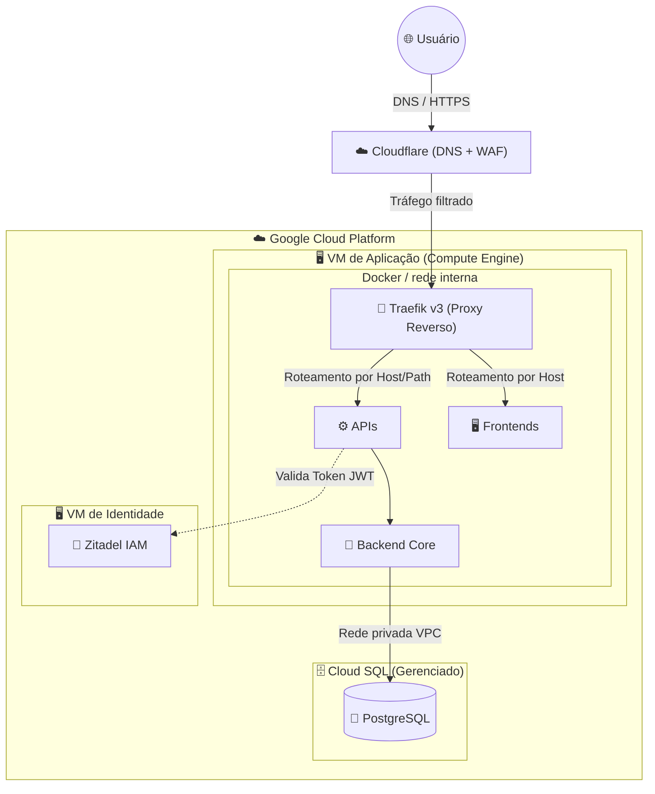
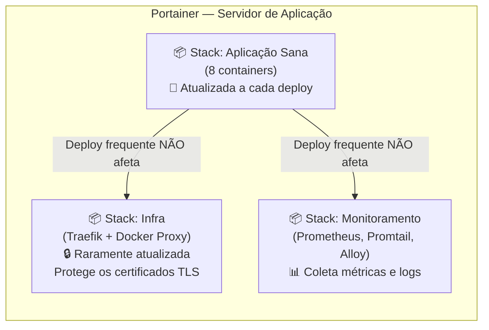
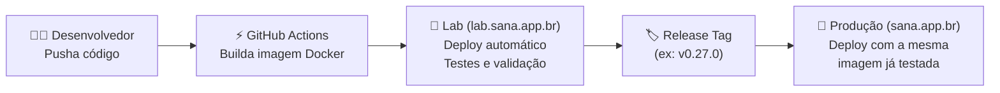
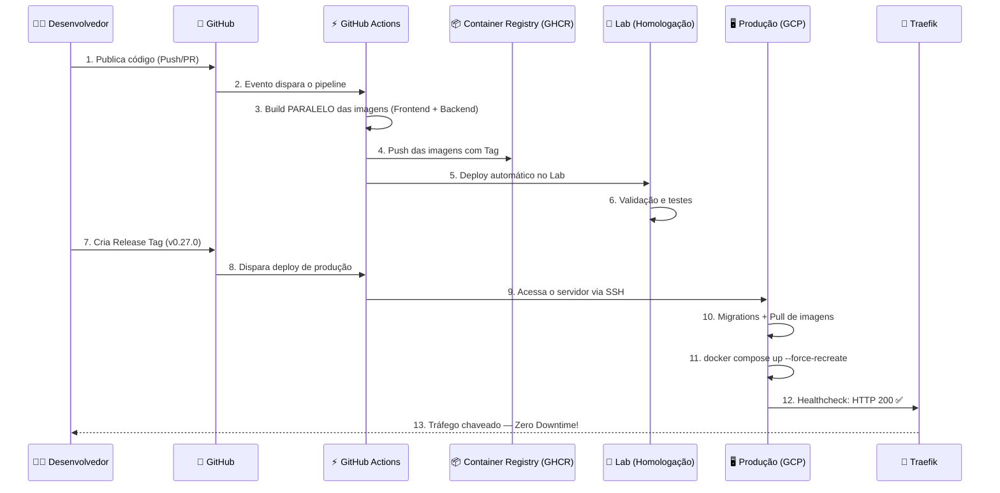
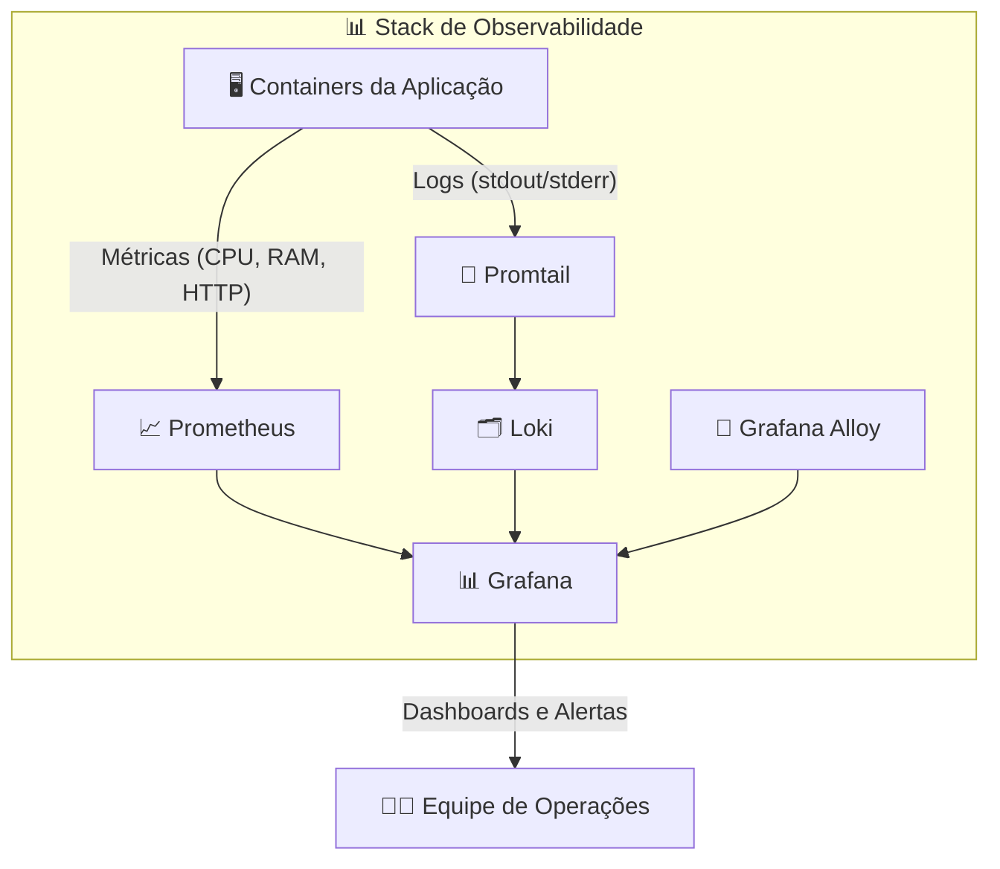

# 🟢 Aula 11.5: Prática CI/CD e Arquitetura Cloud — Estudo de Caso Sana

**Disciplina:** Cloud Computing (Cód. 14189)
**Curso:** Inteligência Artificial e Ciência de Dados — Uniube
**Semana:** 11 | Sexta-feira
**Professor:** Romualdo Mathias Filho
**Tipo:** 📘 Teórica + 🔬 Prática
**Tópicos:** GitOps, CI/CD, Docker, Traefik, Portainer, Observabilidade, GCP

---

> 💬 *"Hoje vamos mergulhar profundamente na infraestrutura real de um sistema em produção, entendendo como ele roda na nuvem (GCP), como monitoramos tudo com Observabilidade, e como fazemos deploy contínuo sem derrubar nenhum usuário."*

---

## 🎯 Objetivo da Aula (Competências)

Ao final desta aula, os alunos serão capazes de:

- Compreender a arquitetura de uma aplicação moderna nativa da nuvem com separação de serviços.
- Entender o padrão **Zero Downtime Deployment** usando infraestrutura imutável e Healthchecks de containers.
- Mapear e descrever um pipeline completo de CI/CD (GitOps V3), incluindo o fluxo **Lab → Produção**.
- Compreender o conceito de **Observabilidade** e como ferramentas como Grafana, Prometheus e Loki nos ajudam a monitorar a saúde da aplicação em tempo real.

---

## 🔄 Revisão Rápida (5 min)

| **Conceito (Aulas Anteriores)** | **Conexão com hoje** |
| --- | --- |
| Bancos de Dados na Nuvem (RDS / Aula 10) | Como o PostgreSQL é gerenciado fora dos containers, garantindo persistência e alta disponibilidade. |
| Redes e VPC (Aula 12) | O isolamento da rede interna dos containers e a exposição segura via Proxy Reverso. |
| EC2 / Instâncias e Containers (Aula 6/8) | Como VMs em provedores Cloud hospedam as Stacks Docker do sistema. |

---

## 📌 1. Visão Geral: O Ecossistema Sana na Nuvem (GCP)

O ecossistema Sana está hospedado no **Google Cloud Platform (GCP)** e possui dois grandes blocos: a **aplicação** e a **infraestrutura de suporte**.

### O Sistema Sana (Aplicação)

É uma plataforma dividida em múltiplos serviços conteinerizados:
- **Frontends Angular:** Interface principal do usuário e painel administrativo.
- **Gateways de API:** Recebem e distribuem as requisições externas.
- **Backend Central:** Motor de processamento principal.
- **Identity Server:** Responsável pela autenticação centralizada via **Zitadel IAM**.

### A Infraestrutura na Nuvem (GCP)

É a base que sustenta tudo:
- **Google Cloud Platform:** VMs (Compute Engine), rede privada (VPC), Cloud SQL.
- **Cloudflare:** Gerenciamento de DNS e proteção WAF na borda.
- **Traefik v3:** Proxy reverso inteligente que distribui o tráfego para os containers corretos.
- **Cloud SQL (PostgreSQL):** Banco de dados gerenciado, **totalmente fora do cluster Docker** para garantir persistência e alta disponibilidade.

> 💡 **Analogia para a aula:** Pense no ecossistema como um prédio corporativo. O **Cloudflare** é a guarita da portaria externa. O **Traefik** é a recepcionista que direciona cada visitante para o andar correto. Os **containers** são os escritórios nos andares, comunicando-se apenas pelos ramais internos (rede Docker). O **Cloud SQL** é o cofre-forte do subsolo — acessível aos escritórios por um corredor privado, mas nunca exposto à rua.

### 🌐 Links do Ecossistema em Produção

| **Serviço** | **URL** | **Descrição** |
| --- | --- | --- |
| Sana (Produção) | [sana.app.br](https://sana.app.br) | Aplicação principal em produção |
| Sana Lab (Homologação) | [lab.sana.app.br](https://lab.sana.app.br) | Ambiente de testes — validação antes de ir para produção |
| Portainer | [monitora.horizonte.tech/portainer](https://monitora.horizonte.tech/portainer/#!/auth) | Gerenciamento visual dos containers Docker |
| Grafana (Observabilidade) | [monitora.horizonte.tech/grafana](https://monitora.horizonte.tech/d/sana-overview/sana-e28094-01-overview-executivo?orgId=1&refresh=30s) | Dashboard de monitoramento em tempo real |

### Diagrama 1: Arquitetura do Ecossistema na GCP (Visão Lógica)


> *Legenda: Setas sólidas representam tráfego de dados. Setas pontilhadas representam validação de autenticação.*

---

## 📌 2. Organização com Portainer e Separação de Stacks

A infraestrutura prioriza **isolamento de responsabilidades** e **imutabilidade**. O **Portainer** é a ferramenta que nos dá uma interface visual para gerenciar tudo.

> 💡 **O que é o Portainer?** É uma interface web que permite gerenciar containers Docker sem precisar usar o terminal. Você pode ver quais containers estão rodando, reiniciar serviços, verificar logs e fazer deploy de novas stacks — tudo pelo navegador. Acesso: [monitora.horizonte.tech/portainer](https://monitora.horizonte.tech/portainer/#!/auth)

### Por que separamos em Stacks?

As stacks são grupos lógicos de containers. Separamos para que o deploy da aplicação **nunca afete a infraestrutura crítica**:

### Diagrama 2: Separação das Stacks no Portainer



> ⚠️ **Por que separar as Stacks?** Se o Traefik fosse recriado junto com a aplicação a cada deploy, todos os certificados TLS do Let's Encrypt seriam perdidos, causando erros de HTTPS para os usuários. A separação protege a infraestrutura da volatilidade da aplicação.

---

## 📌 3. O Conceito de Lab → Produção

Um dos pilares mais importantes do nosso pipeline é o **ambiente de Lab (Homologação)**.

### O que é o Lab?

O Lab é uma réplica do ambiente de produção, acessível em [lab.sana.app.br](https://lab.sana.app.br). Ele serve como **porta de entrada obrigatória** antes de qualquer mudança chegar aos usuários reais.

### Como funciona o fluxo Lab → Produção?



| **Etapa** | **O que acontece** |
| --- | --- |
| 1. Push no GitHub | O GitHub Actions constrói as imagens Docker automaticamente. |
| 2. Deploy no Lab | A imagem é enviada para o Lab. Lá, rodamos testes, validamos a interface, verificamos os logs. |
| 3. Aprovação | Após validação completa no Lab, criamos uma **Tag de Release** (ex: `v0.27.0`). |
| 4. Deploy em Produção | A **mesma imagem** já testada no Lab é aplicada em produção. Sem surpresas. |

> 💡 **Imutabilidade de Imagem:** A imagem que funciona no Lab é *exatamente* a mesma que vai para Produção. Não há recompilação — isso elimina o clássico "na minha máquina funciona".

---

## 📌 4. O Pipeline de Deploy (GitOps V3)

Como o código sai da máquina do desenvolvedor e vai para o ar **sem derrubar nenhum usuário**?

### Diagrama 3: Sequência da Esteira de Deploy (CI/CD)



---

### Passo 1: Git — O Fluxo de Código

Trabalhamos com **Trunk Based Development** (GitHub Flow). A branch `main` é protegida e ninguém faz push direto nela.

- O código entra via **Pull Requests** revisados.
- O deploy para Lab é automático no push.
- O deploy para Produção é disparado quando uma **Release** é publicada com uma Tag semântica (ex: `v0.27.0`).

---

### Passo 2: GitHub Actions — Build Paralelo

O pipeline usa **Matrix Strategy** para construir todas as imagens Docker ao mesmo tempo:

```yaml
# Trecho do deploy.yml (simplificado)
build-backends:
  strategy:
    matrix:
      service:
        - name: backend-core
          dockerfile: docker/core.Dockerfile
        - name: api-gateway
          dockerfile: docker/api.Dockerfile
  steps:
    - name: Build e push — ${{ matrix.service.name }}
      uses: docker/build-push-action@v6
      with:
        push: true
        tags: |
          ghcr.io/org/app/${{ matrix.service.name }}:${{ env.TAG }}
          ghcr.io/org/app/${{ matrix.service.name }}:latest
```

> 💡 **O que é Matrix Strategy?** Em vez de construir as imagens uma por uma, o GitHub Actions constrói **todas ao mesmo tempo** em paralelo. O que levaria 20 minutos leva 4!

---

### Passo 3: Migrations — Banco de Dados Zero Touch

Antes de substituir os containers, a Action executa as migrações no container que ainda está ativo:

```bash
# Executado via SSH antes do deploy:
docker exec app-core php artisan migrate --force
```

> ⚠️ **Por que rodar no container ANTIGO?** O banco precisa ser compatível tanto com o código antigo (ainda rodando) quanto com o novo. Rodando a migration antes, garantimos compatibilidade total.

---

### Passo 4: Zero Downtime com Traefik e Healthcheck

O Traefik monitora a saúde do container novo antes de redirecionar tráfego:

```yaml
# Trecho do compose.yaml (simplificado)
api-gateway:
  image: ghcr.io/org/app/api-gateway:${IMAGE_TAG:-latest}
  healthcheck:
    test: ["CMD", "curl", "-f", "http://localhost:80/up"]
    start_period: 40s
  labels:
    - "traefik.enable=true"
    - "traefik.http.routers.api.rule=Host(`app.example.com`) && PathPrefix(`/api`)"
```

**O que acontece no deploy:**
1. O Docker derruba o container antigo e sobe o novo.
2. O novo container fica em estado **"iniciando"** por até 40s (start_period).
3. O Traefik monitora o Healthcheck e **só redireciona o tráfego** quando o endpoint `/up` retorna `HTTP 200 OK`.
4. Para o usuário: **zero interrupção**.

---

## 📌 5. Observabilidade — Monitorando Tudo em Tempo Real

### O que é Observabilidade?

**Observabilidade** é a capacidade de entender o que está acontecendo dentro de um sistema a partir dos sinais que ele emite. Diferente do monitoramento tradicional (que só alerta quando algo quebra), a observabilidade nos permite **investigar problemas antes que eles afetem os usuários**.

### Os 3 Pilares da Observabilidade

| **Pilar** | **O que é** | **Ferramenta no Sana** |
| --- | --- | --- |
| **Métricas** | Números que medem o comportamento do sistema (CPU, memória, requisições/segundo, latência) | **Prometheus** coleta → **Grafana** exibe |
| **Logs** | Registros textuais de eventos (erros, acessos, debug) | **Promtail** coleta → **Loki** armazena → **Grafana** consulta |
| **Traces** | Rastreamento de uma requisição atravessando múltiplos serviços | **Grafana Alloy** (coleta e correlação) |

### Dashboard de Monitoramento (Grafana)

O dashboard executivo do Sana está acessível em tempo real:
👉 [monitora.horizonte.tech/grafana — Overview Executivo](https://monitora.horizonte.tech/d/sana-overview/sana-e28094-01-overview-executivo?orgId=1&refresh=30s)



> 💡 **Na prática:** Quando fazemos um deploy, abrimos o Grafana lado a lado. Se as métricas de erro subirem ou a latência aumentar, sabemos imediatamente que algo deu errado e podemos fazer rollback antes que os usuários percebam.

---

## 📌 6. O Futuro: IA Interna, Bancos Vetoriais e Custos de Nuvem

O ecossistema Sana está se preparando para integrar **Inteligência Artificial nativa** nas operações do sistema (buscas semânticas, recomendações e análise de prontuários/dados). 

Para que isso seja possível sem criar um banco de dados novo do zero, a arquitetura utilizará o próprio PostgreSQL (no Cloud SQL) com a extensão **`pgvector`**.

### O Impacto na Arquitetura e nos Custos

> ⚠️ **Atenção:** A adoção de bancos de dados vetoriais não é uma mudança simples de software; é uma **mudança drástica de infraestrutura**.

1. **Processamento Intensivo (CPU):** Buscas vetoriais (calcular a distância matemática entre embeddings de IA) consomem exponencialmente mais processamento do que buscas relacionais tradicionais (como `SELECT * WHERE id = 1`).
2. **Consumo de Memória (RAM):** Os índices vetoriais precisam ser carregados na memória RAM para garantir baixa latência nas respostas da IA.
3. **Escalada de Custos:** Para suportar essa carga sem deixar o sistema lento para os usuários comuns, o tamanho da instância do Cloud SQL precisará ser escalado verticalmente de forma agressiva. **É esperado que os custos com banco de dados na nuvem possam quadruplicar** em relação ao modelo relacional padrão.

**Conceito Prático:** Quando projetamos para IA, o custo da infraestrutura (FinOps) deve ser a primeira variável a ser calculada antes de escrever qualquer linha de código.

---

## 📋 Resumo Estrutural — Conceitos Chave

| **Conceito** | **Definição** |
| --- | --- |
| `IMAGE_TAG` | Garante a **imutabilidade**. A mesma imagem testada no Lab vai para Produção. |
| **Lab vs Produção** | Lab (`lab.sana.app.br`) é o ambiente de teste. Produção (`sana.app.br`) é o ambiente real. Mesma imagem, ambientes separados. |
| **Zero Downtime** | O Traefik só redireciona tráfego quando o Healthcheck do container novo passa. |
| **Observabilidade** | Prometheus + Loki + Grafana = visão completa de métricas, logs e alertas em tempo real. |
| **GitOps** | Toda a infraestrutura é definida como código no Git. O deploy é disparado por eventos Git (push, tag, release). |
| **Portainer** | Interface visual para gerenciar containers sem terminal. |

---

## ❓ Banco de Questões

> 🔒 *Seção exclusiva do professor — não publicada para os alunos.*

### Questão 1: Prática — Múltipla Escolha (Nível Intermediário)

**Enunciado:** No pipeline GitOps V3, qual é o papel do **Healthcheck** configurado no `compose.yaml` em relação ao Traefik durante um deploy com `--force-recreate`?

- [ ] A) Reiniciar automaticamente o container caso ele consuma mais de 80% de CPU.
- [ ] B) Autenticar o container junto ao IAM antes de receber tráfego.
- [x] C) Garantir que o Traefik só direcione tráfego ao container novo quando este confirmar disponibilidade (HTTP 200), implementando o Zero Downtime. ✅
- [ ] D) Executar as migrations do banco de dados antes do container inicializar.

**Justificativa:** O Traefik monitora o status do Healthcheck de cada container. Enquanto o novo container não responder `HTTP 200` no endpoint `/up`, o Traefik mantém o tráfego no container antigo. Quando o Healthcheck passa, o tráfego é chaveado — sem interrupção perceptível ao usuário.

---

### Questão 2: Teórica — Dissertativa (Nível Avançado)

**Enunciado:** Explique o conceito de fluxo "Lab → Produção" e por que ele é essencial para a confiabilidade do pipeline de deploy contínuo.

**Resposta esperada:** O fluxo Lab → Produção é a prática de validar toda mudança em um ambiente de homologação (Lab) antes de aplicá-la em produção. A imagem Docker construída pelo CI é a mesma nos dois ambientes (imutabilidade). No Lab, a equipe valida funcionalidades, verifica logs no Grafana e confirma que as migrations de banco rodaram sem erros. Somente após essa validação, uma Tag de Release é criada, disparando o deploy automático em produção com a mesma imagem já testada. Isso elimina o risco de "na minha máquina funciona" e garante deploys previsíveis.

---

### Questão 3: Prática — Múltipla Escolha (Nível Intermediário)

**Enunciado:** Qual dos três pilares da Observabilidade permite investigar o caminho de uma requisição HTTP que passa por múltiplos microsserviços?

- [ ] A) Métricas
- [ ] B) Logs
- [x] C) Traces ✅
- [ ] D) Healthcheck

**Justificativa:** Traces (rastreamento distribuído) permitem acompanhar o percurso completo de uma requisição através de múltiplos serviços, identificando gargalos e pontos de falha na cadeia.

---

## 📄 Artigo de Aprofundamento

- [Traefik: How It Works](https://doc.traefik.io/traefik/) — Documentação oficial do Traefik v3 com exemplos de roteamento dinâmico via Labels Docker.
- [Grafana — Getting Started](https://grafana.com/docs/grafana/latest/getting-started/) — Introdução ao Grafana para monitoramento e dashboards.

---

## 📚 Referências Bibliográficas

- Google Cloud. *Compute Engine Documentation*. cloud.google.com, 2025.
- Docker Inc. *Docker Build Documentation — Buildx and Multi-Platform Builds*. docs.docker.com, 2024.
- Traefik Labs. *Traefik v3 — Docker Provider Configuration*. doc.traefik.io, 2024.
- GitHub. *GitHub Actions — Workflow Syntax for GitHub Actions*. docs.github.com, 2024.
- Grafana Labs. *Grafana, Prometheus, Loki Documentation*. grafana.com, 2025.

---

*Última atualização: 2026-04-24 | Status: publicado*
