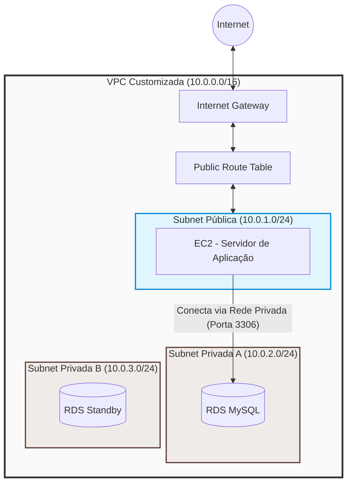

# 🟢 Aula 13: Terraform — Prática de VPC Completa e Isolamento de Banco de Dados (RDS)

**Disciplina:** Cloud Computing (Cód. 14189)  
**Curso:** Inteligência Artificial e Ciência de Dados — Uniube  
**Semana:** 13 | Quarta-feira, 20/05/2026  
**Professor:** Romualdo Mathias Filho  
**Tipo:** 🔬 Prática  
**Tópicos:** [[VPC]], Subnets Públicas e Privadas, Internet Gateway, Route Tables, DB Subnet Group, Security Groups, Amazon RDS MySQL, EC2, [[Terraform]], IaC, Multi-tier Architecture

---

> 💬 *"Na aula passada, aprendemos a provisionar uma EC2 e um banco RDS na VPC padrão da AWS. Hoje, daremos o maior passo em termos de engenharia e segurança de produção: vamos desenhar, planejar e programar nossa própria infraestrutura de rede isolada e segura usando código."*

---

## 🎯 Objetivo da Aula

Ao final desta aula, os alunos serão capazes de:

- Provisionar uma **[[VPC]]** (Virtual Private Cloud) customizada do zero usando [[Terraform]].
- Criar **Subnets** públicas e privadas distribuídas estrategicamente para separar a camada de aplicação da camada de dados.
- Configurar um **Internet Gateway** e **Route Tables** para permitir acesso externo seguro apenas à sub-rede pública.
- Associar o **Amazon RDS** a sub-redes privadas usando um **DB Subnet Group**.
- Garantir o **isolamento absoluto** do banco de dados na sub-rede privada, permitindo tráfego somente a partir da EC2 contida na sub-rede pública.
- Conectar na EC2 e testar o acesso ao RDS via rede privada.

---

## 🔄 Revisão Rápida (5 min)

| **Conceito (Aulas Anteriores)** | **Conexão com hoje** |
| --- | --- |
| Amazon RDS ([[Aula 11 - Pratica de Banco de Dados]]) | Na aula passada de RDS, usamos a rede padrão da AWS. Hoje, criaremos nossa própria infraestrutura de rede segura para abrigá-lo. |
| [[Terraform]] Básico ([[Aula 12 - Terraform na Pratica - IaC com Lightsail e EC2]]) | O ciclo básico `init`, `plan`, `apply` e `destroy` será usado hoje para aplicar a infraestrutura de rede inteira. |
| Redes e [[VPC]] ([[Aula 15 - Teórica Elasticidade Alta Disponibilidade]] / MOC) | Hoje colocaremos em prática os conceitos teóricos de tabelas de roteamento, gateways e subnets públicas/privadas. |

> 💡 **O Salto de Hoje:** Em ambientes de desenvolvimento simples, usamos a VPC padrão da AWS. Mas em ambientes reais de produção, colocar um banco de dados em uma rede com rota para a internet é considerado uma falha grave de segurança. Hoje vamos implementar uma arquitetura clássica de mercado: **Multi-Tier (Duas Camadas)**, com isolamento de rede absoluto.

---

## 📌 1. A Arquitetura de Rede Segura (Multi-Tier)

Em produção, organizamos nossos recursos em camadas de rede separadas lógico-espacialmente:

1. **Camada Pública (Web/App):** Contém recursos que precisam conversar diretamente com os usuários ou com a internet (ex: instâncias EC2, Load Balancers). Ela possui um caminho de ida e volta para a internet através de um **Internet Gateway**.
2. **Camada Privada (Banco de Dados/Dados):** Contém recursos que guardam dados confidenciais e que nunca devem ser expostos diretamente. Ela não possui rota para a internet externa. Qualquer tráfego direto de fora é bloqueado pela ausência de roteamento físico.



### ⚠️ O Gotcha do RDS na AWS
O Amazon RDS **exige** que você passe um `DB Subnet Group` contendo sub-redes privadas em pelo menos **duas Zonas de Disponibilidade (AZs) diferentes** (ex: `us-east-1a` e `us-east-1b`). A AWS faz essa exigência mesmo se você criar um banco Single-AZ, garantindo que se você decidir migrar para Multi-AZ (Alta Disponibilidade) no futuro, a AWS terá a infraestrutura de rede pronta para provisionar a réplica secundária de forma síncrona.

---

## 📌 2. Parte 1 — Criação da Infraestrutura via Console AWS (Interface Web)

Para compreender a fundo os blocos de montar da rede lógica da AWS, faremos primeiro a criação de toda a topologia de forma manual através da interface web do **Console AWS**. Isso permitirá visualizar fisicamente a relação entre VPC, sub-redes, roteamento e segurança antes de automatizarmos tudo.

### Passo 1: Criar a VPC Customizada
1. Acesse o console da AWS e pesquise por **VPC** na barra de pesquisa superior.
2. No menu lateral esquerdo, certifique-se de que está na região `us-east-1` (Norte da Virgínia).
3. Clique em **VPCs** no menu lateral e depois no botão **Create VPC**.
4. Em *VPC settings*, selecione a opção **VPC only** (isso nos obriga a criar subnets e gateways manualmente, entendendo a lógica!).
5. Preencha as configurações:
   * **Name tag:** `VPC-Manual-Aula13`
   * **IPv4 CIDR block:** `10.0.0.0/16` (uma faixa que permite até 65.536 endereços IP privados)
6. Clique em **Create VPC** no final da página.

### Passo 2: Criar as Sub-redes (Subnets)
Criaremos 3 subnets dentro da nossa nova VPC (1 pública para a aplicação e 2 privadas para o banco):
1. No menu lateral esquerdo, clique em **Subnets** e depois em **Create subnet**.
2. Selecione a VPC: `VPC-Manual-Aula13`.
3. Adicione a **Subnet Pública** (onde ficará a EC2):
   * **Subnet name:** `Subnet-Publica-Manual`
   * **Availability Zone:** `us-east-1a`
   * **IPv4 CIDR block:** `10.0.1.0/24` (permite até 256 IPs)
4. Clique em **Add new subnet** para criar a primeira **Subnet Privada** (para o RDS MySQL):
   * **Subnet name:** `Subnet-Privada-Manual-1A`
   * **Availability Zone:** `us-east-1a`
   * **IPv4 CIDR block:** `10.0.2.0/24`
5. Clique em **Add new subnet** novamente para criar a segunda **Subnet Privada** (para resiliência do RDS):
   * **Subnet name:** `Subnet-Privada-Manual-1B`
   * **Availability Zone:** `us-east-1b` (Zona diferente!)
   * **IPv4 CIDR block:** `10.0.3.0/24`
6. Clique em **Create subnet**.

### Passo 3: Internet Gateway (IGW) e Conectividade Externa
1. No menu lateral esquerdo, clique em **Internet gateways** e depois em **Create internet gateway**.
2. **Name tag:** `IGW-Manual-Aula13`
3. Clique em **Create internet gateway**.
4. Com o gateway selecionado na tela de confirmação, clique em **Actions** (canto superior direito) e selecione **Attach to VPC**.
5. Em *Available VPCs*, selecione `VPC-Manual-Aula13` e clique em **Attach internet gateway**.

### Passo 4: Tabelas de Roteamento (Route Tables) e Regras de Fluxo
Ao criar a VPC, a AWS cria uma tabela de roteamento padrão ("Main") automaticamente.
1. No menu lateral esquerdo, clique em **Route tables**. 
2. Identifique a tabela pertencente à `VPC-Manual-Aula13`. Selecione-a, clique no ícone de lápis na coluna *Name* e mude o nome para `Tabela-Privada-Manual`. (Como ela não tem rota para a internet, servirá perfeitamente para as nossas duas subnets privadas!).
3. Agora, clique no botão **Create route table** no canto superior direito para criar a tabela pública:
   * **Name:** `Tabela-Publica-Manual`
   * **VPC:** Selecione `VPC-Manual-Aula13`
   * Clique em **Create route table**.
4. Com a `Tabela-Publica-Manual` selecionada, vá na aba **Routes** na parte inferior e clique em **Edit routes**.
5. Clique em **Add route** e defina:
   * **Destination:** `0.0.0.0/0` (toda a internet externa)
   * **Target:** Selecione **Internet Gateway** e clique no seu `IGW-Manual-Aula13`.
   * Clique em **Save changes**.
6. Ainda com a `Tabela-Publica-Manual` selecionada, vá na aba **Subnet associations** na parte inferior e clique em **Edit subnet associations**.
7. Selecione a caixinha ao lado da `Subnet-Publica-Manual` e clique em **Save associations**. (Agora ela é oficialmente pública, pois tem roteamento para o Internet Gateway!).

### Passo 5: Criar o DB Subnet Group (Grupo de Sub-redes para RDS)
Como o RDS MySQL precisa de sub-redes em pelo menos duas AZs diferentes, a AWS exige que criemos um grupo lógico antes de lançar o banco de dados.
1. No console superior da AWS, pesquise por **RDS** e entre no serviço.
2. No menu lateral esquerdo, clique em **Subnet groups** e depois em **Create DB subnet group**.
3. Preencha as configurações:
   * **Name:** `rds-subnet-group-manual`
   * **Description:** `Grupo de subnets privadas para banco de dados`
   * **VPC:** Selecione `VPC-Manual-Aula13`.
4. Em *Add subnets*:
   * **Availability Zones:** Selecione `us-east-1a` e `us-east-1b`.
   * **Subnets:** Selecione os blocos correspondentes às subnets privadas que você criou (`10.0.2.0/24` e `10.0.3.0/24`).
5. Clique em **Create**.

### Passo 6: Lançar a EC2 (Servidor de Aplicação) na Rede Pública
1. Pesquise por **EC2** no console superior e acesse o serviço. Clique em **Launch instance**.
2. **Name tag:** `EC2-App-Manual`
3. **OS Image:** Selecione **Amazon Linux 2023** (Free tier eligible).
4. **Instance type:** `t2.micro` (ou `t3.micro`).
5. **Key pair:** Selecione uma chave existente ou escolha "Proceed without key pair" (usaremos o EC2 Instance Connect).
6. Em *Network settings*, clique em **Edit**:
   * **VPC:** Selecione `VPC-Manual-Aula13`.
   * **Subnet:** Selecione `Subnet-Publica-Manual`.
   * **Auto-assign public IP:** Mude para **Enable** (Crucial! Sem isso, a EC2 não ganha endereço público para acesso externo).
   * **Firewall (security groups):** Selecione **Create security group**.
     * **Security group name:** `ec2-sg-manual`
     * **Description:** `SG da EC2 com acesso SSH`
     * **Inbound Security Group Rules:** Altere a regra de SSH existente para que o Source Type seja **Anywhere-IPv4 (0.0.0.0/0)**.
7. Clique em **Launch instance**.

### Passo 7: Criar o RDS MySQL nas Subnets Privadas
1. Volte ao painel do **RDS** e clique em **Create database**.
2. Escolha a opção **Standard create** e selecione a engine **MySQL** (versão 8.0.x).
3. Em *Templates*, mude para **Free Tier** (garante o uso sem custos).
4. Configurações da Instância:
   * **DB instance identifier:** `banco-manual`
   * **Credentials Settings:** 
     * **Master username:** `admin`
     * **Master password:** `SenhaSuperSeguraVPC2026!` (Anote a senha!)
5. Em *Connectivity*:
   * **Virtual private cloud (VPC):** Selecione `VPC-Manual-Aula13`.
   * **DB Subnet Group:** Selecione `rds-subnet-group-manual`.
   * **Public access:** Selecione **No** (Garante o isolamento!).
   * **VPC security group:** Selecione **Create new**.
     * **New VPC security group name:** `rds-sg-manual`
6. Deixe as demais configurações como padrão e clique em **Create database** no final da página. (A criação levará cerca de 5-10 minutos).

### Passo 8: Ajuste Fino de Segurança (O Enlace dos Firewalls)
Para garantir que o banco de dados RDS aceite tráfego *somente* vindo da EC2, precisamos ajustar as regras do Security Group do RDS criado no Passo 7.
1. No menu do RDS, clique em **Databases** e depois em `banco-manual`.
2. Na aba **Connectivity & security**, identifique o link do Security Group sob *VPC security groups* (`rds-sg-manual`) e clique nele. Ele te levará para a página de Security Groups do EC2.
3. Com o `rds-sg-manual` selecionado, clique na aba **Inbound rules** na parte inferior e depois em **Edit inbound rules**.
4. Remova qualquer regra padrão existente.
5. Adicione uma nova regra:
   * **Type:** Selecione **MySQL/Aurora** (porta 3306).
   * **Source:** Escolha **Custom** e, na barra de pesquisa, busque pelo ID do Security Group da EC2 (`ec2-sg-manual`).
6. Clique em **Save rules**.

---

## 📌 3. Parte 2 — Automação Absoluta com Terraform (IaC)

### ⚠️ A Dor do Processo Manual
Reparou em quantos cliques, abas e telas diferentes (VPC, Subnets, Internet Gateways, Route Tables, RDS Subnet Groups, EC2, RDS, Security Groups) foram necessários para estruturar esse ambiente simples? 
Se você esquecer de habilitar o *Auto-assign public IP* no Passo 6, ou se errar a Zona de Disponibilidade no Passo 5, toda a infraestrutura falhará de forma difícil de diagnosticar. Agora, imagine ter que repetir tudo isso para múltiplos ambientes (Desenvolvimento, Staging, Produção) e para múltiplos engenheiros no seu time. 

É para resolver esse problema que o mercado adota a **Infraestrutura como Código (IaC) com o Terraform**. Vamos agora criar a *exatamente mesma arquitetura*, mas de forma automatizada por código, controlada no Git, e executada com um único comando!

### 3.1 Estrutura do Projeto

Crie uma pasta chamada `terraform-vpc-rds` e entre nela:

```bash
mkdir terraform-vpc-rds && cd terraform-vpc-rds
```

Para manter o código extremamente limpo, modular e aderente ao **Trabalho Final**, vamos separar nossa infraestrutura em 5 arquivos específicos:

```
terraform-vpc-rds/
├── provider.tf      ← Definição do provedor (AWS)
├── variables.tf     ← Variáveis do projeto (senhas, nomes, etc.)
├── network.tf       ← Recursos de Rede (VPC, Subnets, Gateways, Route Tables)
├── database.tf      ← Recursos de Banco de Dados (RDS, DB Subnet Group, SG do RDS)
├── compute.tf       ← Recursos de Computação (EC2, SG da EC2, User Data)
└── outputs.tf       ← Outputs com IPs e comandos de conexão
```

---

## 📌 4. Desenvolvendo os Arquivos Terraform

Copie e crie os arquivos conforme as definições abaixo.

### 3.1 `provider.tf` — Conexão com a AWS

```hcl
terraform {
  required_providers {
    aws = {
      source  = "hashicorp/aws"
      version = "~> 5.0"
    }
  }
}

provider "aws" {
  region = "us-east-1"
}
```

---

### 3.2 `variables.tf` — Variáveis de Configuração

```hcl
variable "db_name" {
  description = "Nome do banco de dados inicial"
  type        = string
  default     = "projetovpc"
}

variable "db_username" {
  description = "Usuario administrador do RDS"
  type        = string
  default     = "admin"
}

variable "db_password" {
  description = "Senha do banco de dados. sensitive garante protecao de logs."
  type        = string
  sensitive   = true
  default     = "SenhaSuperSeguraVPC2026!"
}
```

---

### 3.3 `network.tf` — Programando a Infraestrutura de Rede (Core)

Neste arquivo, vamos desenhar o esqueleto lógico da nossa rede na AWS.

```hcl
# 1. Criação da VPC
resource "aws_vpc" "main" {
  cidr_block           = "10.0.0.0/16"
  enable_dns_hostnames = true # Essencial para o RDS expor o endpoint DNS privado
  enable_dns_support   = true

  tags = {
    Name = "VPC-Projeto-Final"
  }
}

# 2. Subnet Pública (para o servidor de aplicação EC2)
resource "aws_subnet" "public_1" {
  vpc_id            = aws_vpc.main.id
  cidr_block        = "10.0.1.0/24"
  availability_zone = "us-east-1a"
  map_public_ip_on_launch = true # EC2s criadas aqui ganham IP público automaticamente

  tags = {
    Name = "Subnet-Publica-1"
  }
}

# 3. Subnets Privadas (para o RDS — necessário 2 AZs diferentes)
resource "aws_subnet" "private_1" {
  vpc_id            = aws_vpc.main.id
  cidr_block        = "10.0.2.0/24"
  availability_zone = "us-east-1a"

  tags = {
    Name = "Subnet-Privada-1A"
  }
}

resource "aws_subnet" "private_2" {
  vpc_id            = aws_vpc.main.id
  cidr_block        = "10.0.3.0/24"
  availability_zone = "us-east-1b"

  tags = {
    Name = "Subnet-Privada-1B"
  }
}

# 4. Internet Gateway (para dar internet à Subnet Pública)
resource "aws_internet_gateway" "igw" {
  vpc_id = aws_vpc.main.id

  tags = {
    Name = "VPC-Internet-Gateway"
  }
}

# 5. Tabela de Roteamento Pública (diz: "tráfego para fora vai pelo IGW")
resource "aws_route_table" "public" {
  vpc_id = aws_vpc.main.id

  route {
    cidr_block = "0.0.0.0/0"
    gateway_id = aws_internet_gateway.igw.id
  }

  tags = {
    Name = "Tabela-Roteamento-Publica"
  }
}

# 6. Associa a Tabela de Roteamento Pública à Subnet Pública
resource "aws_route_table_association" "public_1" {
  subnet_id      = aws_subnet.public_1.id
  route_table_id = aws_route_table.public.id
}

# 7. DB Subnet Group (Vincula as subnets privadas para o RDS usar)
resource "aws_db_subnet_group" "rds_subnet_group" {
  name       = "rds-db-subnet-group"
  subnet_ids = [aws_subnet.private_1.id, aws_subnet.private_2.id]

  tags = {
    Name = "Grupo-Subnets-RDS"
  }
}
```

---

### 3.4 `database.tf` — Banco de Dados Totalmente Isolado

Aqui criamos o Security Group e o banco RDS. O banco será colocado no `rds_subnet_group` (o que o joga para as subnets privadas) e seu tráfego será restrito de forma rigorosa.

```hcl
# 1. Security Group para o RDS
resource "aws_security_group" "rds_sg" {
  name        = "rds-private-sg"
  description = "Controle de acesso para o RDS em rede privada"
  vpc_id      = aws_vpc.main.id

  # REGRA DE ENTRADA: Permite conexão MySQL (3306) APENAS do Security Group da EC2
  ingress {
    description     = "MySQL permitido vindo do SG da EC2"
    from_port       = 3306
    to_port         = 3306
    protocol        = "tcp"
    security_groups = [aws_security_group.ec2_sg.id] # Vinculação lógica direta
  }

  # REGRA DE SAÍDA: Liberada (padrão do Terraform)
  egress {
    from_port   = 0
    to_port     = 0
    protocol    = "-1"
    cidr_blocks = ["0.0.0.0/0"]
  }

  tags = {
    Name = "SG-RDS-Privado"
  }
}

# 2. Instância do Banco RDS MySQL
resource "aws_db_instance" "banco" {
  identifier           = "banco-vpc-projeto"
  engine               = "mysql"
  engine_version       = "8.0"
  instance_class       = "db.t3.micro"
  allocated_storage    = 20
  
  db_name              = var.db_name
  username             = var.db_username
  password             = var.db_password
  
  # COLOCANDO O BANCO NA REDE PRIVADA:
  db_subnet_group_name = aws_db_subnet_group.rds_subnet_group.name
  vpc_security_group_ids = [aws_security_group.rds_sg.id]
  
  # SEGURANÇA MÁXIMA: Nenhuma rota externa para internet
  publicly_accessible  = false
  skip_final_snapshot  = true

  tags = {
    Name = "RDS-Privado-VPC"
  }
}
```

---

### 3.5 `compute.tf` — O Servidor de Aplicação na Subnet Pública

Criamos a EC2 na subnet pública, com IP público e um Security Group que aceita SSH. Ele possui um script de inicialização (`user_data`) para instalar automaticamente o cliente MySQL.

```hcl
# 1. Security Group da EC2 (Aplicação)
resource "aws_security_group" "ec2_sg" {
  name        = "ec2-app-sg"
  description = "Acesso de entrada HTTP e SSH para a EC2"
  vpc_id      = aws_vpc.main.id

  # SSH aberto para o console EC2 Instance Connect (ou internet)
  ingress {
    description = "SSH da Internet"
    from_port   = 22
    to_port     = 22
    protocol    = "tcp"
    cidr_blocks = ["0.0.0.0/0"]
  }

  # Porta HTTP para a futura aplicação web/API
  ingress {
    description = "HTTP da Internet"
    from_port   = 80
    to_port     = 80
    protocol    = "tcp"
    cidr_blocks = ["0.0.0.0/0"]
  }

  # Saída liberada para baixar atualizações e se comunicar com o RDS
  egress {
    from_port   = 0
    to_port     = 0
    protocol    = "-1"
    cidr_blocks = ["0.0.0.0/0"]
  }

  tags = {
    Name = "SG-EC2-Publica"
  }
}

# 2. Busca pela AMI mais recente do Amazon Linux 2023
data "aws_ami" "amazon_linux_2023" {
  most_recent = true
  owners      = ["amazon"]

  filter {
    name   = "name"
    values = ["al2023-ami-2023.*-x86_64"]
  }
}

# 3. Instância EC2
resource "aws_instance" "app_server" {
  ami                    = data.aws_ami.amazon_linux_2023.id
  instance_type          = "t2.micro"
  
  # COLOCANDO A INSTÂNCIA NA SUB-REDE PÚBLICA:
  subnet_id              = aws_subnet.public_1.id
  vpc_security_group_ids = [aws_security_group.ec2_sg.id]

  # User Data: Instala o cliente MariaDB/MySQL automaticamente ao inicializar
  user_data = <<-EOF
              #!/bin/bash
              dnf update -y
              dnf install mariadb105 -y
              EOF

  tags = {
    Name = "EC2-App-VPC"
  }
}
```

---

### 3.6 `outputs.tf` — Expondo as Informações Práticas

```hcl
output "ec2_public_ip" {
  value       = aws_instance.app_server.public_ip
  description = "IP Público do servidor de aplicação para acesso SSH"
}

output "rds_endpoint" {
  value       = aws_db_instance.banco.address
  description = "Endpoint privado do banco de dados (acessivel apenas dentro da VPC)"
}

output "comando_conexao_rds" {
  value       = "mysql -h ${aws_db_instance.banco.address} -u ${var.db_username} -p ${var.db_name}"
  description = "Comando a ser executado dentro do terminal do EC2"
}
```

---

## 📌 4. O Ciclo de Execução e Validação Prática

Siga as etapas abaixo para provisionar e testar sua infraestrutura:

### Passo 1: Inicialização do Terraform
Dentro do diretório do projeto, execute:
```bash
terraform init
```

### Passo 2: Planejamento
Gere a simulação da infraestrutura. O plano deve acusar a criação de **12 novos recursos**:
```bash
terraform plan
```
> 🔍 **Revisão Visual:** Dentre os 12 recursos, certifique-se de ver a VPC, as 3 subnets (1 pública, 2 privadas), o Internet Gateway, a Route Table, as regras de firewall e o RDS.

### Passo 3: Provisionamento na Nuvem
Execute a criação da infraestrutura na sua conta AWS Academy (Learner Lab):
```bash
terraform apply
```
*Digite `yes` e pressione Enter quando solicitado.*

> ⏱️ **Lembrete de Paciência:** A criação de uma VPC é instantânea, mas o RDS leva de **6 a 10 minutos** para ficar pronto, pois a AWS aloca fisicamente o hardware, instala a engine de banco e configura o backup. Aproveite o tempo para revisar a estrutura de arquivos criada!

---

## 📌 5. Testando o Isolamento e Conexão (Validação de Produção)

Com o provisionamento completo, o terminal exibirá os Outputs. Exemplo:

```ini
ec2_public_ip       = "54.196.12.80"
rds_endpoint        = "banco-vpc-projeto.c123456789.us-east-1.rds.amazonaws.com"
comando_conexao_rds = "mysql -h banco-vpc-projeto.c123456789.us-east-1.rds.amazonaws.com -u admin -p projetovpc"
```

### 1. Teste de Acesso Direto (Prova de Fogo)
Abra o terminal da sua própria máquina local (seu computador físico) e tente conectar diretamente no banco de dados usando o Endpoint copiado:
```bash
mysql -h <seu_rds_endpoint> -u admin -p
```
**Resultado Esperado:** O comando ficará travado (Timeout) e nunca se conectará. 
*Por quê?* O banco RDS está localizado em uma subnet privada sem Internet Gateway, e o Security Group impede conexões que não tenham origem no Security Group da EC2. Seu banco de dados está 100% protegido contra scanners de portas e ataques externos da internet!

### 2. Acesso através do Bastion/EC2 (Padrão de Mercado)
1. Vá ao console da AWS, acesse a página de instâncias do **EC2**.
2. Selecione a instância **EC2-App-VPC**.
3. Clique em **Connect** no topo da tela.
4. Escolha **EC2 Instance Connect** e clique em **Connect** novamente.
5. Um terminal Linux abrirá diretamente em seu navegador. Você está no servidor de aplicação!

### 3. Conexão Interna
Dentro do terminal web da EC2, cole o comando gerado no output `comando_conexao_rds`:
```bash
mysql -h <seu_rds_endpoint> -u admin -p
```
Digite a senha `SenhaSuperSeguraVPC2026!` (ela não aparecerá no terminal enquanto você digita). Pressione Enter.

> 🎉 **Sucesso!** O prompt mudará para `mysql>` ou `MariaDB [projetovpc]>`. Você está conectado de forma privada e segura no seu banco RDS por dentro da VPC!

### 4. Criação da Tabela de Logs da Aplicação
Execute as queries abaixo para validar o funcionamento total de leitura e escrita:

```sql
-- Criar uma tabela de registro de logs do sistema
CREATE TABLE logs_acesso (
    id INT AUTO_INCREMENT PRIMARY KEY,
    servidor VARCHAR(50) NOT NULL,
    descricao VARCHAR(100) NOT NULL,
    criado_em TIMESTAMP DEFAULT CURRENT_TIMESTAMP
);

-- Inserir registros
INSERT INTO logs_acesso (servidor, descricao) VALUES ('EC2-App-VPC', 'Conexão inicial estabelecida com sucesso');
INSERT INTO logs_acesso (servidor, descricao) VALUES ('EC2-App-VPC', 'Teste de inserção via rede privada executado');

-- Consultar
SELECT * FROM logs_acesso;
```

---

## 📌 6. Limpeza Obrigatória (Não Estoure sua Cota!)
Evite consumo desnecessário de créditos no AWS Academy. Ao finalizar a prática, execute o comando de destruição completa:
```bash
terraform destroy
```
*Digite `yes` e aguarde a finalização.*

---

## 📋 Resumo Estrutural

| **Recurso / Conceito** | **Função Prática** |
| --- | --- |
| `aws_vpc` | Cria a rede privada isolada no datacenter da AWS. |
| `aws_subnet` | Subdivide a rede em blocos lógicos menores com escopos de tráfego diferentes (pública/privada). |
| `aws_internet_gateway` | Porta de entrada/saída que vincula fisicamente a VPC à internet externa. |
| `aws_route_table` | Controla as regras de roteamento (ex: diz que a subnet pública se conecta ao Internet Gateway). |
| `aws_db_subnet_group` | Associa o RDS a sub-redes privadas de diferentes zonas de disponibilidade para viabilizar resiliência. |
| `security_groups` encadeados | Regra de firewall do RDS que não usa endereços de IP fixos, mas sim o ID do Security Group da EC2. |

---

%%
## ❓ Banco de Questões

> 🔒 *Esta seção é visível apenas no Obsidian do professor. Não publicada no site dos alunos.*

### Questão 1: Prática (Múltipla Escolha — Nível: Intermediário)
**Enunciado:** No Terraform desta aula, para que o Amazon RDS pudesse ser provisionado de forma segura e aderente às regras da AWS, foi necessária a criação de um recurso do tipo `aws_db_subnet_group`. Qual é o papel fundamental desse recurso e qual é a principal restrição imposta por ele na AWS?

- [ ] A) Ele criptografa o tráfego do banco de dados e exige que todas as subnets sejam públicas.
- [ ] B) Ele atua como um firewall de rede e exige que o banco seja criado em uma única subnet de teste.
- [x] C) Ele mapeia um conjunto de subnets para que o RDS saiba onde alocar seus IPs privados, exigindo subnets em pelo menos duas Zonas de Disponibilidade (AZs) diferentes. ✅
- [ ] D) Ele monitora a performance da CPU e permite que o banco escale verticalmente para subnets públicas.

**Justificativa:** O `aws_db_subnet_group` é usado pelo RDS para alocar as interfaces de rede elásticas (ENIs) com IPs privados em subnets privadas da sua VPC. A AWS impõe estritamente que esse grupo tenha sub-redes em pelo menos duas Zonas de Disponibilidade (AZs) diferentes para viabilizar de forma transparente o suporte a Multi-AZ (Alta Disponibilidade com failover automatizado) caso a arquitetura evolua.

---

### Questão 2: Prática (Múltipla Escolha — Nível: Avançado)
**Enunciado:** Observe a regra de entrada (ingress) do Security Group do RDS configurada no arquivo `database.tf`:
```hcl
ingress {
  description     = "MySQL permitido vindo do SG da EC2"
  from_port       = 3306
  to_port         = 3306
  protocol        = "tcp"
  security_groups = [aws_security_group.ec2_sg.id]
}
```
Se a EC2 for destruída e recriada pelo Terraform (ganhando um novo IP privado), qual será o impacto dessa mudança na conexão com o banco de dados RDS, considerando a regra acima?

- [ ] A) A conexão falhará, pois o Security Group do RDS depende do endereço de IP estático da EC2.
- [ ] B) O RDS precisará ser recriado imediatamente para aprender o novo endereço de IP privado da EC2.
- [x] C) A conexão continuará funcionando normalmente sem qualquer alteração manual, pois a permissão é baseada no ID do grupo de segurança (associação lógica) e não em endereços IP brutos. ✅
- [ ] D) O Terraform retornará um erro de sintaxe cíclica e corromperá o arquivo `.tfstate`.

**Justificativa:** A principal vantagem de encadear Security Groups (`security_groups = [...]`) em vez de definir faixas de IPs estáticos ou CIDRs é a natureza dinâmica do cloud computing. Como o firewall valida a associação da instância a um grupo de segurança específico (pelo ID do SG), a EC2 pode mudar de IP privado, ser recriada ou até escalar horizontalmente (Auto Scaling) que todas as instâncias do grupo de segurança continuarão acessando o banco de dados transparentemente.

---

### Questão 3: Teórica (Dissertativa — Nível: Intermediário)
**Enunciado:** O desenvolvimento do **Trabalho Final (Projeto Prático)** da disciplina Cloud Computing exige que a infraestrutura seja provisionada via IaC (Terraform) em uma arquitetura Multi-Tier contendo rede pública e privada. Explique, sob a ótica de segurança cibernética e do princípio do menor privilégio, qual é o ganho prático em alocar a instância EC2 em uma subnet pública e a instância RDS em subnets privadas, limitando o ingresso do firewall.

**Resposta esperada:** Ao implementar a arquitetura Multi-Tier, o aluno isola a camada de dados sensíveis (RDS) em sub-redes privadas que não possuem rota de entrada física para a internet, impedindo tentativas de conexão direta, varredura de portas (scanners) e ataques de força bruta vindos do exterior. Além disso, o princípio do menor privilégio é aplicado nas regras do Security Group do RDS, que aceita conexões na porta 3306 restritamente vindas do ID do Security Group da EC2 (camada de aplicação). Isso garante que, mesmo se um invasor descobrir as credenciais de administrador do banco, ele não conseguirá se comunicar com a instância a menos que invada previamente o servidor de aplicação público (EC2), criando barreiras de defesa em profundidade (Defense-in-Depth).
%%

---

## 📄 Artigo de Aprofundamento

- [AWS Virtual Private Cloud (VPC) — Official Documentation](https://docs.aws.amazon.com/vpc/)  
  > *Documentação detalhada explicando os alicerces de rede lógica na AWS. Recomendado para compreender roteamento, gateways e isolamento lógico.*

- [HashiCorp Terraform — AWS Provider: DB Subnet Group](https://registry.terraform.io/providers/hashicorp/aws/latest/docs/resources/db_subnet_group)  
  > *Referência técnica do recurso `aws_db_subnet_group` no Terraform. Essencial para verificar parâmetros avançados e sintaxe.*

---

## 📚 Referências Bibliográficas e Citações

- ANTUNES, Jonathan Lamim. *Amazon AWS: descomplicando a computação em nuvem*. Casa do Código, 2016. **Páginas: [87 - 104]**
- BRIKMAN, Yevgeniy. *Terraform: Up & Running*. O'Reilly Media, 3ª ed., 2022. **Páginas: [112 - 134]**
- MORRIS, Kief. *Infrastructure as Code: Managing Servers in the Cloud*. O'Reilly Media, 2020. **Páginas: [45 - 60]**

---
*Última atualização: 2026-05-19 | Status: publicado*
