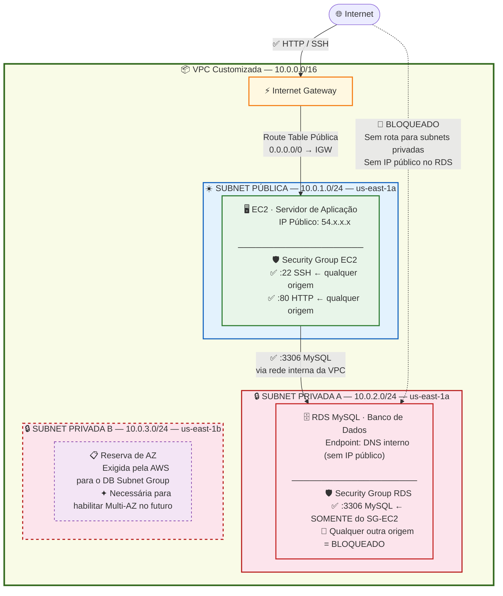

# 🟢 Aula 13p: VPC Completa e Isolamento de Banco de Dados com Terraform

**Disciplina:** Cloud Computing (Cód. 14189)
**Curso:** Inteligência Artificial e Ciência de Dados — Uniube
**Semana:** 13 | Quarta-feira, 20/05/2026
**Professor:** Romualdo Mathias Filho
**Tipo:** 🔬 Prática
**Tópicos:** [[VPC]], Subnets Públicas e Privadas, Internet Gateway, Route Tables, DB Subnet Group, Security Groups, Amazon RDS, EC2, [[Terraform]], IaC, Multi-tier Architecture

---

> 💬 *"Na aula passada, criamos EC2 e RDS usando a rede padrão da AWS. Hoje subimos de nível: vamos construir nossa própria infraestrutura de rede do zero — primeiro clicando para entender, depois codificando para automatizar. É assim que se trabalha em produção."*

---

## 🎯 Objetivo da Aula

Ao final desta aula, os alunos serão capazes de:

- Provisionar uma **[[VPC]]** customizada do zero pela interface web do Console AWS.
- Criar **Subnets** públicas e privadas em Zonas de Disponibilidade diferentes.
- Configurar **Internet Gateway** e **Route Tables** para expor apenas a camada pública.
- Criar um **DB Subnet Group** e associar o Amazon RDS a subnets privadas.
- Encadear **Security Groups** para que o RDS aceite tráfego somente da EC2.
- Automatizar toda a mesma infraestrutura com **[[Terraform]]** (IaC), eliminando trabalho manual.
- Testar e validar o **isolamento de rede** na prática.

---

## 🔄 Revisão Rápida (5 min)

| **Conceito (Aulas Anteriores)** | **Conexão com hoje** |
| --- | --- |
| Amazon RDS ([[Aula 11 - Pratica de Banco de Dados]]) | Usamos a VPC padrão. Hoje criamos uma VPC própria para isolar o banco corretamente. |
| [[Terraform]] Básico ([[Aula 12 - Terraform na Pratica - IaC com Lightsail e EC2]]) | O ciclo `init` → `plan` → `apply` → `destroy` será usado hoje para provisionar redes inteiras. |
| Segurança na Nuvem ([[Aula 13 - Seguranca na Nuvem]]) | Security Groups e princípio do menor privilégio aplicados na prática hoje. |

> 💡 **O salto de hoje:** Colocar um banco de dados em uma rede com rota para a internet é uma falha grave de segurança em produção. Hoje implementamos a arquitetura **Multi-Tier** — padrão de mercado — com isolamento total. E no final, automatizamos tudo com uma única linha de comando.

---

## 📌 1. A Arquitetura Multi-Tier (Duas Camadas)

Em produção, organizamos os recursos em camadas de rede separadas:

1. **Camada Pública (Web/App):** Servidores EC2 e Load Balancers que precisam se comunicar com a internet. Têm rota de saída via Internet Gateway.
2. **Camada Privada (Banco de Dados):** RDS e recursos sensíveis que nunca devem ser expostos. Sem rota para a internet — isolados por design.



> 📖 **Como ler o diagrama:**
> - **Linha sólida →** = tráfego permitido pelas regras de firewall (Security Group)
> - **Linha tracejada -.-→** = tentativa de conexão **bloqueada** — não existe rota de rede e o SG rejeita
> - **🛡️ Security Group** = o firewall virtual de cada recurso — define quem pode falar com quem

### ⚠️ Por que duas subnets privadas?
O Amazon RDS **exige** um `DB Subnet Group` com subnets em pelo menos **duas Zonas de Disponibilidade (AZs) diferentes**. A AWS impõe isso mesmo para bancos Single-AZ, para garantir que uma migração futura para Multi-AZ (alta disponibilidade) possa ser feita sem reconfigurar a rede.


---

## 📌 2. Parte 1 — Construindo a Infraestrutura pelo Console AWS

> 🖱️ **Por que começar pelo Console?** Antes de codificar, precisamos entender visualmente o que cada componente representa na AWS. Quem entende o que está criando, cria código melhor.

Abra o Console AWS em `console.aws.amazon.com` e garanta que está na região **us-east-1 (Norte da Virgínia)**.

---

### Passo 1: Criar a VPC Customizada

1. Pesquise **VPC** na barra superior e entre no serviço.
2. No menu lateral, clique em **VPCs** → **Create VPC**.
3. Em *VPC settings*, selecione **VPC only** (vamos criar os demais componentes manualmente para entender cada etapa).
4. Preencha:
   - **Name tag:** `VPC-Manual-Aula13`
   - **IPv4 CIDR block:** `10.0.0.0/16` (65.536 endereços IP disponíveis)
5. Clique em **Create VPC**.

---

### Passo 2: Criar as Sub-redes (3 Subnets)

Criaremos 1 subnet pública (EC2) e 2 privadas (RDS) em AZs diferentes:

1. No menu lateral, clique em **Subnets** → **Create subnet**.
2. Selecione a VPC: `VPC-Manual-Aula13`.
3. **Subnet Pública** (camada da aplicação):
   - **Subnet name:** `Subnet-Publica`
   - **Availability Zone:** `us-east-1a`
   - **IPv4 CIDR block:** `10.0.1.0/24`
4. Clique em **Add new subnet** — **Subnet Privada A** (banco):
   - **Subnet name:** `Subnet-Privada-1A`
   - **Availability Zone:** `us-east-1a`
   - **IPv4 CIDR block:** `10.0.2.0/24`
5. Clique em **Add new subnet** novamente — **Subnet Privada B** (suporte ao RDS):
   - **Subnet name:** `Subnet-Privada-1B`
   - **Availability Zone:** `us-east-1b` ← AZ diferente!
   - **IPv4 CIDR block:** `10.0.3.0/24`
6. Clique em **Create subnet**.

---

### Passo 3: Internet Gateway e Rota para a Internet

1. No menu lateral, clique em **Internet gateways** → **Create internet gateway**.
   - **Name tag:** `IGW-Aula13`
   - Clique em **Create internet gateway**.
2. Na tela de confirmação, clique em **Actions** → **Attach to VPC**.
   - Selecione `VPC-Manual-Aula13` e clique em **Attach internet gateway**.

---

### Passo 4: Tabelas de Roteamento

Ao criar a VPC, a AWS gera automaticamente uma **Main Route Table** (sem rota para internet). Ela servirá para as subnets privadas.

1. No menu lateral, clique em **Route tables**.
2. Localize a tabela da `VPC-Manual-Aula13`, renomeie para `RT-Privada-Aula13`.
3. Clique em **Create route table**:
   - **Name:** `RT-Publica-Aula13`
   - **VPC:** `VPC-Manual-Aula13`
   - Clique em **Create route table**.
4. Com `RT-Publica-Aula13` selecionada, aba **Routes** → **Edit routes** → **Add route**:
   - **Destination:** `0.0.0.0/0`
   - **Target:** Internet Gateway → `IGW-Aula13`
   - Clique em **Save changes**.
5. Aba **Subnet associations** → **Edit subnet associations** → marque `Subnet-Publica` → **Save associations**.

> ✅ Agora a `Subnet-Publica` tem rota para a internet. As subnets privadas **não têm** — isso é o isolamento por design.

---

### Passo 5: DB Subnet Group (Obrigatório para o RDS)

1. Pesquise **RDS** na barra superior e entre no serviço.
2. No menu lateral, clique em **Subnet groups** → **Create DB subnet group**.
3. Preencha:
   - **Name:** `rds-subnet-group-aula13`
   - **Description:** `Subnets privadas para o banco de dados`
   - **VPC:** `VPC-Manual-Aula13`
4. Em *Add subnets*:
   - **Availability Zones:** `us-east-1a` e `us-east-1b`
   - **Subnets:** selecione `10.0.2.0/24` e `10.0.3.0/24`
5. Clique em **Create**.

---

### Passo 6: Lançar a EC2 na Subnet Pública

1. Pesquise **EC2** e clique em **Launch instance**.
   - **Name:** `EC2-App-Aula13`
   - **OS:** Amazon Linux 2023 (Free tier)
   - **Instance type:** `t2.micro`
   - **Key pair:** Selecione uma existente ou "Proceed without key pair"
2. Em *Network settings* → **Edit**:
   - **VPC:** `VPC-Manual-Aula13`
   - **Subnet:** `Subnet-Publica`
   - **Auto-assign public IP:** **Enable** ← essencial!
   - **Firewall:** Create security group
     - **Name:** `ec2-sg-aula13`
     - Inbound: SSH → Source type **Anywhere-IPv4**
3. Clique em **Launch instance**.

---

### Passo 7: Criar o RDS MySQL nas Subnets Privadas

1. No painel do **RDS**, clique em **Create database**.
   - **Standard create** → Engine: **MySQL** (8.0.x)
   - **Templates:** Free tier
2. Configurações:
   - **DB instance identifier:** `banco-aula13`
   - **Master username:** `admin`
   - **Master password:** `SenhaSuperSeguraVPC2026!`
3. Em *Connectivity*:
   - **VPC:** `VPC-Manual-Aula13`
   - **DB Subnet Group:** `rds-subnet-group-aula13`
   - **Public access:** **No** ← isolamento garantido
   - **VPC security group:** Create new → **Name:** `rds-sg-aula13`
4. Clique em **Create database**. *(Aguarde 5–10 minutos)*

---

### Passo 8: Encadear os Security Groups (O Enlace dos Firewalls)

Este passo é o coração da segurança: o RDS só aceita tráfego vindo da EC2.

1. No painel do RDS, clique em `banco-aula13` → aba **Connectivity & security**.
2. Clique no link do Security Group `rds-sg-aula13`. Isso abre a página de SGs do EC2.
3. Com `rds-sg-aula13` selecionado → aba **Inbound rules** → **Edit inbound rules**.
4. Remova qualquer regra padrão existente.
5. Adicione uma nova regra:
   - **Type:** MySQL/Aurora (porta 3306)
   - **Source:** Custom → pesquise e selecione **`ec2-sg-aula13`** (o ID do SG da EC2)
6. Clique em **Save rules**.

> 💡 **Por que usar o SG como source e não um IP fixo?** Porque se a EC2 for recriada (novo IP), a regra continua funcionando — a permissão é lógica, baseada na *associação ao grupo de segurança*, não no endereço de rede.

---

## 📌 3. Parte 2 — Automatizando com Terraform (IaC)

### Por que Terraform depois do Console?

Você viu: criar essa arquitetura manualmente exigiu **8 passos, 4 serviços diferentes** (VPC, EC2, RDS, Security Groups) e dezenas de cliques. Esqueceu de habilitar o *Auto-assign public IP*? A EC2 fica sem IP. Errou a AZ no DB Subnet Group? O RDS falha. Em produção, esse processo é repetido para Desenvolvimento, Staging e Produção — com múltiplos engenheiros.

**É para isso que existe Infraestrutura como Código.** Vamos agora codificar a *exatamente mesma arquitetura*, versionada no Git e executável com um único comando.

---

### 3.1 Estrutura do Projeto

Crie a pasta e entre nela:

```bash
mkdir terraform-vpc-rds && cd terraform-vpc-rds
```

Estrutura de arquivos — modular, como exigido no Trabalho Final:

```
terraform-vpc-rds/
├── provider.tf      ← Configuração do provedor AWS e região
├── variables.tf     ← Variáveis (senha, nome do banco, etc.)
├── network.tf       ← VPC, Subnets, IGW, Route Tables, DB Subnet Group
├── database.tf      ← Security Group do RDS + Instância RDS
├── compute.tf       ← Security Group da EC2 + Instância EC2
└── outputs.tf       ← IPs e comandos de conexão gerados automaticamente
```

---

### 3.2 `provider.tf` — Provedor AWS

```hcl
terraform {
  required_providers {
    aws = {
      source  = "hashicorp/aws"
      version = "~> 5.0"
    }
  }
}

provider "aws" {
  region = "us-east-1"
}
```

---

### 3.3 `variables.tf` — Variáveis Configuráveis

```hcl
variable "db_name" {
  description = "Nome do banco de dados inicial"
  type        = string
  default     = "projetovpc"
}

variable "db_username" {
  description = "Usuário administrador do RDS"
  type        = string
  default     = "admin"
}

variable "db_password" {
  description = "Senha do banco. sensitive = true oculta nos logs do terraform plan/apply."
  type        = string
  sensitive   = true
  default     = "SenhaSuperSeguraVPC2026!"
}
```

---

### 3.4 `network.tf` — Infraestrutura de Rede Completa

```hcl
# 1. VPC principal
resource "aws_vpc" "main" {
  cidr_block           = "10.0.0.0/16"
  enable_dns_hostnames = true  # Necessário para o RDS expor o endpoint DNS privado
  enable_dns_support   = true

  tags = { Name = "VPC-Projeto-Final" }
}

# 2. Subnet Pública (EC2 e aplicação)
resource "aws_subnet" "public_1" {
  vpc_id                  = aws_vpc.main.id
  cidr_block              = "10.0.1.0/24"
  availability_zone       = "us-east-1a"
  map_public_ip_on_launch = true  # EC2s nessa subnet ganham IP público automaticamente

  tags = { Name = "Subnet-Publica-1" }
}

# 3. Subnets Privadas (RDS exige subnets em pelo menos 2 AZs distintas)
resource "aws_subnet" "private_1" {
  vpc_id            = aws_vpc.main.id
  cidr_block        = "10.0.2.0/24"
  availability_zone = "us-east-1a"

  tags = { Name = "Subnet-Privada-1A" }
}

resource "aws_subnet" "private_2" {
  vpc_id            = aws_vpc.main.id
  cidr_block        = "10.0.3.0/24"
  availability_zone = "us-east-1b"

  tags = { Name = "Subnet-Privada-1B" }
}

# 4. Internet Gateway (porta de saída da VPC para a internet)
resource "aws_internet_gateway" "igw" {
  vpc_id = aws_vpc.main.id

  tags = { Name = "IGW-Projeto-Final" }
}

# 5. Tabela de Roteamento Pública
resource "aws_route_table" "public" {
  vpc_id = aws_vpc.main.id

  route {
    cidr_block = "0.0.0.0/0"
    gateway_id = aws_internet_gateway.igw.id
  }

  tags = { Name = "RT-Publica" }
}

# 6. Associa a Subnet Pública à tabela de roteamento pública
resource "aws_route_table_association" "public_1" {
  subnet_id      = aws_subnet.public_1.id
  route_table_id = aws_route_table.public.id
}

# 7. DB Subnet Group (vincula as subnets privadas ao RDS)
resource "aws_db_subnet_group" "rds_subnet_group" {
  name       = "rds-db-subnet-group"
  subnet_ids = [aws_subnet.private_1.id, aws_subnet.private_2.id]

  tags = { Name = "DB-Subnet-Group-RDS" }
}
```

---

### 3.5 `database.tf` — Banco de Dados Isolado

```hcl
# 1. Security Group do RDS — aceita MySQL apenas do SG da EC2
resource "aws_security_group" "rds_sg" {
  name        = "rds-private-sg"
  description = "Acesso ao RDS restrito ao Security Group da EC2"
  vpc_id      = aws_vpc.main.id

  ingress {
    description     = "MySQL apenas do SG da EC2"
    from_port       = 3306
    to_port         = 3306
    protocol        = "tcp"
    security_groups = [aws_security_group.ec2_sg.id]  # Referência lógica, não IP
  }

  egress {
    from_port   = 0
    to_port     = 0
    protocol    = "-1"
    cidr_blocks = ["0.0.0.0/0"]
  }

  tags = { Name = "SG-RDS-Privado" }
}

# 2. Instância RDS MySQL — totalmente privada
resource "aws_db_instance" "banco" {
  identifier        = "banco-vpc-projeto"
  engine            = "mysql"
  engine_version    = "8.0"
  instance_class    = "db.t3.micro"
  allocated_storage = 20

  db_name  = var.db_name
  username = var.db_username
  password = var.db_password

  db_subnet_group_name   = aws_db_subnet_group.rds_subnet_group.name
  vpc_security_group_ids = [aws_security_group.rds_sg.id]

  publicly_accessible = false  # Sem acesso externo — isolamento total
  skip_final_snapshot = true

  tags = { Name = "RDS-Privado-VPC" }
}
```

---

### 3.6 `compute.tf` — Servidor de Aplicação (EC2)

```hcl
# 1. Security Group da EC2 — SSH e HTTP abertos
resource "aws_security_group" "ec2_sg" {
  name        = "ec2-app-sg"
  description = "Acesso SSH e HTTP para a EC2 pública"
  vpc_id      = aws_vpc.main.id

  ingress {
    description = "SSH"
    from_port   = 22
    to_port     = 22
    protocol    = "tcp"
    cidr_blocks = ["0.0.0.0/0"]
  }

  ingress {
    description = "HTTP"
    from_port   = 80
    to_port     = 80
    protocol    = "tcp"
    cidr_blocks = ["0.0.0.0/0"]
  }

  egress {
    from_port   = 0
    to_port     = 0
    protocol    = "-1"
    cidr_blocks = ["0.0.0.0/0"]
  }

  tags = { Name = "SG-EC2-Publica" }
}

# 2. AMI mais recente do Amazon Linux 2023
data "aws_ami" "amazon_linux_2023" {
  most_recent = true
  owners      = ["amazon"]

  filter {
    name   = "name"
    values = ["al2023-ami-2023.*-x86_64"]
  }
}

# 3. Instância EC2 na subnet pública
resource "aws_instance" "app_server" {
  ami           = data.aws_ami.amazon_linux_2023.id
  instance_type = "t2.micro"

  subnet_id              = aws_subnet.public_1.id
  vpc_security_group_ids = [aws_security_group.ec2_sg.id]

  # Instala o cliente MySQL automaticamente na inicialização
  user_data = <<-EOF
    #!/bin/bash
    dnf update -y
    dnf install mariadb105 -y
  EOF

  tags = { Name = "EC2-App-VPC" }
}
```

---

### 3.7 `outputs.tf` — Informações de Conexão

```hcl
output "ec2_public_ip" {
  value       = aws_instance.app_server.public_ip
  description = "IP público da EC2 para acesso SSH"
}

output "rds_endpoint" {
  value       = aws_db_instance.banco.address
  description = "Endpoint privado do RDS (acessível apenas dentro da VPC)"
}

output "comando_conexao_rds" {
  value       = "mysql -h ${aws_db_instance.banco.address} -u ${var.db_username} -p ${var.db_name}"
  description = "Execute este comando dentro do terminal da EC2"
}
```

---

## 📌 4. Executando e Validando a Infraestrutura

### Passo 1 — Inicializar o Terraform
```bash
terraform init
```

### Passo 2 — Simular (sem criar nada)
```bash
terraform plan
```
> 🔍 **Revisão Visual:** O plano deve mostrar **12 recursos a criar** e 1 data source a ler (AMI):
> 1 VPC · 3 Subnets · 1 IGW · 1 Route Table · 1 RT Association · 1 DB Subnet Group · 2 Security Groups · 1 EC2 · 1 RDS

### Passo 3 — Provisionar na AWS
```bash
terraform apply
```
*Digite `yes` e pressione Enter.*

> ⏱️ **Paciência:** A VPC e a EC2 são criadas em segundos. O RDS leva **6 a 10 minutos** — a AWS provisiona hardware, instala a engine e configura backups. Aproveite para revisar os arquivos.

---

## 📌 5. Testando o Isolamento de Rede

Após o `apply`, os outputs aparecem no terminal:

```ini
ec2_public_ip       = "54.196.12.80"
rds_endpoint        = "banco-vpc-projeto.c123456789.us-east-1.rds.amazonaws.com"
comando_conexao_rds = "mysql -h banco-vpc-projeto.c123456789... -u admin -p projetovpc"
```

### Teste 1 — Prova de Fogo (Isolamento Real)
No **seu próprio computador**, tente conectar diretamente no banco:
```bash
mysql -h <seu_rds_endpoint> -u admin -p
```
**Resultado esperado:** O comando trava (timeout). Nenhuma conexão é estabelecida.

*Por quê?* O RDS está em subnet privada sem IGW, e o Security Group bloqueia qualquer origem que não seja o SG da EC2.

### Teste 2 — Acesso pela EC2 (Padrão de Mercado)
1. Console AWS → **EC2** → Selecione `EC2-App-VPC` → **Connect**
2. Escolha **EC2 Instance Connect** → **Connect**
3. Um terminal Linux abre no navegador. Você está dentro da VPC!

### Teste 3 — Conexão Interna ao Banco
No terminal da EC2, cole o comando gerado pelo output:
```bash
mysql -h <seu_rds_endpoint> -u admin -p
```
Digite a senha `SenhaSuperSeguraVPC2026!` (não aparece na tela). Pressione Enter.

> 🎉 **Sucesso!** O prompt muda para `mysql>`. Você está conectado de dentro da VPC — exatamente como funciona em produção.

### Teste 4 — Validando Leitura e Escrita
```sql
-- Criar tabela de log
CREATE TABLE logs_acesso (
    id         INT AUTO_INCREMENT PRIMARY KEY,
    servidor   VARCHAR(50)  NOT NULL,
    descricao  VARCHAR(100) NOT NULL,
    criado_em  TIMESTAMP DEFAULT CURRENT_TIMESTAMP
);

-- Inserir registros
INSERT INTO logs_acesso (servidor, descricao)
VALUES ('EC2-App-VPC', 'Conexao inicial estabelecida com sucesso'),
       ('EC2-App-VPC', 'Teste de insercao via rede privada executado');

-- Consultar
SELECT * FROM logs_acesso;
```

---

## 📌 6. Limpeza Obrigatória

> 🚨 **Não esqueça!** O RDS cobra por hora mesmo parado. Ao terminar a aula, destrua tudo:

```bash
terraform destroy
```
*Digite `yes` e aguarde a finalização.*

---

## 📋 Resumo Estrutural

| **Recurso Terraform** | **Para que serve** |
| --- | --- |
| `aws_vpc` | Cria a rede lógica privada e isolada dentro da AWS |
| `aws_subnet` | Divide a VPC em blocos com escopos de tráfego distintos (pública/privada) |
| `aws_internet_gateway` | Porta de entrada/saída que conecta a VPC à internet |
| `aws_route_table` | Define as regras de tráfego (subnet pública → IGW; privada → sem saída) |
| `aws_db_subnet_group` | Agrupa subnets privadas em 2+ AZs para o RDS usar como rede |
| `aws_security_group` encadeado | Firewall do RDS que autoriza apenas o ID do SG da EC2 — não IPs fixos |
| `aws_db_instance` | O banco de dados MySQL gerenciado, isolado na rede privada |
| `aws_instance` | Servidor de aplicação na subnet pública, com acesso ao banco via rede interna |

---

%%
## ❓ Banco de Questões

> 🔒 *Esta seção é visível apenas no Obsidian do professor. Não publicada no site dos alunos.*

### Questão 1: Múltipla Escolha — Nível Intermediário

**Enunciado:** Para provisionar o Amazon RDS no Terraform desta aula, foi necessário criar o recurso `aws_db_subnet_group`. Qual é o papel desse recurso e a restrição imposta pela AWS?

- [ ] A) Criptografa o tráfego do banco e exige que todas as subnets sejam públicas.
- [ ] B) Atua como firewall e exige que o banco seja criado em uma única subnet de teste.
- [x] C) Mapeia subnets privadas para que o RDS aloque seus IPs, exigindo subnets em pelo menos duas Zonas de Disponibilidade distintas. ✅
- [ ] D) Monitora CPU e permite escalonamento vertical para subnets públicas.

**Justificativa:** O `aws_db_subnet_group` é o mecanismo que diz ao RDS em quais subnets (e portanto em quais AZs) ele pode alocar suas interfaces de rede. A AWS exige pelo menos 2 AZs distintas para viabilizar a migração futura para Multi-AZ sem reconfiguração de rede.

---

### Questão 2: Múltipla Escolha — Nível Avançado

**Enunciado:** No arquivo `database.tf`, a regra de ingresso do Security Group do RDS referencia o SG da EC2 assim:
```hcl
security_groups = [aws_security_group.ec2_sg.id]
```
Se a EC2 for destruída e recriada pelo Terraform (ganhando novo IP privado), o que acontece com a conexão ao banco?

- [ ] A) A conexão falha — o SG do RDS depende do IP estático da EC2.
- [ ] B) O RDS precisa ser recriado para aprender o novo IP da EC2.
- [x] C) A conexão continua funcionando normalmente — a permissão é baseada no ID do grupo de segurança, não em endereços IP. ✅
- [ ] D) O Terraform retorna erro de dependência cíclica e corrompe o `.tfstate`.

**Justificativa:** Ao encadear SGs em vez de CIDRs de IP, a permissão é lógica e dinâmica. Qualquer instância associada ao `ec2_sg` tem acesso ao banco — independentemente do IP atual — o que suporta Auto Scaling e recriação de instâncias sem intervenção manual.

---

### Questão 3: Dissertativa — Nível Intermediário

**Enunciado:** O Trabalho Final exige uma arquitetura Multi-Tier com rede pública e privada. Explique, sob a ótica do princípio do menor privilégio e da segurança em profundidade (Defense-in-Depth), o ganho prático de alocar a EC2 em subnet pública e o RDS em subnets privadas com Security Group encadeado.

**Resposta esperada:** A arquitetura Multi-Tier cria duas barreiras independentes: (1) **Rede:** o RDS fica em subnet sem rota para a internet — não há como um atacante externo sequer "enxergar" o banco, pois não existe caminho de rede. (2) **Firewall:** mesmo que alguém consiga entrar na VPC, o Security Group do RDS rejeita qualquer conexão que não venha do `ec2_sg`. Isso implementa o princípio do menor privilégio — o banco só aceita o mínimo necessário — e a defesa em profundidade — múltiplas camadas independentes de proteção. Um atacante precisaria comprometer a EC2 *e* obter as credenciais do banco para causar dano.

---
%%

## 📄 Artigo de Aprofundamento

- [AWS Virtual Private Cloud — Documentação Oficial](https://docs.aws.amazon.com/vpc/)
  > *Referência completa de VPC, subnets, roteamento e gateways.*

- [Terraform AWS Provider — aws_db_subnet_group](https://registry.terraform.io/providers/hashicorp/aws/latest/docs/resources/db_subnet_group)
  > *Parâmetros e exemplos do recurso usado nesta aula.*

- [AWS Security Groups — Documentação Oficial](https://docs.aws.amazon.com/vpc/latest/userguide/vpc-security-groups.html)
  > *Como Security Groups encadeados funcionam na prática.*

---

## 📚 Referências Bibliográficas

- ANTUNES, Jonathan Lamim. *Amazon AWS: descomplicando a computação em nuvem*. Casa do Código, 2016. **Cap. 5, pp. 87–104**
- BRIKMAN, Yevgeniy. *Terraform: Up & Running*. O'Reilly Media, 3ª ed., 2022. **Cap. 4, pp. 112–134**
- MORRIS, Kief. *Infrastructure as Code: Managing Servers in the Cloud*. O'Reilly Media, 2020. **Cap. 3, pp. 45–60**

---
*Última atualização: 2026-05-20 | Status: publicado*
