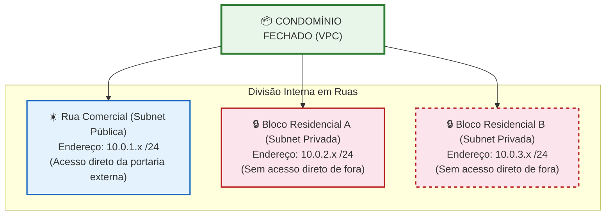
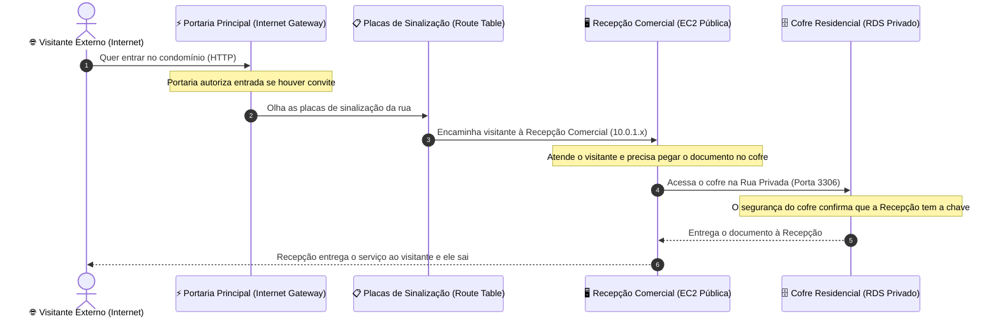

# 🟢 Aula 13t: VPC e Redes na Nuvem

**Disciplina:** Cloud Computing (Cód. 14189)  
**Curso:** Inteligência Artificial e Ciência de Dados, Uniube  
**Semana:** 13 | Sexta-feira, 22/05/2026  
**Professor:** Romualdo Mathias Filho  
**Tipo:** 📘 Teórica  
**Tópicos:** [[VPC]] (Virtual Private Cloud), Blocos CIDR, Subnets Públicas e Privadas, Tabelas de Roteamento, Internet Gateway (IGW), NAT Gateway, Security Groups Encadeados e NACLs.

---

> [!INFO] 🎯 Visão Geral da Aula & Recursos
> **"Compreenda a topologia de redes virtuais que sustenta as maiores arquiteturas em nuvem do mundo, isolando bancos de dados de forma implacável e expondo apenas o estritamente necessário para a internet."**
> 
> * **O que você vai dominar:**
>   - O design arquitetural de redes isoladas e seguras (Multi-Tier Architecture).
>   - A lógica de roteamento IP usando blocos CIDR e sub-redes estratégicas.
>   - A diferença operacional entre firewalls de rede (NACLs) e firewalls de instância (Security Groups).
> * **Pré-requisitos:** Familiaridade com o Terraform criado na [[Aula 13 - Pratica - VPC Completa e Isolamento de Banco de Dados com Terraform|Aula 13p]] e conceitos básicos de IP.
> * **📂 Recursos Adicionais para Download:**
>   - [[../../40_Recursos/Cheatsheet_AWS_VPC.pdf|Cheatsheet de Referência Rápida de VPC (PDF)]]
>   - [Código Terraform de Suporte no GitHub (Repositório Oficial)](https://github.com/rofilho/cloud-computing-uniube/tree/main/aula13-vpc)

---

## 🎯 Objetivo da Aula

Ao final desta aula, os alunos serão capazes de:
- Projetar topologias de rede robustas baseadas no isolamento lógico de sub-redes.
- Mapear e dividir blocos de endereçamento IP utilizando notação CIDR sem desperdício de endereços.
- Diferenciar os papéis do Internet Gateway e do NAT Gateway para saídas seguras à internet.
- Implementar regras dinâmicas e encadeadas de Security Groups (firewall lógico).
- Analisar os resultados de isolamento físico e lógico executados no laboratório com [[Terraform]].

---

## 🔄 Revisão Rápida: Discussão do Lab Passado (10 min)

Na última aula prática ([[Aula 13 - Pratica - VPC Completa e Isolamento de Banco de Dados com Terraform|Aula 13p]]), criamos uma infraestrutura Multi-Tier completa usando Terraform. Vamos entender o que de fato aconteceu por trás dos panos:

| **O Exercício da Aula 13p** | **O Diagnóstico Técnico e Pedagógico** |
| :--- | :--- |
| **Teste 1: Conexão Direta ao RDS** | Tentamos rodar o comando de conexão ao RDS do nosso computador local e deu **Timeout**. Por quê? Porque o RDS estava alocado nas subnets privadas (`Subnet-Privada-1A` e `1B`), que não possuem rota para o Internet Gateway (IGW) e não possuem IP público. |
| **Teste 2: Acesso SSH na EC2** | Conseguimos conectar na EC2 com sucesso. Por quê? A EC2 foi alocada na `Subnet-Publica-1`, que está associada a uma Tabela de Roteamento com rota ativa `0.0.0.0/0 -> IGW`. |
| **Teste 3: Conexão EC2 ➔ RDS** | Conectamos no banco via terminal da EC2. Por quê? A EC2 está dentro do terreno (VPC) e o Security Group do RDS foi configurado para aceitar a porta `3306` vinda logicamente do ID do Security Group da EC2. |

> 💡 **O Insight de Produção:** O Terraform removeu a complexidade de clicar 8 vezes no console da AWS, mas o valor real é a segurança por design. Se um invasor obtiver as credenciais do seu banco de dados, ele ainda precisará comprometer a EC2 na rede pública para tentar qualquer acesso, pois não existe caminho de rede direto da internet ## 📌 1. A Metáfora do Condomínio Fechado: Entendendo VPC e IPs do Zero [Teoria ⏳ 15 min]

Para quem nunca estudou redes de computadores, conceitos como **IP**, **VPC** ou **CIDR** podem parecer uma sopa de letrinhas complexa. Para descomplicar de forma definitiva, vamos usar uma analogia do mundo real: **Um Condomínio Fechado de Luxo**.

---

### 🗺️ O Mapa do Nosso Condomínio



---

### 🏢 Desmistificando os Termos de Rede

#### 1. O que é uma VPC?
* **Na analogia:** É o terreno inteiro do **Condomínio Fechado**. O condomínio tem muros altos e portarias controladas. Ninguém do lado de fora (a internet pública) consegue ver ou entrar nas casas lá dentro sem passar pela autorização da segurança.
* **Na nuvem:** Uma **VPC (Virtual Private Cloud)** é o seu datacenter virtual isolado na AWS. Ela garante que seus servidores fiquem em uma rede só sua, completamente protegida de outras contas.

#### 2. O que é uma Subnet (Sub-rede)?
* **Na analogia:** São as **Ruas ou Blocos** dentro do condomínio.
  * **Rua Comercial (Subnet Pública):** É a rua logo na entrada, onde ficam as lojas e a recepção. Qualquer visitante que entra pela portaria principal consegue chegar lá facilmente.
  * **Ruas Residenciais (Subnets Privadas):** São as ruas restritas ao fundo do condomínio, protegidas por portões extras. Visitantes externos não têm permissão para dirigir diretamente até lá.
* **Na nuvem:** Subnets são divisões lógicas da sua rede. Recursos como servidores web ficam na subnet pública para receber clientes, enquanto bancos de dados com informações sigilosas ficam na subnet privada, sem qualquer contato com a internet.

#### 3. O que são os IPs e a notação CIDR?
* **Na analogia:** É o **sistema de endereços e numeração das casas**.
  * O endereço geral do condomínio é **`10.0.0.0/16`**. O `/16` quer dizer que todas as casas do condomínio obrigatoriamente começam com `10.0.` (essa parte é fixa). O restante dos números pode mudar, permitindo criar até 65.536 casas diferentes lá dentro!
  * Quando dividimos as ruas, usamos o sufixo **`/24`** (ex: **`10.0.1.0/24`**). Isso significa que, na Rua Comercial, todas as casas começam com `10.0.1.`. Como apenas o último número pode mudar (de 0 a 255), temos espaço para 256 casas nessa rua específica.
* **Na nuvem:** O IP identifica de forma única um recurso. A AWS reserva automaticamente **5 IPs em cada subnet** para sua própria administração interna (gerenciamento de roteadores, DNS e broadcast), restando **251 IPs livres** para uso real no padrão `/24`.

> [!NOTE] 💼 Pergunta de Entrevista
> **"Se sua aplicação precisa de 1.000 instâncias ativas concorrentes divididas igualmente em 4 subnets, qual é a menor máscara CIDR (maior número de bits) que você deve aplicar a cada subnet, considerando as reservas padrão da nuvem AWS?"**
> 
> **Resposta Esperada:** 
> Cada subnet precisará de pelo menos $1000 / 4 = 250$ IPs ativos. Como a AWS reserva 5 IPs em cada subnet, precisamos de capacidade física para pelo menos $250 + 5 = 255$ endereços. 
> - Um bloco `/24` fornece $2^8 = 256$ endereços físicos ($256 - 5 = 251$ utilizáveis). 251 atende a demanda de 250 IPs.
> - Se usássemos `/25`, teríamos $2^7 = 128$ endereços físicos ($123$ utilizáveis), o que seria insuficiente.
> - Portanto, a menor máscara utilizável para cada subnet é **`/24`**.

---

## 📌 2. Portarias e Entregadores: O Caminho dos Pacotes [Teoria ⏳ 20 min]

Como os dados se movem de fora para dentro e vice-versa? Vamos ver como os componentes do condomínio operam para controlar quem entra e quem sai.



### 🚪 Os Componentes de Acesso e Roteamento

#### 1. Internet Gateway (IGW): A Portaria Principal
* **Na analogia:** É a **Portaria de Entrada e Saída do Condomínio**. Ela funciona de forma bidirecional: permite que moradores saiam para a cidade e visitantes entrem no condomínio (desde que saibam o número da casa comercial).
* **Na nuvem:** É o componente que conecta sua VPC diretamente com a internet pública, traduzindo IPs públicos externos em IPs privados internos.

#### 2. NAT Gateway: O Entregador de Encomendas
* **Na analogia:** Imagine que os moradores das Ruas Privadas queiram comprar comida em um app de entrega externa. Eles não podem ir até a portaria externa diretamente e os motoboys não podem entrar nas ruas privadas. Então, o condomínio contrata um **Entregador Especial (NAT Gateway)** que fica na Rua Comercial. 
  * O morador pede o lanche.
  * O entregador vai lá fora, busca o lanche, volta e entrega na casa privada.
  * Um estranho na internet **nunca** consegue falar diretamente com o morador da área residencial, mas o morador consegue obter recursos de fora com total segurança por meio do entregador.
* **Na nuvem:** É o recurso que permite que seus bancos de dados e servidores privados acessem a internet apenas para baixar atualizações e patches de segurança de forma **unidirecional**, impedindo qualquer conexão de entrada indesejada.

#### 3. Route Tables (Tabelas de Roteamento): As Placas de Sinalização
* **Na analogia:** São as **Placas de Trânsito** nas esquinas do condomínio. Elas indicam: *"Para ir à Rua Principal, siga em frente"*; *"Para ir à saída da rodovia, dirija-se à Portaria Principal"*.
* **Na nuvem:** Tabelas contendo as regras de tráfego. Elas determinam se os dados que saem de uma subnet devem ir para o Internet Gateway (tornando-a pública) ou se devem ficar restritos internamente (privada).

> [!WARNING] ⚠️ Gotcha de Infraestrutura
> **[Custo Oculto do NAT Gateway]**: Diferente do Internet Gateway, que é gratuito na AWS, o **NAT Gateway é cobrado por hora de provisionamento** (~$0.045/hora) mais os dados processados. Em ambientes de desenvolvimento estudantil ou pequenos projetos, manter um NAT Gateway ativo consome créditos rapidamente. Para evitar custos desnecessários em laboratórios, opte por não usar NAT Gateway e utilize o bastion host (EC2 pública) apenas como ponto de passagem, sem dar acesso direto à internet para os servidores privados, ou destrua a infraestrutura logo após os testes usando `terraform destroy`.

---

## 📌 3. Segurança em Profundidade: Security Groups vs. NACLs [Teoria ⏳ 15 min]

Para evitar invasões e garantir que apenas pessoas autorizadas acessem cada parte do condomínio, a AWS implementa duas barreiras de segurança virtuais.

```
                  [ ☁️ INTERNET PÚBLICA ]
                            │
                            ▼
      ┌───────────────────────────────────────────┐
      │   🚧 Network ACL (NACL) - Stateless       │ <- Portão de Entrada da Rua (Subnet)
      └───────────────────────────────────────────┘
                            │
                            ▼
              ┌───────────────────────────┐
              │ 🛡️ Security Group - Stateful│ <- Segurança na Porta da Instância (EC2/RDS)
              └───────────────────────────┘
                            │
                            ▼
                     [ 🖥️ INSTÂNCIA ]
```

### 🛡️ Entendendo os Firewalls na Prática

| **Conceito** | **Security Group (SG)** | **Network ACL (NACL)** |
| :--- | :--- | :--- |
| **Analogia** | **O Segurança na Porta da sua Casa** | **A Guarita na Entrada de uma Rua** |
| **Escopo** | Protege a **Instância** individualmente (placa de rede do servidor) | Protege a **Subnet** (toda a rua de uma vez só) |
| **Stateful vs Stateless** | **Stateful** (Lembra de quem entrou. Se o segurança autorizou você a entrar, ele deixa você sair sem perguntar nada) | **Stateless** (Não tem memória. Você precisa ter autorização na lista de entrada e na lista de saída de forma explícita) |
| **Lógica de Regras** | Permite configurar apenas regras de **Autorização** (quem pode entrar) | Permite configurar regras de **Autorização** e de **Bloqueio** (quem é proibido de entrar) |

### 🔗 O Encadeamento de Security Groups (Segurança Inteligente)

Imagine que, em vez de listar o documento físico (IP) de todas as pessoas que podem entrar no cofre do banco, o condomínio use um crachá especial.
* O crachá se chama `ec2_sg` (crachá de recepção).
* A regra do cofre diz: **"Apenas pessoas vestindo o crachá `ec2_sg` podem abrir a porta 3306."**

No Terraform (`database.tf`), programamos isso assim:

```hcl
ingress {
  from_port       = 3306
  to_port         = 3306
  protocol        = "tcp"
  security_groups = [aws_security_group.ec2_sg.id] # Permissão pelo Crachá (ID do SG de Origem)
}
```

Isomera a infraestrutura: se criarmos 10 novos servidores web e dermos a eles o crachá `ec2_sg`, eles conseguirão acessar o banco de dados imediatamente. Se criarmos um servidor sem crachá, ele será bloqueado na porta do banco de dados na hora, mesmo que esteja dentro do mesmo condomínio!

### 🧠 Checkpoint: Teste seu Conhecimento!

<details>
<summary><b>🔍 Exercício Rápido: O que acontece se removermos a regra de saída (Egress) do Security Group de uma EC2? O cliente externo ainda conseguirá acessar a página Web?</b></summary>
<blockquote>

**Resposta Correta:** **Sim, o cliente ainda acessará!** 
Como os Security Groups são **Stateful**, o firewall "lembra" que a conexão de entrada foi autorizada. Portanto, ele permite que a resposta volte ao cliente pela porta efêmera correspondente de forma automática, ignorando as regras de saída (Egress) definidas no grupo. Se fosse uma Network ACL (Stateless), a resposta seria bloqueada na saída se não houvesse uma regra explícita de retorno.

</blockquote>
</details>

> [!TIP] 💡 Dica de Produção (Pro-Tip)
> **[Boas Práticas de Segurança e Zero Trust]**: Grandes fintechs e startups de tecnologia utilizam o conceito de **Zero Trust** (Confiança Zero). Bancos de dados de produção nunca recebem IPs públicos e residem em subnets totalmente isoladas. Engenheiros e administradores SRE não expõem portas de SSH (`22`) ou Banco (`3306`) à internet pública. Em vez disso, utilizam VPNs criptografadas corporativas ou ferramentas como o **AWS Systems Manager (SSM) Session Manager**, que permite gerenciar os servidores de forma segura via túnel TLS sem precisar abrir portas de firewall na borda da VPC.

---

## 📋 Resumo Estrutural (Cheatsheet)Es não expõem as portas à internet; em vez disso, utilizam VPNs corporativas dedicadas (como OpenVPN ou AWS Client VPN) ou sessões seguras criptografadas de shell via **AWS Systems Manager (SSM) Session Manager**, eliminando a necessidade de abrir até mesmo a porta SSH `22` na borda da VPC.

---

## 📋 Resumo Estrutural (Cheatsheet)

| **Conceito / Termo** | **Definição e Aplicação Prática em Uma Frase** |
| :--- | :--- |
| **VPC** | O terreno privado lógico na nuvem para isolar todos os seus recursos de computação, dados e rede. |
| **Subnet Pública** | Segmento de rede com rota direta mapeada para o Internet Gateway, ideal para servidores web e load balancers. |
| **Subnet Privada** | Segmento de rede isolado sem rota direta para o IGW, ideal para proteger bancos de dados e microsserviços internos. |
| **CIDR** | Notação usada para definir e fatiar blocos de IPs (ex: `/16` para a VPC inteira e `/24` para as subnets). |
| **Internet Gateway** | O portão bidirecional de entrada e saída que conecta a VPC à internet pública. |
| **NAT Gateway** | Roteador unidirecional seguro que permite que instâncias privadas acessem a internet, mas impede conexões vindas de fora. |
| **Security Group** | Firewall stateful no nível da instância que protege recursos específicos usando regras lógicas e encadeadas. |
| **Network ACL** | Firewall stateless no nível da sub-rede que atua como uma barreira adicional de rede antes do tráfego chegar à instância. |

---

%%
## ❓ Banco de Questões

> 🔒 *Esta seção é visível apenas no Obsidian do professor. Não publicada para os alunos no Quartz.*

### Questão 1 (Múltipla Escolha — Nível: Intermediário)
**Enunciado:** Uma empresa de e-commerce brasileira hospeda sua aplicação web na AWS. A equipe de SRE configurou um banco de dados Amazon RDS MySQL em uma sub-rede cujos recursos não possuem IPs públicos associados. A tabela de roteamento dessa sub-rede possui apenas a rota local padrão `10.0.0.0/16 -> local`. Um desenvolvedor júnior precisa fazer uma manutenção emergencial no banco e tenta conectar seu client local (DBeaver) diretamente ao endpoint do banco via internet. O que ocorrerá e qual é a justificativa técnica?

- [ ] A) A conexão será bem-sucedida, contanto que o desenvolvedor tenha a senha master do banco de dados MySQL.
- [ ] B) A conexão falhará com erro de autenticação (Access Denied), pois o banco está configurado para aceitar apenas tráfego criptografado com chaves SSL corporativas.
- [x] C) A conexão falhará por estouro de tempo (Timeout), porque não existe caminho de rede físico (rota para o Internet Gateway) e o RDS não possui IP público associado. ✅
- [ ] D) A conexão será interceptada por uma regra do CloudWatch, que moverá automaticamente o banco de dados para a subnet pública para permitir a manutenção.

**Justificativa:** O RDS MySQL está alocado em uma subnet puramente privada. Sem IP público e sem rota configurada para um Internet Gateway (IGW) na tabela de roteamento da subnet, o tráfego vindo da internet não consegue encontrar caminho físico de entrada para o banco, resultando em Timeout.

---

### Questão 2 (Múltipla Escolha — Nível: Avançado)
**Enunciado:** Um arquiteto de soluções Cloud está projetando a rede de um novo sistema de processamento de Pix. Ele cria uma VPC com o bloco CIDR `192.168.0.0/16`. Ele deseja dividir essa rede em subnets menores para diferentes microsserviços. Ao criar uma subnet com o bloco CIDR `192.168.10.0/24`, quantas instâncias de servidores virtuais (EC2) ele conseguirá provisionar ativamente nessa subnet com IPs utilizáveis?

- [ ] A) 256 instâncias.
- [ ] B) 254 instâncias.
- [x] C) 251 instâncias. ✅
- [ ] D) 250 instâncias.

**Justificativa:** Embora um bloco `/24` possua $2^8 = 256$ endereços IP matemáticos possíveis, a AWS reserva automaticamente **5 endereços IP** em cada sub-rede para serviços internos de infraestrutura (.0, .1, .2, .3 e .255). Logo, restam $256 - 5 = 251$ endereços IP utilizáveis para alocação ativa de recursos.

---

### Questão 3 (Dissertativa — Nível: Avançado)
**Enunciado:** Explique de que forma o princípio da Defesa em Profundidade (Defense-in-Depth) é materializado ao implementarmos uma arquitetura de rede Multi-Tier contendo subnets públicas e privadas associadas a Security Groups encadeados. Na sua resposta, discuta a diferença de segurança entre essa abordagem e a hospedagem simples de servidores web e bancos de dados na mesma subnet pública, protegidos apenas por senhas de banco.

**Resposta esperada:**
A materialização do princípio da Defesa em Profundidade na arquitetura Multi-Tier ocorre através do estabelecimento de barreiras e filtros de segurança independentes e complementares:
1. **Camada de Isolamento de Rede:** O banco de dados RDS fica hospedado em subnets privadas sem caminhos de roteamento físico para a internet (sem Internet Gateway). Mesmo que as credenciais do banco sejam expostas, nenhum atacante externo conseguirá estabelecer uma conexão TCP direta a partir da internet pública, pois o caminho de rede é inexistente.
2. **Camada de Controle de Acesso Lógico (Firewall):** O Security Group do RDS é configurado de forma encadeada, autorizando tráfego de entrada estritamente a partir do ID do Security Group da EC2 pública. Isso impede que mesmo recursos internos que consigam entrar na VPC (mas que estejam fora do SG permitido, como outra EC2 de teste ou um contêiner comprometido) acessem o banco.
3. **Controle de Autenticação Tradicional:** A senha do banco (segurança de aplicação) atua apenas como a última barreira de proteção.

Em contrapartida, hospedar o banco na mesma subnet pública com IP público e dependendo apenas de senhas de acesso reduz as defesas a um único ponto de falha (Single Point of Failure). Qualquer vulnerabilidade de força bruta, vazamento de credenciais em arquivos de configuração públicos no GitHub ou falha de dia-zero (zero-day) na engine do banco permitiria o comprometimento total e imediato dos dados por atacantes automatizados na internet. A arquitetura de rede Multi-Tier garante que, para comprometer o banco de dados, o invasor precisaria quebrar o isolamento de rede do IGW, comprometer a EC2 na rede pública, herdar o perfil do Security Group e, finalmente, quebrar a credencial do banco, aumentando significativamente a robustez do sistema.

---
%%

## 📄 Artigo de Aprofundamento

- [AWS Virtual Private Cloud (VPC) Fundamentals — AWS Tech Documentation](https://docs.aws.amazon.com/vpc/latest/userguide/what-is-amazon-vpc.html)
  > *Documentação oficial que detalha os conceitos fundamentais de funcionamento de sub-redes, roteamento de pacotes e gateways na nuvem AWS.*

---

## 📚 Referências Bibliográficas

- ANTUNES, Jonathan Lamim. *Amazon AWS: descomplicando a computação em nuvem*. 1ª ed. São Paulo: Casa do Código, 2016. **(Capítulo 5: Redes e Segurança com VPC, pp. 87–104)**
- BRIKMAN, Yevgeniy. *Terraform: Up & Running*. 3ª ed. Sebastopol: O'Reilly Media, 2022. **(Capítulo 4: How to Create Reusable Infrastructure with Terraform Modules, pp. 112–134)**
- TANENBAUM, Andrew S.; WETHERALL, David J. *Redes de Computadores*. 5ª ed. São Paulo: Pearson, 2013. **(Capítulo 5: A Camada de Rede e Roteamento IP, pp. 340–378)**

---
*Última atualização: 2026-05-22 | Status: publicado*
