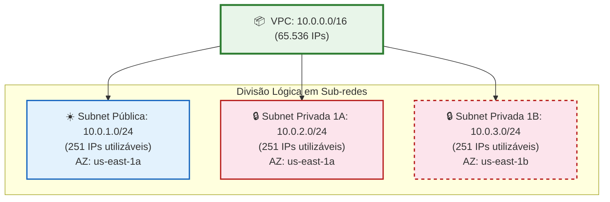
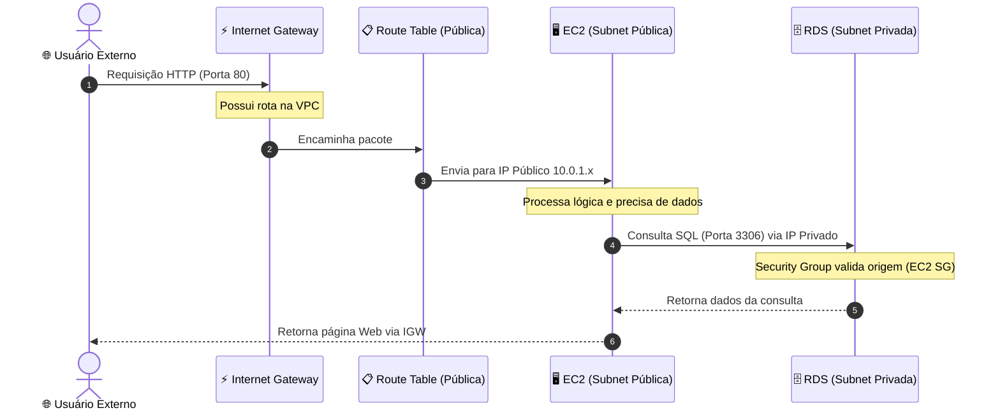

# 🟢 Aula 13t: VPC e Redes na Nuvem

**Disciplina:** Cloud Computing (Cód. 14189)  
**Curso:** Inteligência Artificial e Ciência de Dados, Uniube  
**Semana:** 13 | Sexta-feira, 22/05/2026  
**Professor:** Romualdo Mathias Filho  
**Tipo:** 📘 Teórica  
**Tópicos:** [[VPC]] (Virtual Private Cloud), Blocos CIDR, Subnets Públicas e Privadas, Tabelas de Roteamento, Internet Gateway (IGW), NAT Gateway, Security Groups Encadeados e NACLs.

---

> [!INFO] 🎯 Visão Geral da Aula & Recursos
> **"Compreenda a topologia de redes virtuais que sustenta as maiores arquiteturas em nuvem do mundo, isolando bancos de dados de forma implacável e expondo apenas o estritamente necessário para a internet."**
> 
> * **O que você vai dominar:**
>   - O design arquitetural de redes isoladas e seguras (Multi-Tier Architecture).
>   - A lógica de roteamento IP usando blocos CIDR e sub-redes estratégicas.
>   - A diferença operacional entre firewalls de rede (NACLs) e firewalls de instância (Security Groups).
> * **Pré-requisitos:** Familiaridade com o Terraform criado na [[Aula 13 - Pratica - VPC Completa e Isolamento de Banco de Dados com Terraform|Aula 13p]] e conceitos básicos de IP.
> * **📂 Recursos Adicionais para Download:**
>   - [[../../40_Recursos/Cheatsheet_AWS_VPC.pdf|Cheatsheet de Referência Rápida de VPC (PDF)]]
>   - [Código Terraform de Suporte no GitHub (Repositório Oficial)](https://github.com/rofilho/cloud-computing-uniube/tree/main/aula13-vpc)

---

## 🎯 Objetivo da Aula

Ao final desta aula, os alunos serão capazes de:
- Projetar topologias de rede robustas baseadas no isolamento lógico de sub-redes.
- Mapear e dividir blocos de endereçamento IP utilizando notação CIDR sem desperdício de endereços.
- Diferenciar os papéis do Internet Gateway e do NAT Gateway para saídas seguras à internet.
- Implementar regras dinâmicas e encadeadas de Security Groups (firewall lógico).
- Analisar os resultados de isolamento físico e lógico executados no laboratório com [[Terraform]].

---

## 🔄 Revisão Rápida: Discussão do Lab Passado (10 min)

Na última aula prática ([[Aula 13 - Pratica - VPC Completa e Isolamento de Banco de Dados com Terraform|Aula 13p]]), criamos uma infraestrutura Multi-Tier completa usando Terraform. Vamos entender o que de fato aconteceu por trás dos panos:

| **O Exercício da Aula 13p** | **O Diagnóstico Técnico e Pedagógico** |
| :--- | :--- |
| **Teste 1: Conexão Direta ao RDS** | Tentamos rodar o comando de conexão ao RDS do nosso computador local e deu **Timeout**. Por quê? Porque o RDS estava alocado nas subnets privadas (`Subnet-Privada-1A` e `1B`), que não possuem rota para o Internet Gateway (IGW) e não possuem IP público. |
| **Teste 2: Acesso SSH na EC2** | Conseguimos conectar na EC2 com sucesso. Por quê? A EC2 foi alocada na `Subnet-Publica-1`, que está associada a uma Tabela de Roteamento com rota ativa `0.0.0.0/0 -> IGW`. |
| **Teste 3: Conexão EC2 ➔ RDS** | Conectamos no banco via terminal da EC2. Por quê? A EC2 está dentro do terreno (VPC) e o Security Group do RDS foi configurado para aceitar a porta `3306` vinda logicamente do ID do Security Group da EC2. |

> 💡 **O Insight de Produção:** O Terraform removeu a complexidade de clicar 8 vezes no console da AWS, mas o valor real é a segurança por design. Se um invasor obtiver as credenciais do seu banco de dados, ele ainda precisará comprometer a EC2 na rede pública para tentar qualquer acesso, pois não existe caminho de rede direto da internet para as subnets privadas. Isso é **Defesa em Profundidade (Defense-in-Depth)**.

---

## 📌 1. Anatomia de uma VPC e o Espaço CIDR [Teoria ⏳ 15 min]

Uma **[[VPC]] (Virtual Private Cloud)** é uma rede virtual dedicada à sua conta da AWS. Ela é logicamente isolada de outras redes virtuais na nuvem AWS, funcionando exatamente como a infraestrutura física de rede de um datacenter tradicional, com as vantagens da elasticidade e do provisionamento de [[SRE|SRE]] via código.



### O Endereçamento IP e o CIDR (Classless Inter-Domain Routing)
Ao criar uma VPC, você deve especificar uma faixa de endereços IPv4 no formato de um bloco **CIDR**.
- Exemplo: `10.0.0.0/16`
  - O `10.0.0.0` é o IP base da rede.
  - O `/16` representa a máscara de sub-rede. Significa que os primeiros 16 bits do endereço IP são fixos (identificador da rede: `10.0.x.x`), e os 16 bits restantes podem ser usados para endereçar hosts.
  - Isso nos dá $2^{16} = 65.536$ endereços IP disponíveis dentro dessa VPC.

Quando dividimos esse terreno em prédios (subnets), usamos blocos CIDR menores, como `/24`.
- Exemplo de sub-rede: `10.0.1.0/24`
  - Os primeiros 24 bits são fixos (`10.0.1.x`). Os 8 bits restantes fornecem $2^8 = 256$ endereços IP.
  - **Gotcha importante:** A AWS reserva **5 endereços IP** em cada sub-rede para fins de infraestrutura interna:
    - `10.0.1.0`: Endereço de rede.
    - `10.0.1.1`: Roteador da VPC.
    - `10.0.1.2`: Servidor DNS interno da AWS.
    - `10.0.1.3`: Uso reservado para necessidades futuras da AWS.
    - `10.0.1.255`: Endereço de broadcast de rede (embora broadcast não seja suportado em VPCs, ele permanece reservado).
  - Portanto, em um bloco `/24`, você terá apenas **251 endereços IPs utilizáveis** para suas instâncias.

> [!NOTE] 💼 Pergunta de Entrevista
> **"Se sua aplicação precisa de 1.000 instâncias ativas concorrentes divididas igualmente em 4 subnets, qual é a menor máscara CIDR (maior número de bits) que você deve aplicar a cada subnet, considerando as reservas padrão da nuvem AWS?"**
> 
> **Resposta Esperada:** 
> Cada subnet precisará de pelo menos $1000 / 4 = 250$ IPs ativos. Como a AWS reserva 5 IPs em cada subnet, precisamos de capacidade mínima física para $250 + 5 = 255$ endereços. 
> - Um bloco `/24` fornece $2^8 = 256$ endereços físicos ($256 - 5 = 251$ utilizáveis). 251 atende a demanda de 250 IPs.
> - Se usássemos `/25`, teríamos $2^7 = 128$ endereços físicos ($123$ utilizáveis), o que seria insuficiente.
> - Portanto, a menor máscara utilizável para cada subnet é **`/24`**.

---

## 📌 2. Subnets, Route Tables e Gateways: O Caminho dos Pacotes [Teoria ⏳ 20 min]

Para que os dados fluam corretamente dentro e fora da VPC, a AWS utiliza componentes lógicos de controle de tráfego.



### 1. Subnets Públicas vs. Subnets Privadas
A distinção técnica entre sub-rede pública e privada não é um "check" físico na interface. Uma sub-rede é considerada **pública** apenas se o seu tráfego for associado a uma Tabela de Roteamento contendo uma rota explícita de saída para a internet através do **Internet Gateway**. Uma sub-rede que não possui essa rota é classificada como **privada**.

### 2. Internet Gateway (IGW) vs. NAT Gateway (Network Address Translation)
- **Internet Gateway (IGW):** É um componente horizontal altamente disponível e redundante que atua de forma bidirecional. Ele faz a ponte direta entre a VPC e a internet. Recursos na subnet pública precisam de um IP público ou Elastic IP (EIP) associado para que o IGW realize o mapeamento 1:1 de IP privado para IP público.
- **NAT Gateway:** Atua de forma **unidirecional**. É alocado obrigatoriamente em uma subnet **pública** e possui um IP público elástico. Instâncias em subnets privadas utilizam o NAT Gateway para iniciar conexões de saída com a internet (ex: rodar `sudo dnf update` ou baixar dependências do pip/npm), mas agentes externos na internet **não conseguem** iniciar nenhuma conexão direta de entrada com essas instâncias privadas.

### 3. Tabelas de Roteamento (Route Tables)
Tabelas de Roteamento contêm um conjunto de regras (chamadas rotas) que determinam para onde o tráfego de rede das subnets será direcionado.
- Toda VPC possui uma rota local padrão (ex: `10.0.0.0/16 -> local`), que permite que todas as subnets se comuniquem localmente de forma nativa.
- Para obter acesso externo, criamos uma rota padrão para a internet (`0.0.0.0/0`) e associamos seu destino ao IGW (na tabela pública) ou ao NAT Gateway (na tabela privada, se desejado).

> [!WARNING] ⚠️ Gotcha de Infraestrutura
> **[Custo Oculto do NAT Gateway]**: Diferente do Internet Gateway, que é gratuito na AWS, o **NAT Gateway é cobrado por hora de provisionamento** (~$0.045/hora) mais os dados processados. Em ambientes de desenvolvimento estudantil ou pequenos projetos, manter um NAT Gateway ativo consome créditos rapidamente. Para evitar custos desnecessários em laboratórios, opte por não usar NAT Gateway e utilize o bastion host (EC2 pública) apenas como ponto de passagem, sem dar acesso direto à internet para os servidores privados, ou destrua a infraestrutura logo após os testes usando `terraform destroy`.

---

## 📌 3. Segurança em Profundidade: Security Groups vs. NACLs [Teoria ⏳ 15 min]

A AWS oferece duas camadas de firewalls virtuais com características técnicas fundamentalmente distintas para proteger sua infraestrutura.

| **Característica** | **Security Group (SG)** | **Network ACL (NACL)** |
| :--- | :--- | :--- |
| **Escopo de Ação** | Nível da Instância (Placa de Rede/ENI) | Nível da Sub-rede (Subnet) |
| **Stateful vs. Stateless** | **Stateful** (se a entrada é permitida, a resposta de saída é liberada automaticamente) | **Stateless** (regras de entrada e saída devem ser criadas explicitamente) |
| **Tipo de Regras** | Apenas regras de **Permissão** (Allow) | Regras de **Permissão** e **Bloqueio** (Allow/Deny) |
| **Ordem de Processamento** | Avalia todas as regras de forma global antes de decidir | Avalia as regras em ordem numérica sequencial (ex: 100, 200, 300) |
| **Associação** | Aplicado a recursos específicos (ex: EC2, RDS, ELB) | Aplicado a todas as instâncias contidas na subnet |

### O Encadeamento de Security Groups (Segurança Lógica)
Em vez de autorizar conexões no banco de dados liberando uma faixa de IPs (ex: `10.0.1.0/24`), a boa prática de mercado SRE dita o **encadeamento de Security Groups**.
No Terraform de banco de dados (`database.tf`), a regra de ingresso é expressa referenciando o ID do grupo de segurança de origem:

```hcl
ingress {
  from_port       = 3306
  to_port         = 3306
  protocol        = "tcp"
  security_groups = [aws_security_group.ec2_sg.id] # Permissão lógica dinâmica
}
```

Isso significa que **qualquer instância** que for associada ao grupo de segurança `ec2_sg` terá a entrada autorizada no banco de dados pela porta 3306, independentemente de qual seja o seu IP privado ou em qual subnet pública ou privada ela seja instanciada. Isso suporta de forma automática arquiteturas dinâmicas com [[Auto_Scaling]] e recriação de instâncias sem intervenção manual nas regras de firewall.

### 🧠 Checkpoint: Teste seu Conhecimento!

<details>
<summary><b>🔍 Exercício Rápido: O que acontece se removermos a regra de saída (Egress) do Security Group de uma EC2? O cliente externo ainda conseguirá acessar a página Web?</b></summary>
<blockquote>

**Resposta Correta:** **Sim, o cliente ainda acessará!** 
Como os Security Groups são **Stateful**, o firewall "lembra" que a conexão de entrada foi autorizada. Portanto, ele permite que a resposta volte ao cliente pela porta efêmera correspondente de forma automática, ignorando as regras de saída (Egress) definidas no grupo. Se fosse uma Network ACL (Stateless), a resposta seria bloqueada, a menos que houvesse uma regra de saída explícita correspondente.

</blockquote>
</details>

> [!TIP] 💡 Dica de Produção (Pro-Tip)
> **[Boas Práticas de Segurança em Startups e Fintechs]**: Empresas como Nubank e iFood que processam dados sensíveis de pagamento e autenticação de usuários utilizam abordagens de **Zero Trust**. Bancos de dados relacionais e não-relacionais nunca possuem IPs públicos e residem em subnets privadas sem qualquer rota de saída ou entrada direta da internet. Para tarefas de manutenção ou desenvolvimento em produção que exijam acesso temporário aos dados, engenheiros de redes e SREs não expõem as portas à internet; em vez disso, utilizam VPNs corporativas dedicadas (como OpenVPN ou AWS Client VPN) ou sessões seguras criptografadas de shell via **AWS Systems Manager (SSM) Session Manager**, eliminando a necessidade de abrir até mesmo a porta SSH `22` na borda da VPC.

---

## 📋 Resumo Estrutural (Cheatsheet)

| **Conceito / Termo** | **Definição e Aplicação Prática em Uma Frase** |
| :--- | :--- |
| **VPC** | O terreno privado lógico na nuvem para isolar todos os seus recursos de computação, dados e rede. |
| **Subnet Pública** | Segmento de rede com rota direta mapeada para o Internet Gateway, ideal para servidores web e load balancers. |
| **Subnet Privada** | Segmento de rede isolado sem rota direta para o IGW, ideal para proteger bancos de dados e microsserviços internos. |
| **CIDR** | Notação usada para definir e fatiar blocos de IPs (ex: `/16` para a VPC inteira e `/24` para as subnets). |
| **Internet Gateway** | O portão bidirecional de entrada e saída que conecta a VPC à internet pública. |
| **NAT Gateway** | Roteador unidirecional seguro que permite que instâncias privadas acessem a internet, mas impede conexões vindas de fora. |
| **Security Group** | Firewall stateful no nível da instância que protege recursos específicos usando regras lógicas e encadeadas. |
| **Network ACL** | Firewall stateless no nível da sub-rede que atua como uma barreira adicional de rede antes do tráfego chegar à instância. |

---

%%
## ❓ Banco de Questões

> 🔒 *Esta seção é visível apenas no Obsidian do professor. Não publicada para os alunos no Quartz.*

### Questão 1 (Múltipla Escolha — Nível: Intermediário)
**Enunciado:** Uma empresa de e-commerce brasileira hospeda sua aplicação web na AWS. A equipe de SRE configurou um banco de dados Amazon RDS MySQL em uma sub-rede cujos recursos não possuem IPs públicos associados. A tabela de roteamento dessa sub-rede possui apenas a rota local padrão `10.0.0.0/16 -> local`. Um desenvolvedor júnior precisa fazer uma manutenção emergencial no banco e tenta conectar seu client local (DBeaver) diretamente ao endpoint do banco via internet. O que ocorrerá e qual é a justificativa técnica?

- [ ] A) A conexão será bem-sucedida, contanto que o desenvolvedor tenha a senha master do banco de dados MySQL.
- [ ] B) A conexão falhará com erro de autenticação (Access Denied), pois o banco está configurado para aceitar apenas tráfego criptografado com chaves SSL corporativas.
- [x] C) A conexão falhará por estouro de tempo (Timeout), porque não existe caminho de rede físico (rota para o Internet Gateway) e o RDS não possui IP público associado. ✅
- [ ] D) A conexão será interceptada por uma regra do CloudWatch, que moverá automaticamente o banco de dados para a subnet pública para permitir a manutenção.

**Justificativa:** O RDS MySQL está alocado em uma subnet puramente privada. Sem IP público e sem rota configurada para um Internet Gateway (IGW) na tabela de roteamento da subnet, o tráfego vindo da internet não consegue encontrar caminho físico de entrada para o banco, resultando em Timeout.

---

### Questão 2 (Múltipla Escolha — Nível: Avançado)
**Enunciado:** Um arquiteto de soluções Cloud está projetando a rede de um novo sistema de processamento de Pix. Ele cria uma VPC com o bloco CIDR `192.168.0.0/16`. Ele deseja dividir essa rede em subnets menores para diferentes microsserviços. Ao criar uma subnet com o bloco CIDR `192.168.10.0/24`, quantas instâncias de servidores virtuais (EC2) ele conseguirá provisionar ativamente nessa subnet com IPs utilizáveis?

- [ ] A) 256 instâncias.
- [ ] B) 254 instâncias.
- [x] C) 251 instâncias. ✅
- [ ] D) 250 instâncias.

**Justificativa:** Embora um bloco `/24` possua $2^8 = 256$ endereços IP matemáticos possíveis, a AWS reserva automaticamente **5 endereços IP** em cada sub-rede para serviços internos de infraestrutura (.0, .1, .2, .3 e .255). Logo, restam $256 - 5 = 251$ endereços IP utilizáveis para alocação ativa de recursos.

---

### Questão 3 (Dissertativa — Nível: Avançado)
**Enunciado:** Explique de que forma o princípio da Defesa em Profundidade (Defense-in-Depth) é materializado ao implementarmos uma arquitetura de rede Multi-Tier contendo subnets públicas e privadas associadas a Security Groups encadeados. Na sua resposta, discuta a diferença de segurança entre essa abordagem e a hospedagem simples de servidores web e bancos de dados na mesma subnet pública, protegidos apenas por senhas de banco.

**Resposta esperada:**
A materialização do princípio da Defesa em Profundidade na arquitetura Multi-Tier ocorre através do estabelecimento de barreiras e filtros de segurança independentes e complementares:
1. **Camada de Isolamento de Rede:** O banco de dados RDS fica hospedado em subnets privadas sem caminhos de roteamento físico para a internet (sem Internet Gateway). Mesmo que as credenciais do banco sejam expostas, nenhum atacante externo conseguirá estabelecer uma conexão TCP direta a partir da internet pública, pois o caminho de rede é inexistente.
2. **Camada de Controle de Acesso Lógico (Firewall):** O Security Group do RDS é configurado de forma encadeada, autorizando tráfego de entrada estritamente a partir do ID do Security Group da EC2 pública. Isso impede que mesmo recursos internos que consigam entrar na VPC (mas que estejam fora do SG permitido, como outra EC2 de teste ou um contêiner comprometido) acessem o banco.
3. **Controle de Autenticação Tradicional:** A senha do banco (segurança de aplicação) atua apenas como a última barreira de proteção.

Em contrapartida, hospedar o banco na mesma subnet pública com IP público e dependendo apenas de senhas de acesso reduz as defesas a um único ponto de falha (Single Point of Failure). Qualquer vulnerabilidade de força bruta, vazamento de credenciais em arquivos de configuração públicos no GitHub ou falha de dia-zero (zero-day) na engine do banco permitiria o comprometimento total e imediato dos dados por atacantes automatizados na internet. A arquitetura de rede Multi-Tier garante que, para comprometer o banco de dados, o invasor precisaria quebrar o isolamento de rede do IGW, comprometer a EC2 na rede pública, herdar o perfil do Security Group e, finalmente, quebrar a credencial do banco, aumentando significativamente a robustez do sistema.

---
%%

## 📄 Artigo de Aprofundamento

- [AWS Virtual Private Cloud (VPC) Fundamentals — AWS Tech Documentation](https://docs.aws.amazon.com/vpc/latest/userguide/what-is-amazon-vpc.html)
  > *Documentação oficial que detalha os conceitos fundamentais de funcionamento de sub-redes, roteamento de pacotes e gateways na nuvem AWS.*

---

## 📚 Referências Bibliográficas

- ANTUNES, Jonathan Lamim. *Amazon AWS: descomplicando a computação em nuvem*. 1ª ed. São Paulo: Casa do Código, 2016. **(Capítulo 5: Redes e Segurança com VPC, pp. 87–104)**
- BRIKMAN, Yevgeniy. *Terraform: Up & Running*. 3ª ed. Sebastopol: O'Reilly Media, 2022. **(Capítulo 4: How to Create Reusable Infrastructure with Terraform Modules, pp. 112–134)**
- TANENBAUM, Andrew S.; WETHERALL, David J. *Redes de Computadores*. 5ª ed. São Paulo: Pearson, 2013. **(Capítulo 5: A Camada de Rede e Roteamento IP, pp. 340–378)**

---
*Última atualização: 2026-05-22 | Status: publicado*
