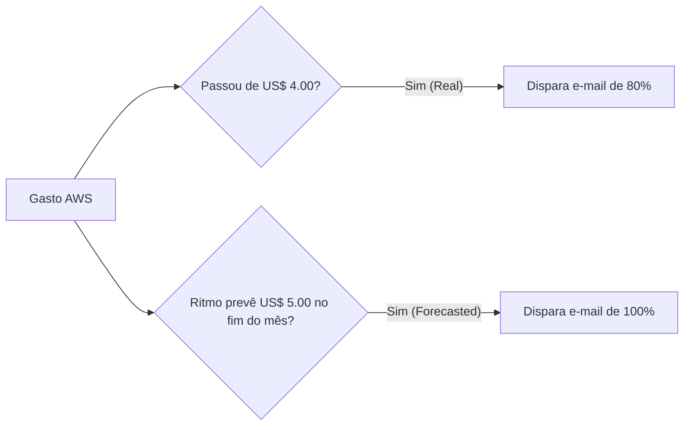
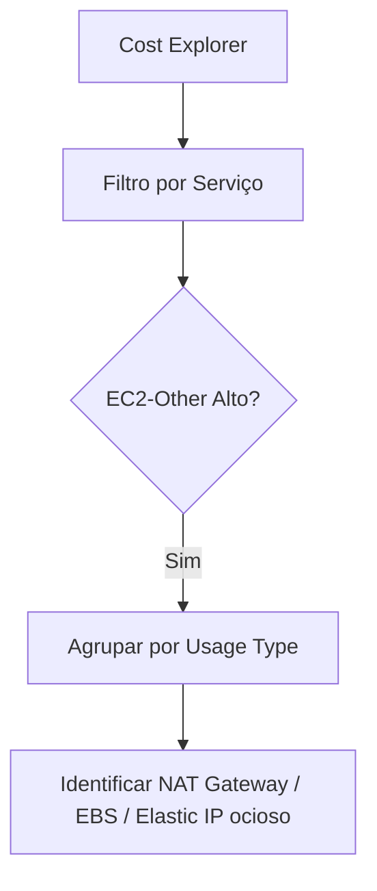

# 🟢 Aula 14p: Prática — Alertas de Custo, Cost Explorer e Calculadora AWS

**Disciplina:** Cloud Computing (Cód. 14189)  
**Curso:** Inteligência Artificial e Ciência de Dados, Uniube  
**Semana 15** | Quarta-feira, 03/06/2026 | Prof. Romualdo Mathias Filho  
**Tipo:** 🔬 Prática (Quarta-feira)  
**Eixo:** 5 — Segurança e FinOps  
**AWS Academy:** Módulo 2.7 — Faturamento e Suporte  

---

> [!INFO] 🎯 Visão Geral da Aula & Recursos
> **Aprenda a blindar sua conta AWS contra cobranças inesperadas, prever orçamentos reais e analisar graficamente para onde vai cada centavo da sua infraestrutura na nuvem.**
> 
> * **O que você vai dominar:**
>   - Configurar alertas de orçamento no AWS Budgets para disparar notificações por e-mail quando o faturamento atingir limites críticos.
>   - Rastrear e diagnosticar custos de recursos ociosos ou esquecidos usando filtros e agrupamentos no AWS Cost Explorer.
>   - Desenhar e estimar detalhadamente o orçamento de uma arquitetura Multi-Tier na nuvem utilizando a AWS Pricing Calculator.
> * **Pré-requisitos:** Acesso ao Console AWS da AWS Academy (Learner Lab) ou conta pessoal da AWS.
> * **📂 Recursos Adicionais para Download:**
>   - [AWS Pricing Calculator - Site Oficial](https://calculator.aws/)
>   - [[../../40_Recursos/Calculadora_AWS_Estudo_Caso.pdf|Estudo de Caso de Dimensionamento de TCO (PDF)]]

---

## 🎯 Objetivo da Aula

Ao final desta aula, os alunos serão capazes de:
- **Configurar** alertas de faturamento preventivos no AWS Budgets baseados em custos reais e previstos.
- **Filtrar** e identificar despesas por serviço e por tags de alocação de custos no AWS Cost Explorer.
- **Estimar** o custo mensal projetado de uma aplicação Multi-Tier usando a AWS Pricing Calculator.

---

## 🔄 Revisão Rápida (5 min)

| **Conceito (Aulas Anteriores)** | **Conexão com a Aula de Hoje** |
| :--- | :--- |
| [[Aula 14 - FinOps e Custos]] | Entendemos os fundamentos conceituais do FinOps (Informar, Otimizar, Operar). Hoje vamos colocar em prática as ferramentas de visibilidade e governança. |
| [[Aula 13 - Pratica - VPC Completa e Isolamento de Banco de Dados com Terraform]] | Criamos uma arquitetura segura com subnets públicas, subnets privadas e NAT Gateway. Hoje aprenderemos a calcular o custo real que essa infraestrutura gera por mês. |
| [[Aula 13 - Seguranca na Nuvem]] | Entendemos que o IAM governa permissões de acesso. Hoje veremos que os Billing Alarms e Budgets atuam como a governança financeira de custos da conta. |

---

## 📌 1. Configurando Alertas Preventivos no AWS Budgets [Hands-On Lab ⏳ 15 min]

Em contas de laboratório (como a AWS Academy) ou contas pessoais da AWS, um erro de configuração de infraestrutura (como esquecer um cluster RDS ligado ou um NAT Gateway ativo) pode consumir rapidamente seus créditos. A primeira linha de defesa financeira de qualquer arquiteto Cloud é o **AWS Budgets**.

### Passo a Passo: Criando um Alerta de Orçamento de US$ 5.00

1. **Acessar o Painel Financeiro:** No Console AWS, utilize a barra de busca superior e procure por **Billing** (ou Faturamento). No menu lateral esquerdo, clique em **Budgets** (Orçamentos).
2. **Iniciar a Criação:** Clique no botão azul **Create budget** (Criar orçamento).
3. **Escolher o Tipo de Orçamento:**
   - Selecione a opção **Customize (advanced)** (Personalizar - avançado).
   - Escolha **Cost budget** (Orçamento de custo) e clique em **Next**.
4. **Configurar os Parâmetros Gerais:**
   - **Budget name:** `Alerta-Uniube-Cloud`
   - **Period:** `Monthly` (Mensal).
   - **Budget effective date:** `Recurring budget` (Orçamento recorrente).
   - **Budgeting method:** `Fixed` (Fixo).
   - **Enter budgeted amount ($):** `5.00` (definiremos o teto em cinco dólares para evitar o estouro de créditos).
   - Clique em **Next**.
5. **Configurar as Regras de Alerta (Thresholds):**
   - Clique em **Add an alert threshold** (Adicionar limite de alerta).
   - **Threshold:** `80%` (ou seja, quando o gasto atingir US$ 4.00).
   - **Trigger:** Selecione **Actual** (Custo real acumulado).
   - **Email recipients:** Insira o seu e-mail pessoal ou acadêmico.
   - Adicione um segundo threshold:
     - **Threshold:** `100%` (ou seja, ao atingir US$ 5.00).
     - **Trigger:** Selecione **Forecasted** (Gasto previsto para o fim do mês, baseado no ritmo de consumo atual).
     - **Email recipients:** Insira o seu e-mail.
6. **Revisar e Criar:** Clique em **Next**, revise as configurações na tela final e clique em **Create budget**.

> [!WARNING] ⚠️ Gotcha de Infraestrutura
> **Tempo de Latência dos Budgets:** Os dados de faturamento e custos da AWS não são processados em tempo real de segundo a segundo. Eles são consolidados e atualizados de **12 a 24 horas**. Isso significa que se você subir um cluster gigante de EC2 que custa US$ 10.00 por hora, o AWS Budgets só enviará o e-mail de alerta no dia seguinte, quando a conta já tiver estourado. O Budget é um alerta de governança diário/mensal, não um disjuntor de tempo real.

---

## 📌 2. Análise Gráfica com o AWS Cost Explorer [Hands-On Lab ⏳ 15 min]

Para otimizar infraestrutura, a primeira fase do ciclo FinOps é **Informar**. O **AWS Cost Explorer** é a ferramenta visual nativa que nos ajuda a analisar de forma detalhada para onde os recursos financeiros estão sendo canalizados.

### Passo a Passo: Rastreando Desperdício

1. **Ativar o Cost Explorer:** No painel de **Billing**, clique em **Cost Explorer** no menu esquerdo.
   *(Nota: Se for a primeira vez que você acessa o Cost Explorer em uma conta pessoal, a AWS solicitará a ativação e pode levar até 24 horas para carregar os primeiros dados. Em contas AWS Academy, ele geralmente já está pré-ativado).*
2. **Explorando a Interface:**
   - Na tela inicial do Cost Explorer, clique em **Cost Explorer** (botão de lançamento ou aba lateral).
   - Defina o intervalo de tempo no canto superior direito para os últimos **14 dias**.
   - Defina a granularidade para **Daily** (Diário).
3. **Agrupamento Estratégico:**
   - No menu lateral direito de filtros, na opção **Group by** (Agrupar por), selecione **Service** (Serviço). O gráfico de barras mudará para exibir cores diferentes para cada serviço AWS (EC2, RDS, VPC, S3, etc.).
   - Procure por cobranças chamadas **EC2-Other** (Outros do EC2).
4. **Identificando Recursos Fantasmas:**
   - Troque o agrupamento para **Usage type** (Tipo de uso).
   - Procure por termos como:
     - `NatGateway-Hours`: Tempo de atividade do NAT Gateway.
     - `VolumeUsage.gp3`: Armazenamento de discos EBS ativos (ou órfãos).
     - `ElasticIP:IdleAddress`: IPs elásticos alocados, mas que não estão associados a nenhuma instância ativa.

### 🧠 Checkpoint: Teste seu Conhecimento!

<b>🔍 Exercício Rápido: Por que a AWS cobra por IPs Elásticos (EIPs) apenas quando as máquinas estão desligadas, mas não cobra quando estão ligadas?</b>

<blockquote>

**Resposta Correta:** A AWS faz isso por motivos de escassez e eficiência. Os endereços IPv4 públicos são recursos escassos e limitados na internet global. Quando você associa um IP Elástico a uma EC2 ativa, você está fazendo uso ativo desse recurso público. Se você desliga a máquina mas mantém o IP reservado em sua conta, esse endereço público fica "preso" e ocioso, impedindo que outros clientes o utilizem. A AWS cobra pela ociosidade para desencorajar o desperdício de endereços IPv4.

</blockquote>

> [!TIP] 💡 Dica de Produção (Pro-Tip)
> **Tags de Alocação de Custos:** Em ambientes de produção reais, as equipes de engenharia configuram tags obrigatórias no Terraform (ex.: `Squad: recomendacao`, `Environment: prod`). O Cost Explorer permite que você filtre os gráficos de gastos diretamente por essas tags. Dessa forma, a equipe de finanças pode enviar a fatura exata para o centro de custo de cada squad de desenvolvimento.

---

## 📌 3. Simulação de Projetos com a AWS Pricing Calculator [Hands-On Lab ⏳ 20 min]

Antes de escrever qualquer código Terraform ou provisionar recursos no console, o arquiteto de nuvem deve fazer a **estimativa de custos** da solução para validar se a arquitetura desenhada é viável financeiramente. A ferramenta oficial para isso é a **AWS Pricing Calculator**.

### Passo a Passo: Estimando o Custo do Trabalho Final

Vamos estimar uma arquitetura de aplicação web padrão contendo:
- **Camada Web:** 2 Instâncias EC2 `t3.medium` rodando 24/7.
- **Armazenamento de Imagens:** 1 Bucket S3 com 50 GB de dados e 100.000 requisições de escrita/leitura.
- **Camada de Banco:** 1 Instância RDS MySQL `db.t3.micro` no modelo Single-AZ com 20 GB de disco SSD.
- **Distribuição e Rede:** 1 Application Load Balancer (ALB) e tráfego de rede de saída (Data Transfer Out) de 10 GB para a internet.

1. **Acessar a Calculadora:** Abra o site público [calculator.aws](https://calculator.aws/) e clique em **Create estimate** (Criar estimativa).
2. **Configurar a Região Padrão:** No canto superior direito, selecione a região **US East (N. Virginia)** (usada por padrão nos labs da AWS Academy).
3. **Adicionar o Amazon EC2:**
   - Clique em **Add service** (Adicionar serviço).
   - Busque por `Amazon EC2` e clique em **Configure**.
   - Defina a descrição: `EC2 Web Servers`.
   - Em **Tenancy**, selecione **Shared Instances**.
   - Em **Operating System**, selecione **Linux**.
   - **Workload:** Selecione `Constant usage` (Uso constante).
   - **Quantity:** `2`.
   - **Instance type:** Busque e selecione `t3.medium` (2 vCPUs, 4 GB RAM).
   - **Pricing model:** Selecione **On-Demand** (Sob demanda).
   - Em **Storage (EBS)**, defina o tamanho do disco padrão da máquina: `8 GB` gp3.
   - Clique em **Save and add service**.
4. **Adicionar o Amazon RDS:**
   - Clique em **Add service**, busque por `Amazon RDS for MySQL` e clique em **Configure**.
   - **Database engine:** `MySQL`.
   - **Deployment option:** `Single-AZ` (ou Multi-AZ, dependendo da necessidade de alta disponibilidade).
   - **Quantity:** `1`.
   - **Database Instance:** Busque por `db.t3.micro`.
   - **Storage type:** `General Purpose SSD (gp3)`.
   - **Storage amount:** `20 GB`.
   - Clique em **Save and add service**.
5. **Adicionar o Amazon S3:**
   - Busque por `Amazon S3`, clique em **Configure**.
   - Selecione **S3 Standard**.
   - **S3 Storage:** `50 GB per month`.
   - **PUT/COPY/POST/LIST Requests:** `100000`.
   - **GET/SELECT/Other Requests:** `100000`.
   - Clique em **Save and add service**.
6. **Exportar a Estimativa:**
   - Clique em **View estimate** (Visualizar estimativa) no canto superior direito.
   - Você verá o custo mensal somado de todos os serviços.
   - Clique em **Share** (Compartilhar), gere um link público e salve o link gerado (ou exporte o arquivo CSV/PDF) para anexar à documentação do projeto.

---

## 📋 Resumo Estrutural

| **Conceito / Ação** | **Definição e Aplicação Prática em Uma Frase** |
| :--- | :--- |
| **AWS Budgets** | Ferramenta que dispara alertas por e-mail quando os custos reais ou estimados ultrapassam limites pré-definidos (teto de segurança). |
| **AWS Cost Explorer** | Painel visual de faturamento que permite analisar gastos diários filtrando por Serviço, Tags ou Tipo de Uso. |
| **AWS Pricing Calculator** | Site público que permite simular e prever o custo total estimado de uma infraestrutura AWS antes do deploy. |
| **EC2-Other** | Categoria no Cost Explorer que agrupa custos de armazenamento (EBS), IPs Elásticos ociosos, tráfego de rede e NAT Gateways. |

---

%%
## ❓ Banco de Questões

> 🔒 *Esta seção é visível apenas no Obsidian do professor. Não publicada para os alunos no Quartz.*

### Questão 1 (Múltipla Escolha — Nível: Intermediário)
**Enunciado:** Um grupo de estudantes de Cloud Computing da Uniube implantou uma infraestrutura temporária para testar um pipeline de CI/CD contendo instâncias EC2 e um NAT Gateway. No fim do laboratório, o grupo executou `terraform destroy` no terminal local. No dia seguinte, a fatura consolidada no AWS Academy registrou uma cobrança contínua de rede. Ao abrir o AWS Cost Explorer e aplicar o filtro "Group by: Usage Type", qual dos seguintes itens listados o grupo deveria investigar como a causa raiz provável de cobrança contínua residual?

- [ ] A) `ElasticIP:Address` associado a uma instância EC2 em estado "Running".
- [x] B) `NatGateway-Hours` indicando que o NAT Gateway residual não foi destruído pelo Terraform. ✅
- [ ] C) `VolumeUsage.gp3` referente aos discos das instâncias EC2 excluídas.
- [ ] D) `DataTransfer-Out-Bytes` causado pelo tráfego de monitoramento de logs da AWS.

**Justificativa:** O NAT Gateway gera cobrança por hora de atividade (`NatGateway-Hours`) na rede a partir do momento em que é provisionado na VPC, independentemente de haver tráfego passando por ele ou de as instâncias EC2 estarem desligadas. Se o comando `terraform destroy` falhou ao excluir a VPC ou o NAT Gateway, a cobrança continuará ativa. A alternativa A está incorreta porque EIPs associados a máquinas ativas não são cobrados. A alternativa C está incorreta porque, se a EC2 foi de fato destruída e o disco EBS estava marcado para excluir no término (comportamento padrão), o volume gp3 também é apagado. A alternativa D refere-se a tráfego de saída, que só cobra se houver dados trafegando.

---

### Questão 2 (Múltipla Escolha — Nível: Básico)
**Enunciado:** O professor Romualdo solicitou que todos os alunos configurassem um alerta preventivo no AWS Budgets para evitar estouros de limite financeiro nas contas Learner Labs da AWS Academy. Para garantir que o aluno seja alertado sobre um consumo excessivo de recursos antes mesmo que a cobrança chegue de fato à fatura consolidada no final do mês, qual deve ser a configuração de gatilho (trigger) do alerta no AWS Budgets?

- [ ] A) Gatilho baseado em custos acumulados históricos (Historical Costs).
- [ ] B) Gatilho baseado em custos reais (Actual Costs) configurado estritamente em 100% do orçamento.
- [x] C) Gatilho baseado em custos previstos (Forecasted Costs) configurado para disparar um alerta quando a projeção de gastos cruzar o limite do orçamento. ✅
- [ ] D) Gatilho baseado em alertas do Amazon CloudWatch disparado pelo uso de CPU das instâncias.

**Justificativa:** Ao configurar um alerta com base em custos previstos (Forecasted Costs), o AWS Budgets usa algoritmos de machine learning para projetar qual será o custo total da conta no último dia do mês com base na taxa de consumo atual de recursos. Se a projeção de gastos ultrapassar o orçamento definido (ex: US$ 5.00), o alerta é disparado antes mesmo que o limite de créditos seja estourado de fato. Alertas baseados em custos reais (Actual) só disparam quando o limite já foi atingido, o que pode ser tarde demais para evitar a suspensão da conta acadêmica.

---

### Questão 3 (Dissertativa — Nível: Avançado)
**Enunciado:** Durante o planejamento do Trabalho Final de Cloud Computing, uma squad de estudantes propôs uma arquitetura escalável contendo: 4 instâncias EC2 (para servidores de aplicação), 1 Application Load Balancer (para distribuição de carga), 1 banco de dados RDS PostgreSQL Multi-AZ de alta disponibilidade e 1 NAT Gateway. O orçamento estimado gerou um valor que extrapola a cota máxima de créditos semestrais disponíveis na AWS Academy. 

Com base nos princípios de FinOps de **Otimização de Custos e Rightsizing**, aponte 3 modificações arquiteturais técnicas que a squad pode fazer para reduzir o custo estimado na AWS Pricing Calculator, justificando o impacto de cada mudança na fatura e no desempenho da aplicação.

**Resposta esperada:**
Para ajustar o orçamento do projeto à cota de créditos da AWS Academy, a squad pode aplicar as seguintes otimizações:
1. **Substituição de NAT Gateway por NAT Instance:** O NAT Gateway possui uma taxa de cobrança fixa por hora relativamente alta na AWS. Em ambientes não-produtivos de teste, a squad pode substituir o NAT Gateway por uma instância EC2 de baixo custo (ex: `t3.micro`) configurada manualmente como NAT Instance. Isso reduz o custo operacional de rede de aproximadamente US$ 32/mês para cerca de US$ 8/mês.
2. **Rebaixamento de RDS Multi-AZ para RDS Single-AZ:** Embora o RDS Multi-AZ seja o padrão de produção para alta disponibilidade (pois replica os dados de forma síncrona em uma segunda zona de disponibilidade), ele dobra o preço do banco de dados na nuvem. Como o ambiente do Trabalho Final é voltado a fins de teste acadêmico, mudar para Single-AZ corta exatamente pela metade o custo mensal de processamento e armazenamento do banco RDS.
3. **Rightsizing de Computação (EC2) e Auto Scaling dinâmico:** Se a squad orçou 4 instâncias EC2 estáticas ligadas 24/7 sob demanda, isso gera um custo de ociosidade contínuo. Eles podem configurar o Auto Scaling para atuar com capacidade mínima de 1 instância de madrugada, subindo para 2 ou 3 instâncias em horários de testes acadêmicos. Adicionalmente, realizar o rightsizing mudando a família das instâncias para o menor tamanho viável (ex.: trocar de `t3.medium` para `t3.micro`), o que reduz o custo computacional em cerca de 75% por hora por instância ativa.

---
%%

## 📄 Artigo de Aprofundamento

- [AWS Budgets — Documentação Oficial e Guia de Melhores Práticas](https://docs.aws.amazon.com/pt_br/cost-management/latest/userguide/budgets-managing-costs.html)
> *Resumo prático: O manual técnico da AWS que explica detalhadamente as regras de consolidação de faturamento, a lógica dos alertas preventivos e a integração de alertas com outros serviços (como Lambda e SNS) para desligar infraestruturas de forma automática.*

---

## 📚 Referências Bibliográficas

- **ANTUNES, Jonathan Lamim**. *Amazon AWS: descomplicando a computação em nuvem*. 1ª ed. São Paulo: Casa do Código, 2016. **(Capítulo 7 — Faturamento, Previsibilidade e Alertas de Custos, pp. 182–195)**
- **KOLBE JÚNIOR, Armando**. *Computação em nuvem*. 1ª ed. Curitiba: Contentus, 2020. **(Capítulo 4 — Gestão Financeira, TCO e Retorno de Investimento, pp. 62–75)**
- **AWS**. *AWS Billing and Cost Management User Guide* (online). Seattle: Amazon Web Services, 2024. **(AWS Budgets and Cost Explorer sections, pp. 45–60)**

---
*Última atualização: 2026-06-03 | Status: publicado*
