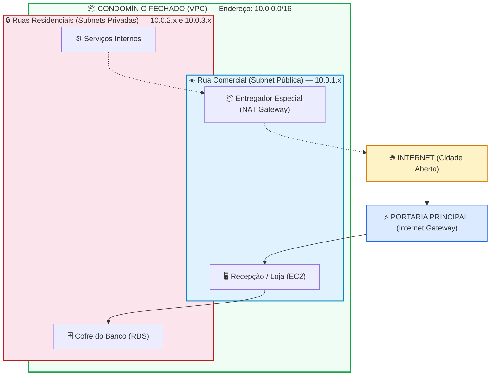
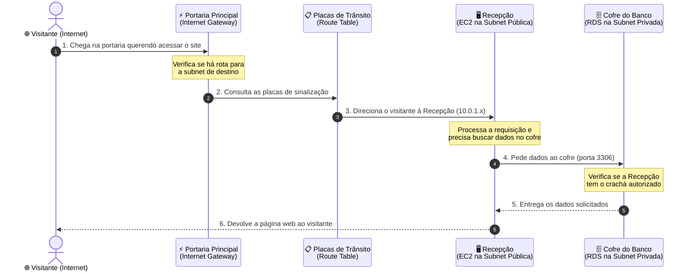

# 🟢 Aula 14: VPC e Redes na Nuvem

**Disciplina:** Cloud Computing (Cód. 14189)  
**Curso:** Inteligência Artificial e Ciência de Dados, Uniube  
**Semana:** 13 | Sexta-feira, 22/05/2026  
**Professor:** Romualdo Mathias Filho  
**Tipo:** 📘 Teórica  
**Tópicos:** [[VPC]] (Virtual Private Cloud), Blocos CIDR, Subnets Públicas e Privadas, Tabelas de Roteamento, Internet Gateway (IGW), NAT Gateway, Security Groups Encadeados e NACLs.

---

> [!INFO] 🎯 Visão Geral da Aula & Recursos
> **"Entenda como as redes virtuais funcionam na nuvem — mesmo que você nunca tenha estudado Redes de Computadores — e descubra como empresas isolam seus bancos de dados de forma segura."**
> 
> * **O que você vai aprender:**
>   - O que é uma rede virtual na nuvem e por que ela é essencial.
>   - Como funciona o endereçamento (IP e CIDR) usando analogias do mundo real.
>   - A diferença entre áreas públicas e privadas dentro de uma rede na nuvem.
>   - Como os firewalls virtuais protegem seus servidores em camadas.
> * **Pré-requisitos:** Apenas familiaridade com o laboratório da [[Aula 13 - Pratica - VPC Completa e Isolamento de Banco de Dados com Terraform|Aula 13p]] (Terraform). Não é necessário ter cursado Redes de Computadores.
> * **📂 Recursos Adicionais:**
>   - [Código Terraform de Suporte no GitHub](https://github.com/rofilho/cloud-computing-uniube/tree/main/aula13-vpc)

---

## 🎯 Objetivos de Aprendizagem

Ao final desta aula, você será capaz de:
1. Explicar o que é uma VPC e por que ela existe, usando suas próprias palavras.
2. Entender como os endereços IP funcionam dentro de uma rede na nuvem (notação CIDR).
3. Diferenciar subnet pública de subnet privada e saber quando usar cada uma.
4. Explicar o papel do Internet Gateway, do NAT Gateway e das Tabelas de Roteamento.
5. Comparar Security Groups e NACLs e entender por que usamos os dois.
6. Conectar toda essa teoria com o que vocês construíram no laboratório prático com [[Terraform]].

---

## 🔄 Revisão Rápida: O que Aconteceu no Lab da Semana Passada? (10 min)

Na última aula prática ([[Aula 13 - Pratica - VPC Completa e Isolamento de Banco de Dados com Terraform|Aula 13p]]), vocês criaram uma infraestrutura completa usando Terraform. Vamos relembrar os três testes que fizemos e entender **por que** cada um teve o resultado que teve:

| **O que testamos** | **O que aconteceu e por quê** |
| :--- | :--- |
| **Teste 1:** Conectar no banco de dados (RDS) direto do nosso computador | Deu **Timeout** (ficou carregando e não conectou). O banco estava numa área isolada da rede — sem nenhum caminho de acesso direto vindo da internet. |
| **Teste 2:** Acessar o servidor EC2 via SSH | **Funcionou!** O servidor EC2 estava numa área pública da rede, com uma rota de saída para a internet configurada. |
| **Teste 3:** De dentro do EC2, conectar no banco RDS | **Funcionou!** O EC2 e o RDS estão dentro da mesma rede privada, e o firewall do banco foi configurado para aceitar conexões vindas do servidor EC2. |

> [!TIP] 💡 Por que isso importa na vida real?
> O Terraform automatizou os cliques no console da AWS, mas o valor real é a **segurança por design**. Mesmo que um invasor descubra a senha do banco de dados, ele **não consegue conectar**, porque simplesmente não existe estrada levando da internet até o banco. Ele precisaria primeiro invadir o servidor EC2 na área pública para depois tentar acessar o banco internamente. Isso se chama **Defesa em Profundidade** (*Defense-in-Depth*).

---

## 📌 0. Antes de Tudo: O que é uma Rede de Computadores? (5 min)

> **Se você nunca estudou Redes, este é o único conceito que precisa entender antes de continuar.**

Uma **rede de computadores** é simplesmente um grupo de dispositivos (computadores, servidores, celulares) conectados entre si para trocar informações. Quando você acessa o Instagram, seu celular envia uma mensagem pela internet até um servidor do Meta, que responde com o conteúdo do seu feed.

Para que essa comunicação funcione, cada dispositivo precisa de um **endereço único** — assim como cada casa tem um CEP. No mundo das redes, esse endereço se chama **IP** (Internet Protocol).

- **IP Público:** É como o endereço da sua casa com CEP completo — qualquer pessoa no mundo consegue te encontrar por ele.
- **IP Privado:** É como o número do seu apartamento dentro de um condomínio fechado — só quem já está dentro do condomínio consegue chegar até você por esse número.

> 🎯 **É só isso que você precisa saber por enquanto!** Com esse conceito em mente, vamos construir toda a teoria de VPC usando uma analogia simples e poderosa.

---

## 📌 1. A Metáfora do Condomínio Fechado: Entendendo VPC do Zero (15 min)

Para explicar redes na nuvem de forma intuitiva, vamos usar uma analogia completa: **um Condomínio Fechado de Luxo**.

### 🗺️ O Mapa do Nosso Condomínio



### 🏢 Traduzindo os Termos Técnicos

Cada conceito de rede na nuvem tem um equivalente direto no nosso condomínio:

| **Conceito na Nuvem** | **No Condomínio** | **Explicação Simples** |
| :--- | :--- | :--- |
| **VPC** | O Condomínio Fechado inteiro | Seu terreno privado na nuvem, com muros altos. Ninguém de fora entra sem autorização. Cada conta AWS pode ter várias VPCs. |
| **Subnet Pública** | A Rua Comercial (na entrada) | Área acessível para visitantes. Aqui ficam os servidores web que precisam atender clientes da internet. |
| **Subnet Privada** | As Ruas Residenciais (no fundo) | Área restrita, sem acesso externo direto. Aqui ficam os bancos de dados e serviços internos sensíveis. |
| **IP** | O número da casa | Endereço único que identifica cada recurso (servidor, banco de dados) dentro da rede. |
| **CIDR** | O sistema de numeração das ruas | Define quantas casas cabem em cada rua. Veremos em detalhe a seguir. |

---

### 🔢 Entendendo IPs e CIDR sem Complicação

O **CIDR** (Classless Inter-Domain Routing) é apenas o sistema de numeração que define o tamanho de uma rede. Funciona assim:

**O endereço do condomínio inteiro: `10.0.0.0/16`**
- A parte `10.0.` é fixa — é o "CEP" do condomínio.
- O `/16` indica que os primeiros 16 bits (dois primeiros números) são fixos.
- Os dois últimos números podem variar livremente (de `10.0.0.0` a `10.0.255.255`).
- Resultado: **65.536 endereços possíveis** dentro desse condomínio.

**O endereço de uma rua específica: `10.0.1.0/24`**
- Agora `10.0.1.` é a parte fixa — é o "nome da rua".
- O `/24` indica que os primeiros 24 bits (três primeiros números) são fixos.
- Apenas o último número varia (de `10.0.1.0` a `10.0.1.255`).
- Resultado: **256 endereços** nessa rua.

**Mas atenção:** a AWS reserva **5 endereços** em cada subnet para uso administrativo interno:

| **IP Reservado** | **Quem usa** |
| :--- | :--- |
| `10.0.1.0` | Endereço da própria rede |
| `10.0.1.1` | Roteador interno da VPC |
| `10.0.1.2` | Servidor DNS da AWS |
| `10.0.1.3` | Reservado para uso futuro |
| `10.0.1.255` | Endereço de broadcast |

Portanto, em um bloco `/24`, você tem **256 - 5 = 251 endereços livres** para seus servidores e bancos de dados.

> [!NOTE] 💼 Pergunta de Entrevista de Emprego
> **"Sua aplicação precisa de 1.000 instâncias ativas divididas igualmente em 4 subnets. Qual bloco CIDR usar em cada subnet?"**
> 
> **Raciocínio:** Cada subnet precisa de 250 instâncias + 5 reservas da AWS = 255 IPs no mínimo.  
> - `/24` = 256 IPs → 251 livres → **atende** ✅  
> - `/25` = 128 IPs → 123 livres → **insuficiente** ❌  
> - Resposta: **`/24`** é a menor máscara que funciona.

---

## 📌 2. Como os Dados Trafegam: Portarias, Entregadores e Placas (20 min)

Agora que sabemos como o condomínio é organizado internamente, vamos entender como os dados entram, saem e se movimentam.

### 🔀 O Caminho Completo de uma Requisição Web



### 🚪 Os Três Componentes de Controle de Tráfego

#### ⚡ Internet Gateway (IGW) — A Portaria Principal

| | |
|---|---|
| **No condomínio** | É a portaria de entrada e saída. Funciona nos dois sentidos: visitantes entram e moradores saem. |
| **Na nuvem** | Componente que conecta sua VPC à internet pública. É gratuito e altamente disponível. |
| **Regra importante** | Uma subnet só é considerada **pública** se sua tabela de roteamento tiver uma rota apontando para o IGW. Sem essa rota → subnet privada. |

#### 📦 NAT Gateway — O Entregador Especial

| | |
|---|---|
| **No condomínio** | Os moradores das ruas residenciais (subnet privada) querem pedir comida por delivery. Mas os motoboys não podem entrar na área residencial e os moradores não podem sair até a portaria. Então o condomínio contrata um **entregador especial** que fica na rua comercial: o morador pede → o entregador vai lá fora, busca e entrega na casa privada. Ninguém de fora consegue falar diretamente com o morador. |
| **Na nuvem** | Permite que servidores privados façam downloads (atualizações, pacotes npm/pip) sem ficarem expostos à internet. O tráfego é **unidirecional**: só sai, nunca entra. |

> [!WARNING] ⚠️ Cuidado com o Custo!
> O Internet Gateway é **gratuito**. Já o NAT Gateway é **cobrado por hora** (~$0.045/h) + dados processados. Em laboratórios acadêmicos, isso pode consumir seus créditos rápido. **Dica:** use `terraform destroy` logo após os testes ou simplesmente não crie NAT Gateway em labs — use a EC2 pública como ponto de passagem (bastion host).

#### 📋 Route Tables — As Placas de Trânsito

| | |
|---|---|
| **No condomínio** | São as placas de sinalização nas esquinas: *"Rua Principal → siga em frente"*; *"Saída do condomínio → Portaria Principal"*. |
| **Na nuvem** | Tabelas com regras que determinam para onde o tráfego vai. |

Na prática, uma Route Table tem essa cara:

| **Destino** | **Alvo** | **O que faz** |
| :--- | :--- | :--- |
| `10.0.0.0/16` | `local` | Tráfego interno: qualquer subnet fala com qualquer subnet dentro da VPC |
| `0.0.0.0/0` | `igw-xxxxx` | Tráfego externo: tudo que não for interno vai para o Internet Gateway (internet) |

- A **subnet pública** tem a rota `0.0.0.0/0 → IGW` (tem saída para a internet).
- A **subnet privada** **não tem** essa rota (fica isolada do mundo externo).

---

## 📌 3. Firewalls Virtuais: Security Groups vs. NACLs (15 min)

Agora vamos entender as **duas camadas de proteção** que a AWS coloca na frente dos seus servidores. Continuando a analogia do condomínio:

### 🏗️ As Duas Barreiras de Segurança

```
       [ 🌐 INTERNET ]
              │
              ▼
┌──────────────────────────────────────────┐
│  🚧 NACL (Network ACL)                  │  ← Guarita na entrada da RUA
│  Stateless · Permite e Bloqueia          │
└──────────────────────────────────────────┘
              │
              ▼
        ┌─────────────────────────┐
        │  🛡️ Security Group (SG) │  ← Segurança na porta da CASA
        │  Stateful · Só permite  │
        └─────────────────────────┘
              │
              ▼
        [ 🖥️ Sua Instância ]
```

O tráfego passa pelas duas barreiras em sequência. Vamos entender cada uma:

### 📊 Comparação Lado a Lado

| **Aspecto** | **Security Group (SG)** | **Network ACL (NACL)** |
| :--- | :--- | :--- |
| **Analogia** | Segurança na **porta da sua casa** | Guarita na **entrada da rua** |
| **Protege o quê?** | Uma instância específica (EC2, RDS) | A subnet inteira (todas as instâncias da rua) |
| **Stateful ou Stateless?** | **Stateful** — tem memória | **Stateless** — não tem memória |
| **O que isso significa?** | Se alguém entra com autorização, pode sair sem nova checagem | Toda entrada e saída precisa de autorização separada |
| **Tipos de regra** | Apenas **ALLOW** (quem pode entrar) | **ALLOW** e **DENY** (quem pode e quem não pode) |
| **Ordem das regras** | Avalia todas as regras juntas | Avalia em ordem numérica (regra 100, 200, 300...) |

> [!NOTE] 🧠 Entendendo Stateful vs. Stateless com um exemplo
> **Cenário:** Um cliente acessa seu site na porta 80.
> 
> **Security Group (Stateful):** Você só precisa criar a regra de entrada na porta 80. A resposta de volta para o cliente é liberada **automaticamente**, porque o SG "lembra" que aquela conexão foi autorizada na entrada.
> 
> **Network ACL (Stateless):** Você precisa criar a regra de entrada na porta 80 **E** uma regra de saída separada para permitir a resposta. Se esquecer a regra de saída, o cliente nunca receberá a resposta.

---

### 🔗 Encadeamento de Security Groups: O Sistema de Crachás

Em vez de liberar acesso ao banco de dados por endereço IP (que pode mudar a qualquer momento), a AWS permite um mecanismo muito mais inteligente: **liberar por crachá** (Security Group ID).

**Na analogia do condomínio:**
- O cofre do banco (RDS) não mantém uma lista de CPFs autorizados.
- Em vez disso, a regra diz: *"Qualquer pessoa usando o crachá azul da Recepção pode entrar."*
- Se contratarmos 10 novos recepcionistas e dermos o crachá azul para todos, **todos** terão acesso ao cofre automaticamente.
- Se alguém perder o crachá, perde o acesso na hora.

**No Terraform (`database.tf`)**, isso é escrito assim:

```hcl
# Regra do Security Group do banco de dados:
ingress {
  from_port       = 3306
  to_port         = 3306
  protocol        = "tcp"
  security_groups = [aws_security_group.ec2_sg.id]  # ← O "crachá azul"
}
```

**Por que isso é genial?**
- Se o Auto Scaling criar 50 novas instâncias EC2 com o crachá `ec2_sg`, todas acessam o banco **automaticamente**.
- Se uma instância EC2 for destruída, ela perde o crachá e o acesso é revogado **instantaneamente**.
- Nenhum IP é hardcoded. Tudo é dinâmico e escalável.

### 🧠 Checkpoint: Teste seu Conhecimento!

<details>
<summary><b>🔍 Exercício Rápido: O que acontece se removermos TODAS as regras de saída (Egress) do Security Group de uma EC2? O cliente externo ainda conseguirá acessar a página web?</b></summary>
<blockquote>

**Resposta: Sim, o cliente ainda acessará!**

Como os Security Groups são **Stateful**, o firewall "lembra" que a conexão de entrada (porta 80) foi autorizada. Portanto, ele permite que a resposta de saída volte ao cliente **automaticamente**, mesmo sem nenhuma regra de saída explícita.

Se fosse uma **Network ACL (Stateless)**, a resposta seria bloqueada na saída, porque NACLs não lembram de conexões anteriores — seria necessário criar uma regra de saída manualmente.

</blockquote>
</details>

---

## 📌 4. Defesa em Profundidade: Por que Tudo Isso Importa (10 min)

Vamos unir tudo o que aprendemos em um princípio de segurança usado por todas as grandes empresas de tecnologia:

> **Defesa em Profundidade (Defense-in-Depth):** Nunca dependa de uma única barreira. Crie múltiplas camadas de proteção, para que a falha de uma não comprometa o sistema inteiro.

### 🏦 Cenário Real: Protegendo um Sistema de Pagamentos

Imagine que estamos construindo o backend de um sistema de Pix para uma fintech:

```
┌─ Camada 1: ISOLAMENTO DE REDE ──────────────────────────────────────────┐
│  O banco de dados fica numa subnet PRIVADA.                             │
│  Não existe rota da internet até ele. Ponto final.                      │
│  → Mesmo com a senha vazada, ninguém conecta.                           │
├─ Camada 2: FIREWALL LÓGICO (Security Group) ────────────────────────────┤
│  O SG do banco só aceita conexões vindas do crachá da EC2.              │
│  → Mesmo dentro da VPC, um container comprometido sem o crachá          │
│     não consegue acessar o banco.                                       │
├─ Camada 3: AUTENTICAÇÃO ────────────────────────────────────────────────┤
│  Usuário e senha do banco (ou IAM Authentication).                      │
│  → Última barreira. Se todas as outras falharem, ainda precisa da senha.│
└─────────────────────────────────────────────────────────────────────────┘
```

**Compare com a alternativa insegura:** colocar o banco de dados na subnet pública com IP público, protegido apenas por senha. Um ataque de força bruta, um vazamento de credenciais no GitHub ou uma falha zero-day no MySQL significaria **comprometimento total e imediato**.

> [!TIP] 💡 Como as Grandes Empresas Fazem
> Fintechs como Nubank e iFood utilizam o conceito de **Zero Trust** (Confiança Zero): bancos de dados **nunca** recebem IPs públicos. Para manutenção em produção, os engenheiros SRE **não abrem portas SSH** na internet. Em vez disso, usam o **AWS Systems Manager (SSM) Session Manager**, que cria um túnel criptografado direto — sem precisar abrir nenhuma porta de firewall.

---

## 📋 Resumo Estrutural (Cheatsheet)

| **Conceito** | **Analogia** | **Definição Técnica** |
| :--- | :--- | :--- |
| **VPC** | Condomínio Fechado | Rede virtual privada e isolada na nuvem AWS |
| **Subnet Pública** | Rua Comercial (na entrada) | Segmento de rede com rota para o Internet Gateway |
| **Subnet Privada** | Ruas Residenciais (no fundo) | Segmento isolado, sem acesso direto da internet |
| **CIDR** | Sistema de numeração de casas/ruas | Notação que define o tamanho de um bloco de IPs (ex: `/16`, `/24`) |
| **Internet Gateway** | Portaria Principal | Portão bidirecional que conecta a VPC à internet |
| **NAT Gateway** | Entregador Especial | Saída unidirecional para downloads sem exposição |
| **Route Table** | Placas de Trânsito | Regras que definem o destino do tráfego em cada subnet |
| **Security Group** | Segurança na porta da casa | Firewall stateful por instância (só Allow) |
| **Network ACL** | Guarita na entrada da rua | Firewall stateless por subnet (Allow + Deny) |

---

%%
## ❓ Banco de Questões

> 🔒 *Esta seção é visível apenas no Obsidian do professor. Não publicada para os alunos no Quartz.*

### Questão 1 (Múltipla Escolha — Nível: Intermediário)
**Enunciado:** Uma empresa de e-commerce brasileira hospeda sua aplicação web na AWS. A equipe de SRE configurou um banco de dados Amazon RDS MySQL em uma sub-rede cujos recursos não possuem IPs públicos associados. A tabela de roteamento dessa sub-rede possui apenas a rota local padrão `10.0.0.0/16 -> local`. Um desenvolvedor júnior precisa fazer uma manutenção emergencial no banco e tenta conectar seu client local (DBeaver) diretamente ao endpoint do banco via internet. O que ocorrerá e qual é a justificativa técnica?

- [ ] A) A conexão será bem-sucedida, contanto que o desenvolvedor tenha a senha master do banco de dados MySQL.
- [ ] B) A conexão falhará com erro de autenticação (Access Denied), pois o banco está configurado para aceitar apenas tráfego criptografado com chaves SSL corporativas.
- [x] C) A conexão falhará por estouro de tempo (Timeout), porque não existe caminho de rede físico (rota para o Internet Gateway) e o RDS não possui IP público associado. ✅
- [ ] D) A conexão será interceptada por uma regra do CloudWatch, que moverá automaticamente o banco de dados para a subnet pública para permitir a manutenção.

**Justificativa:** O RDS MySQL está alocado em uma subnet puramente privada. Sem IP público e sem rota configurada para um Internet Gateway (IGW) na tabela de roteamento da subnet, o tráfego vindo da internet não consegue encontrar caminho físico de entrada para o banco, resultando em Timeout.

---

### Questão 2 (Múltipla Escolha — Nível: Avançado)
**Enunciado:** Um arquiteto de soluções Cloud está projetando a rede de um novo sistema de processamento de Pix. Ele cria uma VPC com o bloco CIDR `192.168.0.0/16`. Ele deseja dividir essa rede em subnets menores para diferentes microsserviços. Ao criar uma subnet com o bloco CIDR `192.168.10.0/24`, quantas instâncias de servidores virtuais (EC2) ele conseguirá provisionar ativamente nessa subnet com IPs utilizáveis?

- [ ] A) 256 instâncias.
- [ ] B) 254 instâncias.
- [x] C) 251 instâncias. ✅
- [ ] D) 250 instâncias.

**Justificativa:** Embora um bloco `/24` possua $2^8 = 256$ endereços IP matemáticos possíveis, a AWS reserva automaticamente **5 endereços IP** em cada sub-rede para serviços internos de infraestrutura (.0, .1, .2, .3 e .255). Logo, restam $256 - 5 = 251$ endereços IP utilizáveis para alocação ativa de recursos.

---

### Questão 3 (Dissertativa — Nível: Avançado)
**Enunciado:** Explique de que forma o princípio da Defesa em Profundidade (Defense-in-Depth) é materializado ao implementarmos uma arquitetura de rede Multi-Tier contendo subnets públicas e privadas associadas a Security Groups encadeados. Na sua resposta, discuta a diferença de segurança entre essa abordagem e a hospedagem simples de servidores web e bancos de dados na mesma subnet pública, protegidos apenas por senhas de banco.

**Resposta esperada:**
A materialização do princípio da Defesa em Profundidade na arquitetura Multi-Tier ocorre através do estabelecimento de barreiras e filtros de segurança independentes e complementares:
1. **Camada de Isolamento de Rede:** O banco de dados RDS fica hospedado em subnets privadas sem caminhos de roteamento físico para a internet (sem Internet Gateway). Mesmo que as credenciais do banco sejam expostas, nenhum atacante externo conseguirá estabelecer uma conexão TCP direta a partir da internet pública, pois o caminho de rede é inexistente.
2. **Camada de Controle de Acesso Lógico (Firewall):** O Security Group do RDS é configurado de forma encadeada, autorizando tráfego de entrada estritamente a partir do ID do Security Group da EC2 pública. Isso impede que mesmo recursos internos que consigam entrar na VPC (mas que estejam fora do SG permitido, como outra EC2 de teste ou um contêiner comprometido) acessem o banco.
3. **Controle de Autenticação Tradicional:** A senha do banco (segurança de aplicação) atua apenas como a última barreira de proteção.

Em contrapartida, hospedar o banco na mesma subnet pública com IP público e dependendo apenas de senhas de acesso reduz as defesas a um único ponto de falha (Single Point of Failure). Qualquer vulnerabilidade de força bruta, vazamento de credenciais em arquivos de configuração públicos no GitHub ou falha de dia-zero (zero-day) na engine do banco permitiria o comprometimento total e imediato dos dados por atacantes automatizados na internet. A arquitetura de rede Multi-Tier garante que, para comprometer o banco de dados, o invasor precisaria quebrar o isolamento de rede do IGW, comprometer a EC2 na rede pública, herdar o perfil do Security Group e, finalmente, quebrar a credencial do banco, aumentando significativamente a robustez do sistema.

---
%%

## 📄 Artigo de Aprofundamento

- [AWS Virtual Private Cloud (VPC) Fundamentals — AWS Tech Documentation](https://docs.aws.amazon.com/vpc/latest/userguide/what-is-amazon-vpc.html)
  > *Documentação oficial que detalha os conceitos fundamentais de funcionamento de sub-redes, roteamento de pacotes e gateways na nuvem AWS.*

---

## 📚 Referências Bibliográficas

- ANTUNES, Jonathan Lamim. *Amazon AWS: descomplicando a computação em nuvem*. 1ª ed. São Paulo: Casa do Código, 2016. **(Capítulo 5: Redes e Segurança com VPC, pp. 87–104)**
- BRIKMAN, Yevgeniy. *Terraform: Up & Running*. 3ª ed. Sebastopol: O'Reilly Media, 2022. **(Capítulo 4: How to Create Reusable Infrastructure with Terraform Modules, pp. 112–134)**
- TANENBAUM, Andrew S.; WETHERALL, David J. *Redes de Computadores*. 5ª ed. São Paulo: Pearson, 2013. **(Capítulo 5: A Camada de Rede e Roteamento IP, pp. 340–378)**

---
*Última atualização: 2026-05-22 | Status: publicado*
