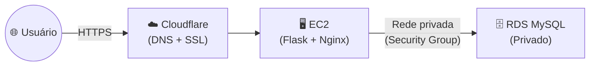

# 🚀 Aula 16: Projeto Final — Deploy de Aplicação Completa em Nuvem

**Disciplina:** Cloud Computing (Cód. 14189)
**Curso:** Inteligência Artificial e Ciência de Dados — Uniube
**Semana:** 16 | Quarta-feira
**Professor:** Romualdo Mathias Filho
**Tipo:** 🔬 Prática — Estudo Autônomo Avaliado

---

> 💬 *"A nuvem não é um destino — é uma forma de construir. Hoje vocês param de aprender sobre nuvem e começam a construir com ela. Uma aplicação real, com banco de dados real, acessível por um domínio real. E sim, vocês vão usar IA para gerar o código — porque no mercado, o profissional de nuvem não é avaliado por escrever código, é avaliado por fazer o sistema funcionar no ar."*

---

## 🎯 Objetivo

Ao final desta atividade, os grupos serão capazes de:

- Provisionar infraestrutura completa na AWS (EC2 + RDS) de forma funcional.
- Utilizar **IA Generativa** para criar o código da aplicação usando **prompts estruturados**.
- Implantar um backend com conexão a banco de dados relacional em produção.
- Implantar um frontend acessível pela internet com URL pública.
- Configurar um domínio DNS via Cloudflare apontando para a aplicação na nuvem.
- Documentar todo o processo em relatório técnico seguindo as normas ABNT.

---

## 🔄 Conexão com o Semestre

| **Conceito Visto nas Aulas** | **Como Aparece neste Projeto** |
| --- | --- |
| EC2 e Instâncias (Aula 06/08) | Servidor que rodará o backend da aplicação |
| RDS — Banco de Dados na Nuvem (Aula 10/11) | Banco de dados privado acessado pelo backend |
| Security Groups e Rede (Aula 11/15) | Firewall isolando banco da internet |
| Terraform / IaC (Aula 12) | Opcional: provisionar tudo via código |
| Segurança (Aula 13) | Credenciais fora do código, portas mínimas |
| FinOps e Custos (Aula 14) | Escolher instâncias Free Tier, documentar custo |

---

## 📋 Visão Geral do Trabalho

O grupo vai construir e implantar uma **aplicação web funcional completa em nuvem**, acessível por um domínio real configurado via Cloudflare.

---

## 🤖 O Papel da IA neste Projeto

> **O código da aplicação será gerado por Inteligência Artificial.**

O grupo **não precisa saber programar** em Python, JavaScript ou SQL. O que precisa é:

1. **Escolher o tema** da aplicação
2. **Usar os prompts fornecidos** para que a IA gere o código
3. **Fazer o deploy** — colocar tudo funcionando na nuvem
4. **Documentar** tudo no relatório

### Os Prompts (Cadeia Sequencial)

| # | Prompt | O que gera | Entrada necessária |
|---|---|---|---|
| 🖥️ **0** | [Infraestrutura na AWS](./Prompts-IA-Projeto-Final#%EF%B8%8F-prompt-0--infraestrutura-na-aws-ec2--rds) | Guia passo a passo para criar EC2 + RDS + Security Groups no console da AWS | Nenhuma |
| 📋 **1** | [Banco de Dados](./Prompts-IA-Projeto-Final#-prompt-1--banco-de-dados-schema-sql) | Schema SQL completo (`CREATE TABLE` + `INSERT`) | Tema da aplicação |
| ⚙️ **2** | [Backend](./Prompts-IA-Projeto-Final#%EF%B8%8F-prompt-2--backend-api-python--flask) | API Flask com todos os endpoints | Tema + SQL do Prompt 1 |
| 🖥️ **3** | [Frontend](./Prompts-IA-Projeto-Final#%EF%B8%8F-prompt-3--frontend-interface-web) | Interface HTML/CSS/JS completa | Tema + código do Prompt 2 |
| 🚀 **4** | [Deploy na EC2](./Prompts-IA-Projeto-Final#-prompt-4--deploy-com-nginx-na-ec2) | Guia de deploy com Nginx | — |

> 📌 **Todos os prompts estão na página [Prompts de IA →](./Prompts-IA-Projeto-Final)** — abra e deixe ao lado enquanto trabalha.

> ⚠️ **Regra:** O grupo precisa **entender e saber explicar** o código gerado. Na avaliação, o professor poderá perguntar para qualquer integrante como funciona qualquer parte do sistema.

---

## ✅ O que a aplicação precisa ter

### Requisitos Obrigatórios

| Requisito | Descrição |
|---|---|
| ☁️ Hospedada em nuvem | EC2 rodando o backend da aplicação |
| 🗄️ Banco de dados privado | RDS MySQL — sem acesso direto pela internet |
| 🔐 Security Groups corretos | SG do banco aceita conexões **apenas** da EC2 |
| 🌐 DNS e HTTPS | Domínio configurado via Cloudflare, com cadeado HTTPS ativo |
| 📄 Relatório técnico (ABNT) | Com diagrama, screenshots e custo estimado — mín. 5 páginas |
| 🎥 Vídeo (máx. 5 min) | Demonstrando o projeto com o console da AWS aberto |

### ⭐ Diferenciais (O professor incentiva — não são obrigatórios)

| Diferencial | Descrição |
|---|---|
| 🔧 Terraform | Provisionar a infraestrutura via código |
| 🔄 CI/CD | Push no GitHub → deploy automático |

---

## 📦 O que entregar

| # | Entregável | Como |
|---|---|---|
| 📝 **1** | Relatório técnico (ABNT) com todas as evidências incorporadas | PDF no AVA |
| 🎥 **2** | Link do vídeo (máx. 5 min) com a AWS aberta | Incluído dentro do PDF |
| 🎤 **3** | Apresentação ao vivo para o professor | Presencial, a partir de 10/06 |

**Formato do arquivo:** `nome_do_grupo.pdf`

### ⚠️ Prazo — Sem Exceções

> **O prazo de entrega do PDF é fixo: 10/06/2026 às 23h59.**
>
> A seção de Estudos Autônomos no AVA fecha automaticamente nesse horário. Após o fechamento, **não é possível enviar o arquivo**, independentemente do motivo.
>
> **Entregue antes do prazo. Não deixe para o último dia.**

---

## 🎤 Sobre a Apresentação ao Vivo

Durante a apresentação (a partir de 10/06), o professor poderá:
- ✅ Pedir para executar o `terraform apply` ao vivo (se usou Terraform)
- ✅ Pedir para acionar o CI/CD via git push (se implementou)
- ✅ Solicitar demonstração prática de qualquer parte da infraestrutura
- ✅ Fazer perguntas individuais a qualquer integrante

---

## 📄 Estrutura do Relatório Técnico (ABNT)

| Seção | O que deve conter |
|---|---|
| **Capa** | Nome do grupo, integrantes (nome + matrícula), disciplina, professor, data |
| **Sumário** | Com as seções e páginas |
| **Introdução** | Contexto do projeto, objetivo, tema escolhido |
| **Arquitetura** | Diagrama obrigatório + descrição de cada serviço |
| **Implementação** | Passo a passo com screenshots; incluir prompts usados e como foram adaptados |
| **Testes e Evidências** | Screenshots organizados, legendados e referenciados no texto |
| **Conclusão** | Aprendizados e dificuldades encontradas |
| **Referências** | Fontes no formato ABNT |

**Formatação ABNT:**

| Elemento | Padrão |
|---|---|
| Fonte | Times New Roman tamanho 12 |
| Espaçamento | 1,5 entrelinhas |
| Margens | Superior e esquerda: 3 cm / Inferior e direita: 2 cm |
| Parágrafo | Recuo de 1,25 cm na primeira linha |
| Figuras | "Figura X — Descrição. Fonte: Autores, 2026." |
| Mínimo de páginas | **5 páginas de conteúdo** (excluindo capa e sumário) |

---

## 📊 Rubrica de Avaliação — 20 pontos

| Critério | Muito Bom (A) | Bom (B/C) | Precisa Melhorar (D/F) | Pts |
|---|---|---|---|---|
| **Parte Escrita + Vídeo** | Arquitetura documentada, aplicação funcionando, segurança aplicada, custos documentados, vídeo explicativo | Relatório com seções faltando ou sem vídeo | Sem relatório ou sem evidências | **13 pts** |
| **Apresentação e Arguição** | Demo ao vivo funcionando, respostas técnicas corretas de todos os integrantes | Apresentação com falhas ou respostas parciais | Não apresentou ou aplicação não funcionou | **7 pts** |

> 💡 Grupos que usarem **Terraform** e/ou **CI/CD** demonstram maior domínio técnico — valorizado nas perguntas da arguição.

---

## 💡 Dicas para o Sucesso

**Para a infraestrutura:**
- Use o **Prompt 0** para obter o guia de criação da EC2 + RDS direto pelo console da AWS.
- Lembre-se: banco de dados **sempre privado** — Security Group do RDS só aceita conexões da EC2.
- Guarde o endpoint do RDS — você vai precisar colocar no arquivo `.env` do backend.

**Para os prompts de IA:**
- Siga a ordem: **Prompt 1 → 2 → 3 → 4**. Cada um depende do anterior.
- Se a IA gerar código com erro, cole o erro de volta na conversa e peça para corrigir.

**Para o Cloudflare:**
- Crie uma conta gratuita em cloudflare.com.
- O proxy laranja ☁️ ativado habilita o HTTPS automaticamente.
- Propagação DNS pode levar até 24h — configure com antecedência.

**Para o relatório:**
- Tirem screenshots desde o início — é mais fácil documentar enquanto fazem.
- Numerem os screenshots: *"Conforme a Figura 3, a instância RDS está com status Available..."*

---

## 📚 Referências

- Amazon Web Services. *Amazon RDS User Guide*. aws.amazon.com, 2026.
- Cloudflare, Inc. *Cloudflare Learning Center — DNS*. cloudflare.com, 2026.
- Associação Brasileira de Normas Técnicas. *NBR 14724: Trabalhos acadêmicos — Apresentação*. ABNT, 2011.

---

*Última atualização: 2026-05-13 | Cloud Computing — Uniube 2026 | Prof. Romualdo Mathias Filho*
