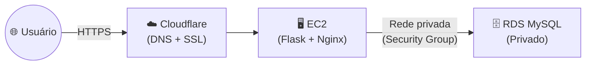

# 🚀 Aula 16: Projeto Final — Deploy de Aplicação Completa em Nuvem

**Disciplina:** Cloud Computing (Cód. 14189)
**Curso:** Inteligência Artificial e Ciência de Dados — Uniube
**Semana:** 16 | Quarta-feira
**Professor:** Romualdo Mathias Filho
**Tipo:** 🔬 Prática — Estudo Autônomo Avaliado
**Tópicos:** EC2, RDS, DNS, Cloudflare, Backend, Frontend, IA Generativa, Infraestrutura em Nuvem

---

> 💬 *"A nuvem não é um destino — é uma forma de construir. Hoje vocês param de aprender sobre nuvem e começam a construir com ela. Uma aplicação real, com banco de dados real, acessível por um domínio real. E sim, vocês vão usar IA para gerar o código — porque no mercado, o profissional de nuvem não é avaliado por escrever código, é avaliado por fazer o sistema funcionar no ar."*

---

## 🎯 Objetivo da Aula

Ao final desta atividade, os grupos serão capazes de:

- Provisionar infraestrutura completa na AWS (EC2 + RDS) de forma funcional.
- Utilizar **IA Generativa** (ChatGPT, Claude, Gemini) para criar o código da aplicação usando **prompts estruturados**.
- Implantar um backend com conexão a banco de dados relacional em produção.
- Implantar um frontend acessível pela internet com URL pública.
- Configurar um domínio DNS via Cloudflare apontando para a aplicação na nuvem.
- Documentar todo o processo em relatório técnico seguindo as normas ABNT.

---

## 🔄 Conexão com o Semestre

| **Conceito Visto nas Aulas** | **Como Aparece neste Projeto** |
| --- | --- |
| EC2 e Instâncias (Aula 06/08) | Servidor que rodará o backend da aplicação |
| RDS — Banco de Dados na Nuvem (Aula 10/11) | Banco de dados privado acessado pelo backend |
| Security Groups e Rede (Aula 11/15) | Firewall isolando banco da internet |
| Terraform / IaC (Aula 12) | Opcional: provisionar tudo via código |
| Segurança (Aula 13) | Credenciais fora do código, portas mínimas |
| FinOps e Custos (Aula 14) | Escolher instâncias Free Tier, documentar custo |

---

## 📋 Visão Geral do Trabalho

O grupo vai construir e implantar uma **aplicação web funcional completa na AWS**, acessível por um domínio real configurado via Cloudflare.

A aplicação precisa ser real — não é uma simulação, não é um print do console. É uma URL que qualquer pessoa pode abrir no navegador e usar.



---

## 🤖 O Papel da IA neste Projeto

> **O código da aplicação será gerado por Inteligência Artificial.**

O grupo **não precisa saber programar** em Python, JavaScript ou SQL. O que o grupo precisa saber é:

1. **Escolher o tema** da aplicação (catálogo de filmes, agenda, cardápio, etc.)
2. **Usar os prompts fornecidos** para que a IA gere o código do banco, backend e frontend
3. **Fazer o deploy** — colocar tudo funcionando na AWS
4. **Documentar** tudo no relatório

O professor fornece **4 prompts prontos e estruturados**. O grupo cola cada prompt na IA, personaliza com o tema escolhido, e recebe o código. O desafio é fazer funcionar na nuvem.

### Os 4 Prompts (Cadeia Sequencial)

| # | Prompt | O que gera | Entrada necessária |
|---|---|---|---|
| 📋 **1** | [Banco de Dados](./Prompts-IA-Projeto-Final#-prompt-1--banco-de-dados-schema-sql) | Schema SQL completo (`CREATE TABLE` + `INSERT`) | Tema da aplicação |
| ⚙️ **2** | [Backend](./Prompts-IA-Projeto-Final#%EF%B8%8F-prompt-2--backend-api-python--flask) | API Flask com todos os endpoints | Tema + SQL do Prompt 1 |
| 🖥️ **3** | [Frontend](./Prompts-IA-Projeto-Final#%EF%B8%8F-prompt-3--frontend-interface-web) | Interface HTML/CSS/JS completa | Tema + código do Prompt 2 |
| 🚀 **4** | [Deploy na EC2](./Prompts-IA-Projeto-Final#-prompt-4--deploy-com-nginx-na-ec2) | Guia de deploy com Nginx | — |

> 📌 **Todos os prompts estão na página [Prompts de IA →](./Prompts-IA-Projeto-Final)** — abra e deixe ao lado enquanto trabalha.

> 💡 **Os prompts são encadeados:** cada um recebe como entrada o resultado do anterior. Isso garante que o banco, o backend e o frontend sejam 100% compatíveis entre si.

> ⚠️ **Regra:** O grupo precisa **entender e saber explicar** o código gerado. Na avaliação, se o professor perguntar "como a API se conecta ao banco?", a resposta *"a IA gerou"* não é aceita sozinha. Leiam o código e entendam o fluxo.

---

## 🗂️ As 4 Etapas do Projeto

---

### Etapa 1 — Infraestrutura na AWS
**O que fazer:** Provisionar toda a infraestrutura que sustentará a aplicação.

**Itens obrigatórios:**

| Item | Descrição |
|---|---|
| EC2 (Backend) | Instância t2.micro ou t3.micro rodando o servidor da aplicação |
| RDS MySQL (ou outro) | Banco de dados relacional, **privado** (`publicly_accessible = false`) |
| Security Groups | SG do banco aceita conexões **apenas** do SG do backend (EC2) |
| Acesso público | A EC2 do backend tem IP público |

**Como fazer (ambas as opções valem a mesma nota):**
- **Opção A — Console da AWS (Interface Visual):** Criação manual clicando no painel da AWS. É a opção mais recomendada para esta etapa do curso, mas requer documentar o passo a passo com screenshots no relatório.
- **Opção B — Terraform (Opcional):** Para quem quer o desafio de automatizar via código (IaC).
> *Nota: O uso de GitHub Actions (CI/CD) para deploy automatizado também é totalmente opcional.*

**Evidência obrigatória:** Screenshots mostrando os recursos criados (EC2 com status "Running", RDS com status "Available", Security Groups configurados).

---

### Etapa 2 — Backend e Banco de Dados
**O que fazer:** Usar os **Prompts 1 e 2** para gerar o banco e o backend, depois implantá-los na EC2.

**Passo a passo:**
1. Cole o **Prompt 1** na IA → receba o SQL → execute no banco via terminal da EC2
2. Cole o **Prompt 2** na IA (incluindo o SQL gerado) → receba o código Flask
3. Suba os arquivos para a EC2, configure o `.env` com o endpoint do RDS
4. Instale as dependências e rode `python3 app.py`

**Evidência obrigatória:**
- Screenshot do endpoint `/health` retornando `{"status": "ok", "database": "connected"}`
- Screenshot de uma consulta real ao banco via endpoint da API

---

### Etapa 3 — Frontend e DNS (Cloudflare)
**O que fazer:** Usar o **Prompt 3** para gerar o frontend, configurar Nginx (**Prompt 4**) e apontar o domínio via Cloudflare.

**Passo a passo:**
1. Cole o **Prompt 3** na IA (incluindo o código do backend) → receba o HTML
2. Salve como `templates/index.html` na EC2
3. Use o **Prompt 4** para configurar Nginx como proxy reverso (porta 80)
4. Configure o domínio no Cloudflare (registro A → IP da EC2)
5. Ative o proxy ☁️ para habilitar HTTPS automaticamente

> 💡 **Sobre o domínio:** Converse com o professor caso haja dificuldade em obter um domínio. Alternativas: subdomínios gratuitos ou domínio compartilhado do professor.

**Evidência obrigatória:**
- Screenshot do painel Cloudflare com os registros DNS
- Screenshot do navegador acessando a aplicação pelo domínio com cadeado HTTPS

---

### Etapa 4 — Relatório Técnico (ABNT)
**O que fazer:** Documentar todo o processo em relatório técnico formal.

**Estrutura obrigatória:**

| Seção | O que deve conter |
|---|---|
| **Capa** | Nome do grupo, integrantes (nome + matrícula), disciplina, professor, data |
| **Sumário** | Gerado automaticamente com as seções e páginas |
| **Introdução** | Contexto do projeto, objetivo, justificativa (1-2 páginas) |
| **Arquitetura** | Diagrama da arquitetura (obrigatório) + descrição de cada serviço AWS |
| **Etapas de Implementação** | Descrição detalhada: infraestrutura, deploy, DNS. Incluir os prompts utilizados e como foram adaptados |
| **Testes e Evidências** | Screenshots de cada etapa — organizados, legendados e referenciados no texto |
| **Conclusão** | Aprendizados, dificuldades e como foram resolvidas |
| **Referências** | Fontes consultadas no formato ABNT |

**Formatação ABNT obrigatória:**

| Elemento | Padrão |
|---|---|
| Fonte | Times New Roman tamanho 12 |
| Espaçamento | 1,5 entrelinhas |
| Margens | Superior e esquerda: 3 cm / Inferior e direita: 2 cm |
| Parágrafo | Recuo de 1,25 cm na primeira linha |
| Numeração de páginas | Superior direito, a partir da Introdução |
| Capa | Sem numeração, centralizada |
| Figuras | Legendadas (Figura X — Descrição. Fonte: Autores, 2026.) |
| Mínimo de páginas | **5 páginas de conteúdo** (excluindo capa e sumário) |

---

## 📊 Rubrica de Avaliação — 25 pontos

| Critério | Muito Bom (A) | Bom (B/C) | Precisa Melhorar (D/F) | Pts |
|---|---|---|---|---|
| **Configuração da Infraestrutura** | EC2 + RDS + Security Groups corretamente configurados, banco privado, aplicação acessível pelo domínio | EC2 e RDS funcionando, mas com falhas de segurança (banco público, SGs permissivos) ou sem DNS | Infraestrutura incompleta ou não funcional | **10 pts** |
| **Evidências Técnicas** | Screenshots organizados, legendados, cobrindo todas as 4 etapas, com URLs/IPs visíveis | Screenshots presentes mas incompletos, sem legendas ou mal organizados | Poucas ou nenhuma evidência visual | **5 pts** |
| **Relatório Técnico** | Segue ABNT completo, todas as seções presentes, diagrama de arquitetura incluído, mínimo de 5 páginas | Relatório presente mas com seções faltando, formatação parcial ou sem diagrama | Sem relatório ou entregue sem formatação mínima | **7 pts** |
| **Participação dos Integrantes** | Todos os integrantes identificados no relatório com suas contribuições descritas | Participação parcialmente documentada | Sem identificação individual | **3 pts** |

---

## ⚠️ Regras de Entrega

### Nome do arquivo

```
nome_do_grupo.pdf
```

Exemplos válidos: `grupo_alpha.pdf`, `equipe_cloud.pdf`

> ⚠️ **Atenção:** Arquivos nomeados incorretamente ou em formato diferente de PDF terão desconto de **2 pontos**.

### Prazo e local de entrega

| Item | Detalhe |
|---|---|
| **Prazo máximo** | **10/06/2026 até 23h59** |
| **Onde entregar** | AVA — seção **Estudos Autônomos** |
| **Formato** | Um **único arquivo PDF** contendo o relatório técnico completo |
| **Vídeo (Máx 5 min)** | Inclua no PDF o link para o vídeo demonstrativo com console aberto |
| **Apresentação** | Haverá uma **apresentação única** em sala de aula para avaliação oral |

---

### 🎤 Sobre a Apresentação ao Vivo

Durante a apresentação em sala, o professor poderá:
- ✅ Pedir para o grupo **executar o `terraform apply`** ao vivo (se usou Terraform)
- ✅ Pedir para **acionar o pipeline CI/CD** via git push (se implementou)
- ✅ Solicitar **demonstração prática** de qualquer parte da infraestrutura
- ✅ Fazer **perguntas individuais** a qualquer integrante sobre o projeto

### Sobre os grupos

| Item | Regra |
|---|---|
| Tamanho | **Máximo 4 integrantes** |
| Participação | Todos devem ter contribuição documentada |
| Uso de IA | **Permitido e incentivado** — desde que o grupo saiba explicar o que foi gerado |

### ⚠️ Atenção ao Prazo — Sem Exceções

> **O prazo de entrega é fixo: 10/06/2026 às 23h59.**
>
> A seção de Estudos Autônomos no AVA fecha automaticamente nesse horário. Após o fechamento, **não é possível enviar o arquivo**, independentemente do motivo. Não há entrega tardia, não há exceção.
>
> **Entregue antes do prazo. Não deixe para o último dia.**

---

## 💡 Dicas para o Sucesso

**Para a infraestrutura:**
- Use o `main.tf` da Aula 11 como ponto de partida — já tem EC2 + RDS + Security Groups interligados.
- Lembre-se: `publicly_accessible = false` no RDS.
- Guarde o endpoint do RDS — você vai colar no `.env` do backend.

**Para os prompts de IA:**
- Siga a ordem: **Prompt 1 → 2 → 3 → 4**. Cada prompt depende do anterior.
- Cole o resultado do prompt anterior dentro do próximo. Isso garante compatibilidade.
- Se a IA gerar código com erro, cole o erro de volta na conversa e peça para corrigir.

**Para o Cloudflare:**
- Crie uma conta gratuita em cloudflare.com.
- O proxy laranja (☁️ ativado) ativa o HTTPS automaticamente.
- Propagação DNS pode levar até 24h — configure com antecedência.

**Para o relatório:**
- Tirem screenshots desde o início — é mais fácil documentar enquanto fazem.
- Numerem os screenshots e façam referência no texto: *"Conforme a Figura 3, a instância RDS está com status Available..."*
- Incluam no relatório quais prompts foram utilizados e como foram adaptados ao tema.

---

## 📋 Resumo Estrutural

| **Conceito** | **Definição** |
| --- | --- |
| `publicly_accessible = false` | Banco inacessível pela internet — acesso apenas via EC2 |
| Security Group Interligado | SG do RDS autoriza apenas tráfego do SG da EC2 |
| DNS via Cloudflare | Registro A apontando para o IP da EC2, com proxy SSL ativado |
| Prompt Encadeado | Técnica de engenharia de prompt onde o resultado de um prompt alimenta o próximo |
| ABNT | Norma brasileira para formatação de documentos acadêmicos |

---

## 📄 Artigo de Aprofundamento

- [Cloudflare — How Cloudflare Works](https://www.cloudflare.com/learning/what-is-cloudflare/)
  > *Funcionamento do proxy DNS, proteção DDoS e SSL automático.*

- [AWS RDS — Connecting to a DB Instance](https://docs.aws.amazon.com/AmazonRDS/latest/UserGuide/CHAP_CommonTasks.Connect.html)
  > *Guia oficial para conectar aplicações ao RDS.*

- [OpenAI — Prompt Engineering Best Practices](https://platform.openai.com/docs/guides/prompt-engineering)
  > *Fundamentos de engenharia de prompt aplicados na construção dos prompts desta aula.*

---

## 📚 Referências Bibliográficas

- Amazon Web Services. *Amazon RDS User Guide*. aws.amazon.com, 2026.
- Cloudflare, Inc. *Cloudflare Learning Center — DNS*. cloudflare.com, 2026.
- HashiCorp. *Terraform AWS Provider Documentation*. registry.terraform.io, 2026.
- OpenAI. *Prompt Engineering Guide*. platform.openai.com, 2025.
- Associação Brasileira de Normas Técnicas. *NBR 14724: Trabalhos acadêmicos — Apresentação*. Rio de Janeiro: ABNT, 2011.

---

*Última atualização: 2026-05-13 | Status: publicado*
