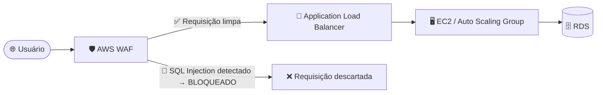
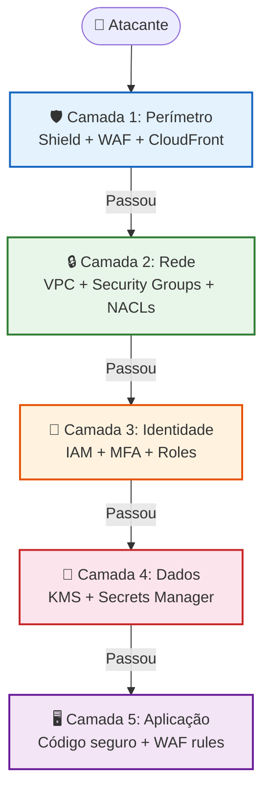

# 🟢 Aula 17: Segurança na Nuvem — IAM, Criptografia e Proteção de Aplicações

**Disciplina:** Cloud Computing (Cód. 14189)
**Curso:** Inteligência Artificial e Ciência de Dados, Uniube
**Semana 14** | Sexta-feira, 22/05/2026 | Prof. Romualdo Mathias Filho
**Tipo:** 📘 Teórica (Sexta-feira)
**Tópicos:** [[Zero_Trust]], IAM (Usuários, Roles, Policies), Princípio do Menor Privilégio, KMS, Secrets Manager, [[VPC]] Security Groups, WAF, Shield, Modelo de Responsabilidade Compartilhada

---

> 💬 *"Na nuvem, a segurança não é um firewall que você liga e esquece. É um modelo mental — cada permissão que você dá a mais é uma porta que você deixa aberta para um atacante."*
> — Adaptado de Werner Vogels, CTO da Amazon

---

## 🎯 Objetivo da Aula

Ao final desta aula, os alunos serão capazes de:

- **Explicar** o Modelo de Responsabilidade Compartilhada da AWS e identificar o que é responsabilidade do provedor vs. do cliente
- **Aplicar** o princípio do menor privilégio ao criar e gerenciar políticas IAM (usuários, grupos, roles e policies)
- **Diferenciar** autenticação e autorização no contexto de identidade em nuvem
- **Descrever** o funcionamento do AWS KMS para criptografia de dados em repouso e em trânsito
- **Avaliar** como WAF e Shield protegem aplicações web contra ataques comuns (SQL Injection, DDoS, XSS)

---

## 🔄 Revisão Rápida (5 min)

| **Conceito (Aulas Anteriores)** | **Conexão com hoje** |
| --- | --- |
| Security Groups ([[Aula 13 - Pratica - VPC Completa e Isolamento de Banco de Dados com Terraform]]) | Na prática de VPC, encadeamos SGs para isolar o RDS. Hoje entendemos os fundamentos teóricos por trás disso. |
| VPC e Subnets Privadas ([[Aula 13 - Pratica - VPC Completa e Isolamento de Banco de Dados com Terraform]]) | O isolamento de rede é uma camada de segurança. Hoje vamos aprofundar nas outras camadas: identidade, criptografia e WAF. |
| Elasticidade e ELB ([[Aula 15 - Teorica Elasticidade Alta Disponibilidade]]) | O ALB que distribui tráfego também pode trabalhar com WAF para filtrar requisições maliciosas antes de chegar aos servidores. |

> 💡 **O salto de hoje:** Nas aulas anteriores, protegemos o banco de dados isolando-o numa rede privada. Mas e se alguém roubar as credenciais do `admin`? E se o código tiver uma SQL Injection? Isolamento de rede **não basta** — hoje adicionamos as camadas de **identidade**, **criptografia** e **proteção de aplicação**.

---

## 🛡️ 1. Modelo de Responsabilidade Compartilhada

**Definição:** O Modelo de Responsabilidade Compartilhada da AWS estabelece que a segurança na nuvem é dividida entre o provedor (AWS) e o cliente. A AWS protege *a infraestrutura que roda os serviços*, enquanto o cliente é responsável por *tudo o que coloca dentro dessa infraestrutura*. (AWS, 2024)

> 📖 "A computação em nuvem não elimina a necessidade de segurança — ela redistribui as responsabilidades entre provedor e consumidor." (ERL; PUTTINI; MAHMOOD, 2013, p. 295)

### Divisão de Responsabilidades

| Camada | Responsável | O que inclui |
|---|---|---|
| Hardware físico, data centers, rede global | **AWS** | Servidores, switches, racks, refrigeração, segurança física 24/7 |
| Hypervisor e virtualização | **AWS** | Isolamento entre contas de clientes, patches de hypervisor |
| Sistema Operacional da instância | **Cliente** | Patches de segurança, atualizações, hardening |
| Configuração de rede (VPC, SG, NACL) | **Cliente** | Quais portas abrir, quais IPs permitir |
| Gestão de identidade (IAM) | **Cliente** | Quem pode acessar o quê, com quais permissões |
| Criptografia de dados | **Cliente** | Ativar criptografia, gerenciar chaves, configurar TLS |
| Dados e conteúdo | **Cliente** | Classificação, backup, compliance (LGPD, HIPAA) |

### Como a responsabilidade varia por modelo de serviço

| Modelo | O que a AWS gerencia | O que o cliente gerencia |
|---|---|---|
| **IaaS (EC2)** | Hardware + Hypervisor | Tudo acima: OS, firewall, patches, dados, IAM |
| **PaaS (RDS, Elastic Beanstalk)** | Hardware + Hypervisor + OS + Engine | Configuração do banco, backups, IAM, dados |
| **SaaS (S3, Lambda)** | Quase tudo — infra, runtime, escalabilidade | Dados, permissões de acesso, criptografia |

💡 **Analogia:** Pense em alugar um apartamento. O prédio (AWS) garante que a estrutura, elevador e portaria funcionem. Mas se você deixar a porta do apartamento aberta (IAM mal configurado) ou perder a chave (credenciais vazadas), o prejuízo é seu.

---

## 🔑 2. AWS IAM — Gerenciamento de Identidade e Acesso

**Definição:** O AWS Identity and Access Management (IAM) é o serviço que controla **quem** (identidade) pode fazer **o quê** (permissão) em **quais recursos** (escopo) da sua conta AWS. (AWS, 2024)

> 📖 "O gerenciamento inadequado de identidades e acessos é consistentemente a causa raiz mais frequente de incidentes de segurança em ambientes de nuvem." (CSA — Cloud Security Alliance, *Top Threats to Cloud Computing*, 2022)

### 2.1 Componentes Fundamentais do IAM

| Componente | O que é | Quando usar |
|---|---|---|
| **Root User** | O dono da conta — acesso irrestrito e irrevogável | **NUNCA** para tarefas do dia a dia. Apenas para configurações iniciais (billing, encerrar conta) |
| **IAM User** | Identidade para uma pessoa ou serviço com credenciais próprias | Acesso humano individual (cada membro da equipe = 1 IAM User) |
| **IAM Group** | Coleção de usuários que compartilham as mesmas permissões | Organizar equipes: grupo `Devs`, grupo `DBAs`, grupo `Estagiarios` |
| **IAM Role** | Identidade temporária assumida por serviços, contas ou aplicações | EC2 que precisa acessar S3; Lambda que precisa ler do RDS |
| **IAM Policy** | Documento JSON que define permissões (Allow/Deny) | Anexada a Users, Groups ou Roles para definir "o que pode fazer" |

### 2.2 Autenticação vs. Autorização

| Conceito | Pergunta que responde | Exemplo AWS |
|---|---|---|
| **Autenticação** | "Quem é você?" | Login com usuário + senha + MFA |
| **Autorização** | "O que você pode fazer?" | Policy que permite `s3:GetObject` mas nega `s3:DeleteBucket` |

### 2.3 Anatomia de uma IAM Policy (JSON)

```json
{
  "Version": "2012-10-17",
  "Statement": [
    {
      "Sid": "PermitirLeituraS3",
      "Effect": "Allow",
      "Action": [
        "s3:GetObject",
        "s3:ListBucket"
      ],
      "Resource": [
        "arn:aws:s3:::meu-bucket-prod",
        "arn:aws:s3:::meu-bucket-prod/*"
      ]
    },
    {
      "Sid": "NegarDeletarBucket",
      "Effect": "Deny",
      "Action": "s3:DeleteBucket",
      "Resource": "*"
    }
  ]
}
```

| Campo | Significado |
|---|---|
| `Effect` | `Allow` (permitir) ou `Deny` (negar) — **Deny sempre vence** |
| `Action` | Operações permitidas/negadas (ex: `ec2:RunInstances`, `rds:CreateDBInstance`) |
| `Resource` | ARN (Amazon Resource Name) do recurso alvo — pode ser específico ou `*` (todos) |
| `Condition` | (Opcional) Condições extras: horário, IP de origem, MFA obrigatório |

> ⚠️ **Regra de Ouro:** Se houver um `Deny` explícito em qualquer policy, ele SEMPRE vence sobre um `Allow`, independentemente de onde esteja. Isso se chama **explicit deny wins**.

---

## 🔐 3. Princípio do Menor Privilégio (Least Privilege)

**Definição:** O Princípio do Menor Privilégio estabelece que cada identidade (usuário, serviço ou aplicação) deve receber **somente** as permissões mínimas necessárias para executar sua tarefa, e nada mais. (STALLINGS, 2024)

> 📖 "O menor privilégio é o princípio mais importante — e o mais violado — da segurança computacional. Sua aplicação rigorosa é o que separa ambientes seguros de ambientes vulneráveis." (STALLINGS, 2024, p. 312)

### Na Prática: O Que Fazer e O Que Não Fazer

| ❌ Anti-Pattern (Inseguro) | ✅ Boa Prática (Seguro) |
|---|---|
| Dar `AdministratorAccess` para todo mundo | Criar policies específicas por função (Dev, DBA, QA) |
| Usar Access Keys do Root | Proteger Root com MFA de hardware e nunca gerar Access Keys |
| Hardcodar credenciais no código | Usar IAM Roles para que serviços assumam permissões temporárias |
| Uma conta AWS para tudo | AWS Organizations com contas separadas (dev, staging, prod) |
| Nunca revisar permissões | Usar IAM Access Analyzer para identificar permissões não utilizadas |

### Como a EC2 Acessa o S3 Sem Senha (IAM Role)

Na [[Aula 13 - Pratica - VPC Completa e Isolamento de Banco de Dados com Terraform]], vimos que o Security Group do RDS referencia o SG da EC2 em vez de um IP fixo. O conceito de IAM Role é análogo:

1. Você cria uma **IAM Role** com uma Policy que permite `s3:GetObject`
2. Anexa essa Role à instância EC2 (Instance Profile)
3. A aplicação dentro da EC2 chama o S3 normalmente — **sem nenhuma credencial no código**
4. A AWS gera credenciais temporárias automaticamente (rotacionam a cada hora)

💡 **Analogia:** É como um crachá inteligente. Em vez de dar a chave-mestra do prédio para todo mundo, cada funcionário recebe um crachá que abre somente as portas que ele precisa acessar — e o crachá expira no fim do turno.

---

## 🔒 4. Criptografia na AWS — KMS e Secrets Manager

### 4.1 AWS KMS (Key Management Service)

**Definição:** O AWS KMS é o serviço centralizado de gerenciamento de chaves criptográficas, permitindo criar, rotacionar e controlar o uso de chaves para proteger dados em repouso e em trânsito. (AWS, 2024)

> 📖 "A criptografia é a última linha de defesa: mesmo que todas as outras barreiras falhem e o atacante acesse os dados, sem a chave de descriptografia, os dados são inúteis." (KOLBE JÚNIOR, 2020, p. 142)

| Tipo de Chave | Quem Gerencia | Quando Usar |
|---|---|---|
| **AWS Managed Keys** | AWS (rotação automática) | Quando você quer criptografia sem gerenciar chaves |
| **Customer Managed Keys (CMK)** | Você (controle total de acesso e rotação) | Quando precisa de auditoria detalhada, compliance ou cross-account |
| **Customer Provided Keys** | Você fornece a chave | Casos extremos de compliance (raro) |

### Criptografia em Repouso vs. em Trânsito

| Tipo | O que protege | Implementação AWS |
|---|---|---|
| **Em repouso (At Rest)** | Dados armazenados (S3, EBS, RDS) | KMS + criptografia AES-256 habilitada no serviço |
| **Em trânsito (In Transit)** | Dados trafegando pela rede | TLS/SSL (HTTPS), VPN, PrivateLink |

💡 **Exemplo prático:** Quando você ativou `publicly_accessible = false` no RDS da [[Aula 13 - Pratica - VPC Completa e Isolamento de Banco de Dados com Terraform]], protegeu o trânsito (sem IP público). Mas os dados **dentro** do disco do RDS ainda podem ser lidos se alguém acessar o storage. A criptografia at rest com KMS resolve isso.

### 4.2 AWS Secrets Manager

**Definição:** O AWS Secrets Manager armazena, rotaciona e gerencia credenciais (senhas de banco, API keys, tokens) de forma centralizada, eliminando a necessidade de hardcodar segredos no código. (AWS, 2024)

### O Problema que o Secrets Manager Resolve

```python
# ❌ NUNCA FAÇA ISSO — Credencial hardcoded no código
db_password = "SenhaSuperSeguraVPC2026!"
connection = mysql.connect(host="rds-endpoint", password=db_password)
```

```python
# ✅ CORRETO — Busca a senha do Secrets Manager em runtime
import boto3
client = boto3.client('secretsmanager')
secret = client.get_secret_value(SecretId='prod/rds/password')
connection = mysql.connect(host="rds-endpoint", password=secret['SecretString'])
```

| Recurso | Benefício |
|---|---|
| Rotação automática | A senha do banco muda a cada 30 dias sem intervenção humana |
| Auditoria via CloudTrail | Toda vez que alguém acessa um segredo, fica registrado |
| Integração nativa | RDS, Redshift, Lambda e ECS consomem segredos nativamente |
| Versionamento | Mantém histórico de versões do segredo para rollback |

💡 **Exemplo real:** A **Nubank** nunca armazena senhas de banco no código-fonte. Toda credencial é injetada em runtime via gerenciador de segredos — se um repositório Git for comprometido, nenhuma senha estará exposta.

---

## 🌐 5. Proteção de Aplicações — WAF e Shield

### 5.1 AWS WAF (Web Application Firewall)

**Definição:** O AWS WAF é um firewall de aplicação web que filtra requisições HTTP/HTTPS com base em regras configuráveis, protegendo contra ataques como SQL Injection, Cross-Site Scripting (XSS) e bots maliciosos. (AWS, 2024)

| Tipo de Ataque | O que o atacante faz | Como o WAF protege |
|---|---|---|
| **SQL Injection** | Insere comandos SQL em campos de formulário | Regra que detecta padrões SQL em parâmetros HTTP |
| **XSS (Cross-Site Scripting)** | Injeta JavaScript malicioso na página | Regra que bloqueia tags `<script>` em inputs |
| **Credential Stuffing** | Testa milhares de senhas roubadas automaticamente | Rate limiting + Bot Control |
| **Web Scraping** | Robôs extraem dados da aplicação em massa | Regras de detecção de bots + CAPTCHA |

### Onde o WAF se Encaixa na Arquitetura



> 💡 O WAF atua **na frente** do ALB, filtrando o tráfego antes de chegar aos servidores. É como um detector de metais na entrada de um prédio — quem passa, está limpo.

### 5.2 AWS Shield

| Versão | O que protege | Custo |
|---|---|---|
| **Shield Standard** | Proteção automática contra DDoS nas camadas 3 e 4 (rede/transporte) | Gratuito (incluído em todos os serviços AWS) |
| **Shield Advanced** | Proteção avançada com mitigação DDoS em tempo real, equipe de resposta (DRT) e proteção de custos contra spikes de tráfego de ataque | ~US$ 3.000/mês (enterprise) |

💡 **Exemplo real:** Durante a **Black Friday**, o **Mercado Livre** recebe tentativas massivas de DDoS. O Shield Standard mitiga ataques volumétricos automaticamente, enquanto o WAF bloqueia bots que tentam comprar automaticamente ofertas relâmpago.

---

## 🏗️ 6. Defesa em Profundidade (Defense-in-Depth)

**Definição:** A Defesa em Profundidade é a estratégia de aplicar **múltiplas camadas independentes** de proteção, de forma que a falha de uma camada não comprometa todo o sistema. (STALLINGS, 2024, p. 325)

### As 5 Camadas de Segurança na AWS

| Camada | Mecanismo | Exemplo AWS |
|---|---|---|
| 1. **Perímetro** | Firewall de borda, DDoS | CloudFront + Shield + WAF |
| 2. **Rede** | Isolamento e segmentação | VPC, Subnets privadas, NACLs, Security Groups |
| 3. **Identidade** | Quem pode acessar o quê | IAM Users, Roles, Policies, MFA |
| 4. **Dados** | Proteção do conteúdo | KMS (criptografia), Secrets Manager, Macie (classificação) |
| 5. **Aplicação** | Código seguro, scanning | WAF, Inspector (vulnerabilidades), CodeGuru |



> 📖 "A segurança perimetral sozinha é insuficiente em ambientes de nuvem. A abordagem Defense-in-Depth garante que cada camada protege independentemente, de modo que mesmo a penetração de uma barreira não compromete o sistema inteiro." (ERL; PUTTINI; MAHMOOD, 2013, p. 302)

💡 **Analogia:** Pense em um castelo medieval. Não basta ter um muro alto (firewall). O castelo tem fosso (VPC), portão com guardas (IAM), cofre com chave para os tesouros (KMS) e vigias nas torres (CloudWatch). Cada camada funciona independentemente.

---

## ⚖️ 7. Na Prática: Antes vs. Depois da Segurança em Nuvem

| Cenário | Sem as camadas de hoje | Com IAM + KMS + WAF + VPC |
|---|---|---|
| Desenvolvedor sai da empresa | Acesso permanece ativo, risco de sabotagem | IAM desativado, credenciais revogadas automaticamente |
| Repositório Git vazado | Senhas do banco expostas publicamente | Secrets Manager: nenhuma senha no código |
| SQL Injection no formulário | Atacante acessa dados de todos os clientes | WAF bloqueia antes de chegar ao servidor |
| Disco de backup roubado | Dados legíveis em texto claro | KMS: dados criptografados, ilegíveis sem a chave |
| DDoS na Black Friday | Site fica fora do ar por horas | Shield + Auto Scaling: tráfego absorvido |

---

## 📋 Resumo Estrutural

| **Conceito** | **Definição em Uma Frase** |
| --- | --- |
| Responsabilidade Compartilhada | A AWS protege a infraestrutura; o cliente protege o que roda nela (dados, IAM, firewall) |
| IAM | Serviço que controla quem pode fazer o quê em quais recursos da conta AWS |
| IAM Policy | Documento JSON que define permissões (Allow/Deny) para Actions em Resources |
| IAM Role | Identidade temporária que permite serviços acessarem outros sem credenciais hardcoded |
| Menor Privilégio | Cada identidade recebe somente o mínimo necessário para sua tarefa |
| KMS | Serviço de gerenciamento de chaves para criptografia de dados em repouso |
| Secrets Manager | Armazena e rotaciona credenciais automaticamente, eliminando senhas no código |
| WAF | Firewall de aplicação que filtra SQL Injection, XSS e bots antes de chegar ao servidor |
| Shield | Proteção contra DDoS incluída por padrão (Standard) ou avançada (Advanced) |
| Defense-in-Depth | Múltiplas camadas independentes de segurança protegem contra diferentes vetores de ataque |

---

%%
## ❓ Banco de Questões

> 🔒 Esta seção é visível apenas no Obsidian do professor. Não publicada.

### Questão 1: Múltipla Escolha — Nível Básico

**Enunciado:** Uma startup que roda sua aplicação em instâncias EC2 na AWS sofreu um incidente: um ex-funcionário ainda conseguiu acessar o banco de dados RDS porque suas credenciais IAM nunca foram revogadas. No Modelo de Responsabilidade Compartilhada, de quem é a responsabilidade por esse incidente?

- [ ] A) Da AWS, porque ela deveria monitorar automaticamente quem acessa os recursos do cliente.
- [x] B) Do cliente (startup), porque o gerenciamento de identidade e acesso (IAM) é responsabilidade do cliente no modelo compartilhado. ✅
- [ ] C) Do ex-funcionário, porque ele violou um acordo de confidencialidade.
- [ ] D) De ambos igualmente, porque a responsabilidade é sempre 50/50 entre AWS e cliente.

**Justificativa:** No Modelo de Responsabilidade Compartilhada, a AWS protege a infraestrutura física e o hypervisor. Tudo acima — incluindo gestão de identidade (IAM), configuração de firewall (Security Groups) e criptografia de dados — é responsabilidade do cliente. Revogar acessos de ex-funcionários é uma obrigação operacional de quem administra a conta AWS.

---

### Questão 2: Múltipla Escolha — Nível Intermediário

**Enunciado:** Uma equipe de desenvolvimento precisa que suas instâncias EC2 acessem um bucket S3 para armazenar logs da aplicação. Seguindo o Princípio do Menor Privilégio, qual é a abordagem correta?

- [ ] A) Criar um IAM User com `AdministratorAccess` e armazenar as Access Keys no código da aplicação.
- [ ] B) Usar as credenciais do Root User para configurar o acesso ao S3 via variáveis de ambiente.
- [x] C) Criar uma IAM Role com uma Policy que permite apenas `s3:PutObject` no bucket específico e anexá-la à instância EC2 via Instance Profile. ✅
- [ ] D) Desativar toda autenticação e tornar o bucket S3 público para facilitar o acesso.

**Justificativa:** A IAM Role com Policy restritiva implementa o princípio do menor privilégio: a EC2 só pode escrever (`PutObject`) no bucket específico, sem credenciais hardcoded no código. As credenciais são temporárias e rotacionam automaticamente, eliminando o risco de vazamento de Access Keys.

---

### Questão 3: Dissertativa — Nível Avançado

**Enunciado:** Na arquitetura Multi-Tier construída na Aula 13 Prática (VPC com Terraform), o RDS está isolado em subnets privadas e o Security Group aceita conexões apenas do SG da EC2. Explique por que esse isolamento de rede, apesar de essencial, **não é suficiente** para garantir a segurança completa do banco de dados. Descreva pelo menos 3 camadas adicionais de segurança que deveriam ser implementadas, citando os serviços AWS correspondentes.

**Resposta esperada:** O isolamento de rede (VPC + Security Groups) protege contra acesso externo direto, mas não cobre outros vetores de ataque: (1) **Identidade e Acesso (IAM):** Se o atacante comprometer a EC2 e encontrar credenciais do banco no código, o Security Group não impede o acesso — é necessário usar IAM Roles e Secrets Manager para eliminar senhas hardcoded e rotacionar credenciais automaticamente. (2) **Criptografia de Dados (KMS):** Se alguém acessar os backups ou snapshots do RDS (por exemplo, via permissão IAM mal configurada), os dados estarão legíveis — é necessário ativar criptografia at rest com KMS para tornar os dados inúteis sem a chave. (3) **Proteção de Aplicação (WAF):** Se a aplicação na EC2 tiver uma vulnerabilidade de SQL Injection, o atacante pode manipular consultas ao banco por dentro da conexão legítima — é necessário um WAF na frente do ALB para filtrar payloads maliciosos antes de chegarem à EC2. A segurança efetiva exige Defense-in-Depth: múltiplas camadas independentes (rede + identidade + dados + aplicação) trabalhando juntas.

---
%%

## 📄 Artigo de Aprofundamento

- [AWS Well-Architected Framework — Security Pillar](https://docs.aws.amazon.com/wellarchitected/latest/security-pillar/welcome.html)
  > *Guia oficial da AWS que detalha os fundamentos de segurança em nuvem: IAM, detecção de ameaças, proteção de dados e resposta a incidentes. Leitura essencial para o Trabalho Final.*

- [OWASP Top 10 — 2021](https://owasp.org/www-project-top-ten/)
  > *Lista das 10 vulnerabilidades mais críticas em aplicações web (SQL Injection, XSS, Broken Access Control). O WAF protege contra muitas dessas ameaças.*

---

## 📚 Referências Bibliográficas e Citações

### 📖 Referências Obrigatórias

| Autor | Obra | Capítulo/Seção Utilizada |
|---|---|---|
| STALLINGS, William | *Cryptography and Network Security: Principles and Practice*. Pearson, 8ª ed., 2024 | Cap. 10 — Access Control; Cap. 12 — Key Management (pp. 312–340) |
| KOLBE JÚNIOR, Armando | *Computação em nuvem*. Contentus, 2020 | Cap. 6 — Segurança em Computação em Nuvem (pp. 135–155) |

### 📖 Referências Complementares

| Autor | Obra | Relevância |
|---|---|---|
| ERL, T.; PUTTINI, R.; MAHMOOD, Z. | *Cloud Computing: Concepts, Technology & Architecture*. Prentice Hall, 2013 | Cap. 10 — Cloud Security Mechanisms (pp. 290–320) |
| AWS | *AWS Well-Architected Framework — Security Pillar* (online, 2024) | Princípios de segurança: IAM, criptografia, detecção, resposta |
| CSA — Cloud Security Alliance | *Top Threats to Cloud Computing — Pandemic Eleven*, 2022 | Os 11 maiores riscos de segurança em nuvem |

### 🔗 Links Úteis

| Recurso | Descrição | Link |
|---|---|---|
| IAM Documentation | Guia completo de IAM | https://docs.aws.amazon.com/IAM/latest/UserGuide/ |
| KMS Documentation | Guia de gerenciamento de chaves | https://docs.aws.amazon.com/kms/latest/developerguide/ |
| WAF Documentation | Documentação do Web Application Firewall | https://docs.aws.amazon.com/waf/latest/developerguide/ |
| Secrets Manager | Documentação do gerenciador de segredos | https://docs.aws.amazon.com/secretsmanager/latest/userguide/ |

---
*Última atualização: 2026-05-20 | Status: publicado*
