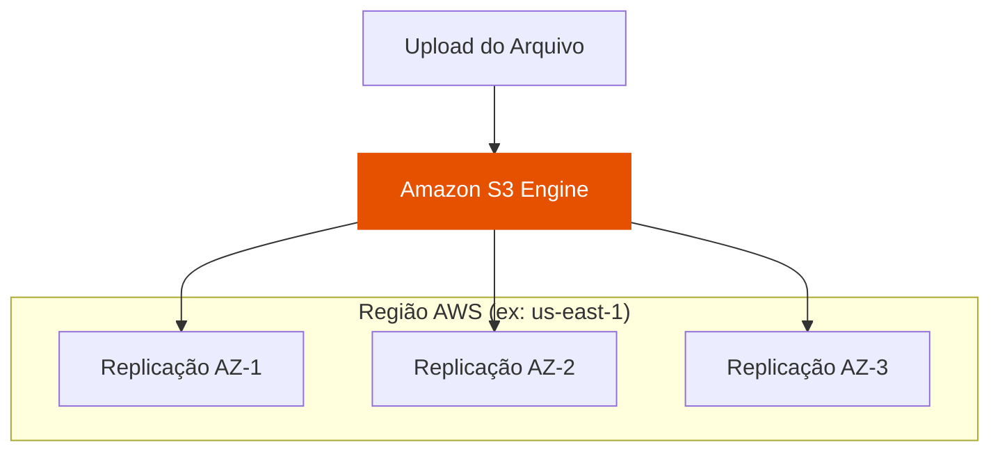
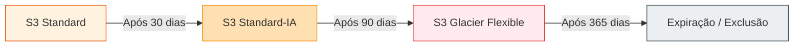

# 🟢 Aula 18: Amazon S3 — Armazenamento de Objetos e Alta Disponibilidade

**Disciplina:** Cloud Computing (Cód. 14189)  
**Curso:** Inteligência Artificial e Ciência de Dados — Uniube  
**Semana:** 14 | Sexta-feira, 29/05/2026  
**Professor:** Romualdo Mathias Filho  
**Tipo:** 📘 Teórica  
**Tópicos:** [[Amazon_S3]], Armazenamento de Objetos, Classes de Armazenamento, Políticas de Ciclo de Vida (Lifecycle), Bucket Policies, Segurança e Criptografia, Static Website Hosting.

---

> [!INFO] 🎯 Visão Geral da Aula & Recursos
> **Nesta aula teórica completa, você vai dominar a arquitetura de armazenamento do Amazon S3 (Simple Storage Service). Entenderemos por que o armazenamento de objetos revolucionou os sistemas distribuídos, como desenhar políticas de ciclo de vida automatizadas para otimização de custos (FinOps), as melhores práticas de segurança e governança de dados em nuvem e como hospedar portais estáticos globais de baixíssimo custo.**
> 
> * **O que você vai dominar:**
>   - A distinção arquitetural e operacional entre armazenamento de Objetos, Bloco (EBS) e Arquivo (EFS).
>   - A física de custos do S3 através de suas classes de armazenamento e regras de ciclo de vida.
>   - A modelagem de segurança via IAM Policies, Bucket Policies e Criptografia em repouso.
> * **Pré-requisitos:** Conceitos de [[VPC]], subnets, e permissões do IAM analisados em [[Aula 13 - Seguranca na Nuvem]].
> * **📂 Recursos Adicionais para Download:**
>   - [📚 AWS Certified Solutions Architect Study Guide](https://www.wiley.com/en-us/AWS+Certified+Solutions+Architect+Study+Guide-p-9781119713081)
>   - [[../../40_Recursos/Cheatsheet_S3_CLI.pdf|Cheatsheet de Comandos AWS CLI para S3 (PDF)]]
>   - [🌐 Documentação Oficial do Amazon S3](https://docs.aws.amazon.com/s3/)

---

## 🎯 Objetivo da Aula

Ao final desta aula, os alunos serão capazes de:
- **Diferenciar** as tecnologias de armazenamento de bloco (EBS), arquivo (EFS) e objetos (S3), identificando o caso de uso ideal para cada uma.
- **Selecionar** estrategicamente as classes de armazenamento do S3 para maximizar a economia de recursos de acordo com a frequência de acesso (FinOps).
- **Projetar** políticas de acesso (Bucket Policies) e perfis de segurança (IAM Roles) eficientes aplicando o princípio do menor privilégio.
- **Estruturar** e automatizar a migração e expiração de dados utilizando regras de ciclo de vida.

---

## 🔄 Revisão Rápida (5 min)

| **Conceito (Aulas Anteriores)** | **Conexão com a Aula de Hoje** |
| :--- | :--- |
| Segurança na Nuvem ([[Aula 13 - Seguranca na Nuvem]]) | O IAM fornece chaves e políticas. Hoje entenderemos como as **Bucket Policies** adicionam uma camada de segurança baseada em recursos diretamente no S3. |
| Instâncias EC2 ([[Aula 08 - Lancando Instancias EC2 AWS CLI e Terraform]]) | A EC2 armazena seus dados no EBS (bloco). Hoje compararemos o EBS com o S3 para entender por que o S3 é a escolha ideal para dados não estruturados. |
| Conceito de Infraestrutura como Código ([[Terraform]]) | Provisionamos recursos via console e CLI. O S3 se destaca como o armazenamento ideal para armazenar o arquivo de estado global do Terraform (`.tfstate`). |

---

## 📌 1. A Revolução do Armazenamento de Objetos com AWS S3 [Teoria ⏳ 15 min]

Em sistemas tradicionais *on-premises* ou em instâncias [[EC2]], o armazenamento comum é baseado em **Bloco (Block Storage)** por meio do EBS. Nele, o disco rígido é mapeado de forma crua, dividido em blocos de tamanho fixo, e exige um Sistema de Arquivos (como ext4 ou NTFS) para ser legível pelo Sistema Operacional. Existe também o armazenamento de **Arquivo (File Storage)** como o EFS, que compartilha arquivos em rede via protocolo NFS.

O **Amazon S3** quebra esse paradigma ao implementar o **Armazenamento de Objetos (Object Storage)**. Os dados não residem em diretórios aninhados e setores físicos. Em vez disso, o S3 utiliza uma **estrutura plana (flat namespace)** baseada em chaves e valores:

```
[Estrutura Plana do S3 Bucket]
Chave (Identificador Único)                 Valor (Objeto Físico)
──────────────────────────                 ─────────────────────
/site/index.html                           => [Arquivo HTML de 15KB]
/uploads/2026/foto.png                      => [Arquivo de Imagem de 1.2MB]
/db-backups/backup_mysql.sql               => [Arquivo SQL de 45GB]
```

### Anatomia de um Objeto no S3:
1. **Chave (Key):** O nome do objeto que representa o caminho exclusivo dele dentro do bucket (ex: `uploads/documento.pdf`).
2. **Valor (Value):** Os dados reais em bytes (o arquivo em si). Os objetos podem ter de 0 bytes até o limite máximo de **5 TB** por arquivo.
3. **Metadados (Metadata):** Um conjunto de pares chave-valor contendo informações sobre o objeto (ex: `Content-Type: text/html`, data de criação, hash MD5).
4. **ID da Versão (Version ID):** Se o versionamento estiver ativo, identifica unicamente a versão daquele objeto.
5. **Sub-recursos:** Listas de controle de acesso (ACLs) e configurações de criptografia.

### Durabilidade vs. Disponibilidade
O Amazon S3 oferece métricas de SLA impressionantes que guiam arquiteturas de alta disponibilidade:

*   **Durabilidade de $99,999999999\%$ (11 noves):** Projetado para impedir a perda física do arquivo. Se você armazenar 10.000.000 de objetos no S3, você pode perder estatisticamente apenas um objeto a cada 10.000 anos. Isso é alcançado porque o S3 replica automaticamente os dados em pelo menos **três data centers (Zonas de Disponibilidade)** geograficamente isolados e resilientes de uma mesma região AWS.
*   **Disponibilidade de $99,9\%$:** Mede a probabilidade do serviço estar acessível e operacional para requisições a qualquer momento do ano.



> [!NOTE] 💼 Pergunta de Entrevista
> **Qual a diferença prática entre a consistência de dados do S3 em relação a bancos de dados distribuídos tradicionais?**
> 
> **Resposta Esperada:** Desde o final de 2020, o Amazon S3 oferece **consistência forte imediata (Strong Read-After-Write Consistency)** para todas as operações de escrita (`PUT` e `DELETE`) de novos objetos ou sobrescritas. Isso significa que, imediatamente após o recebimento de um sucesso de gravação (`HTTP 200 OK`), qualquer requisição subsequente de leitura (`GET`) lerá a versão atualizada do dado, eliminando o comportamento antigo de consistência eventual, onde réplicas distantes podiam retornar dados desatualizados por alguns segundos.

---

## 📌 2. Classes de Armazenamento e Ciclo de Vida (FinOps) [Teoria & Custos ⏳ 15 min]

Nem todos os dados de uma empresa são acessados de forma recorrente. Armazenar backups antigos de conformidade fiscal de 5 anos atrás com o mesmo custo de armazenamento das fotos de perfil acessadas no feed do aplicativo a cada segundo é um erro crasso de engenharia de custos (**[[FinOps]]**). 

Para resolver isso, a AWS divide o S3 em **Classes de Armazenamento**, balanceando custo de armazenamento, custo de requisição e velocidade de recuperação:

| **Classe S3** | **Custo/GB** | **Latência de Acesso** | **Frequência Mínima** | **Taxa de Recuperação (Data Retrieval)** | **Caso de Uso Comum** |
| :--- | :--- | :--- | :--- | :--- | :--- |
| **S3 Standard** | Mais Alto | Milissegundos | Acesso Diário | Gratuito | Sites ativos, imagens de feeds, uploads recentes. |
| **S3 Intelligent-Tiering** | Variável | Milissegundos | Acesso Desconhecido | Gratuito | Data Lakes de Big Data, dados de padrão flutuante. |
| **S3 Standard-IA (Infrequent)** | Médio | Milissegundos | Acesso Mensal | Pago por GB | Backups ativos, relatórios mensais de auditoria. |
| **S3 One Zone-IA** | Baixo | Milissegundos | Acesso Raro | Pago por GB (Apenas 1 AZ) | Réplicas secundárias, dados reproduzíveis facilmente. |
| **S3 Glacier Instant Retrieval**| Muito Baixo | Milissegundos | Acesso Trimestral | Pago por GB | Imagens médicas históricas arquivadas. |
| **S3 Glacier Flexible** | Extremamente Baixo| Minutos a Horas | Acesso Anual | Pago por GB | Backups anuais de segurança regulamentar. |
| **S3 Glacier Deep Archive** | O Mais Baixo | 12 a 48 Horas | Raramente | Pago por GB | Arquivamento de fitas legadas de TV, logs regulatórios de 10 anos. |

### Políticas de Ciclo de Vida (Lifecycle Policies)
Para evitar que administradores façam a gestão de mudança de classe manualmente, o S3 permite programar regras de **Ciclo de Vida (Lifecycle)** baseadas em tempo. As transições ocorrem de forma transparente:



> [!TIP] 💡 Dica de Produção (Pro-Tip)
> **A Otimização Inteligente com S3 Intelligent-Tiering:** 
> Grandes corporações com terabytes de dados (como iFood ou Nubank) não conseguem prever o comportamento de acesso de cada arquivo individual. O uso do **S3 Intelligent-Tiering** resolve isso de forma automatizada: ele monitora os objetos e move arquivos sem uso por 30 dias consecutivos para a camada de acesso infrequente. Se o arquivo for solicitado novamente, ele retorna à camada frequente instantaneamente **sem taxas de recuperação**. Isso reduz custos em até $40\%$ sem qualquer overhead de código ou infraestrutura.

---

## 📌 3. Governança, Políticas de Acesso e Segurança [Teoria & Segurança ⏳ 20 min]

Por padrão, a AWS adota um modelo rígido de **Zero Trust**. Todo bucket S3 recém-criado possui o recurso de **Block Public Access** habilitado, tornando o bucket e seus objetos totalmente privados.

### Como controlar o acesso ao S3?
O S3 oferece dois mecanismos lógicos principais para conceder permissões:

1. **Políticas baseadas em identidade (IAM Policies):** Vinculadas a usuários, grupos ou perfis (Roles) do IAM. Definem o que aquela identidade pode fazer. (Ex: "A instância computacional EC2-App tem perfil de leitura de S3").
2. **Políticas baseadas em recursos (Bucket Policies):** Vinculadas diretamente ao bucket S3. Definem quem (quais contas AWS, IPs públicos ou o público geral) pode acessar os objetos daquele bucket.

```
                  ┌──────────────────────┐
                  │ Requisição de Acesso │
                  └──────────┬───────────┘
                             │
            ┌────────────────┴────────────────┐
     ❌ SIM │  Block Public Access está ativo?│
   ┌────────┴─────────────────────────────────┴────────┐
   │                                                   │ NÃO
   ▼                                                   ▼
Acesso                                       ┌─────────┴─────────┐
Negado (HTTP 403)                     ❌ NÃO │ Bucket Policy ou  │
                                    ┌────────┴ IAM permite?      ├────────┐
                                    │        └───────────────────┘        │ SIM
                                    ▼                                     ▼
                                 Acesso                                 Acesso
                                 Negado (HTTP 403)                     Liberado (HTTP 200)
```

### Cenário Clássico: Bucket Policy para Site Estático
Para expor arquivos HTML públicos do frontend e manter seguras as imagens privadas na mesma pasta, escrevemos uma Bucket Policy focada em recursos específicos:

```json
{
    "Version": "2012-10-17",
    "Statement": [
        {
            "Sid": "PermitirAcessoPublicoApenasAoHTML",
            "Effect": "Allow",
            "Principal": "*",
            "Action": "s3:GetObject",
            "Resource": "arn:aws:s3:::nome-do-meu-bucket/index.html"
        }
    ]
}
```

### Static Website Hosting e CORS
O S3 pode funcionar como um servidor web de alta performance. Ao ativar o **Static Website Hosting**, o S3 gera um endpoint público no formato:
`http://[nome-do-bucket].s3-website-[regiao].amazonaws.com`

*   **O Gotcha do CORS (Cross-Origin Resource Sharing):** Se a página estática servida pelo S3 tentar enviar requisições assíncronas (via Javascript fetch/AJAX) para um backend rodando em um servidor EC2 com IP público, o navegador do cliente bloqueará a requisição por questões de segurança de origem cruzada. Para resolver isso, **devemos configurar as permissões de CORS no backend da EC2**, informando ao navegador que a origem pública do bucket S3 é confiável.

---

### 🧠 Checkpoint: Teste seu Conhecimento!

<details>
<summary><b>🔍 Exercício Rápido: O Caso do Arquivo de Estado do Terraform</b></summary>
<blockquote>

**Cenário:** Em uma empresa, 5 engenheiros DevOps trabalham no mesmo projeto com Terraform. Para evitar que dois engenheiros apliquem alterações concorrentes na infraestrutura e corrompam o estado do projeto, eles escolheram hospedar o arquivo `terraform.tfstate` em um bucket S3.

**Pergunta:** Apenas armazenar o estado no S3 resolve o problema de concorrência? O que mais deve ser configurado de forma obrigatória?

**Resposta Correta:** Não, o S3 por si só armazena o arquivo de forma redundante e segura, mas não gerencia travas de arquivo (*file locks*). Para evitar concorrência destrutiva, os desenvolvedores devem configurar o **State Locking** no backend do Terraform do S3 utilizando uma tabela do **Amazon DynamoDB**. O DynamoDB armazenará um hash de trava temporário durante a execução do comando `terraform apply`, bloqueando a escrita de qualquer outro membro do time até a conclusão do processo.

</blockquote>
</details>

> [!WARNING] ⚠️ Gotcha de Infraestrutura
> **O Perigo do Acesso Público Irrestrito:** 
> Vazamento de dados em buckets S3 é uma das principais causas de invasões e exposição de dados sigilosos reportados na mídia nos últimos anos. Erros comuns de juniores envolvem desativar completamente o `Block Public Access` e aplicar uma Bucket Policy com o recurso `"Resource": "arn:aws:s3:::nome-do-bucket/*"` contendo dados corporativos sensíveis (planilhas financeiras, arquivos de configuração com senhas). Lembre-se: **se o arquivo não é um ativo público de site, ele deve permanecer privado**, e o acesso a instâncias EC2 ou serviços externos deve ser concedido por meio de credenciais efêmeras de **IAM Roles**, nunca por chaves públicas permanentes ou buckets escancarados na web.

---

## 📋 Resumo Estrutural

| **Conceito / Comando** | **Definição e Aplicação Prática em Uma Frase** |
| :--- | :--- |
| **Armazenamento de Objetos** | Modelo de dados sem diretórios físicos, onde arquivos são chaves e valores indexados horizontalmente, ideal para arquivos de mídia e logs. |
| **11 Noves de Durabilidade** | Garantia matemática de segurança física de arquivos obtida através da replicação assíncrona automática em 3 data centers diferentes da AWS. |
| **Bucket Policy** | Documento JSON anexado ao bucket S3 que concede ou nega acesso público/privado baseado em IPs, origens e recursos de forma centralizada. |
| **S3 Glacier Deep Archive** | A classe de menor custo da AWS ($0.00099/GB) voltada para retenção regulamentar de longo prazo, com tempo de recuperação de até 48 horas. |
| `aws s3 sync local s3://bucket` | Comando da AWS CLI que sincroniza de forma incremental arquivos locais com o bucket S3, enviando apenas as alterações. |

---
## 📄 Artigo de Aprofundamento

- [Melhores Práticas de Segurança para o Amazon S3 - Documentação Oficial AWS](https://docs.aws.amazon.com/pt_br/AmazonS3/latest/userguide/security-best-practices.html)
> *Resumo prático: Este guia oficial detalha como aplicar criptografia em repouso de forma nativa, auditar acessos via CloudTrail, monitorar buckets públicos usando o IAM Access Analyzer e evitar vazamentos catastróficos de arquivos corporativos.*

---

## 📚 Referências Bibliográficas

- **PIPER, Ben; CLINTON, David**, *AWS Certified Solutions Architect Study Guide: Associate (SAA-C02) Exam*. 3. ed. Indianapolis: John Wiley & Sons, 2021. **(Capítulo 4: Object Storage and Amazon S3, pp. 115–142)**
- **ARASU, John**, *Cloud Computing Architecture: Standards and Protocols*. London: CRC Press, 2023. **(Capítulo 7: Scalable Distributed Object Systems, pp. 210–232)**

---
*Última atualização: 2026-05-29 | Status: publicado*
