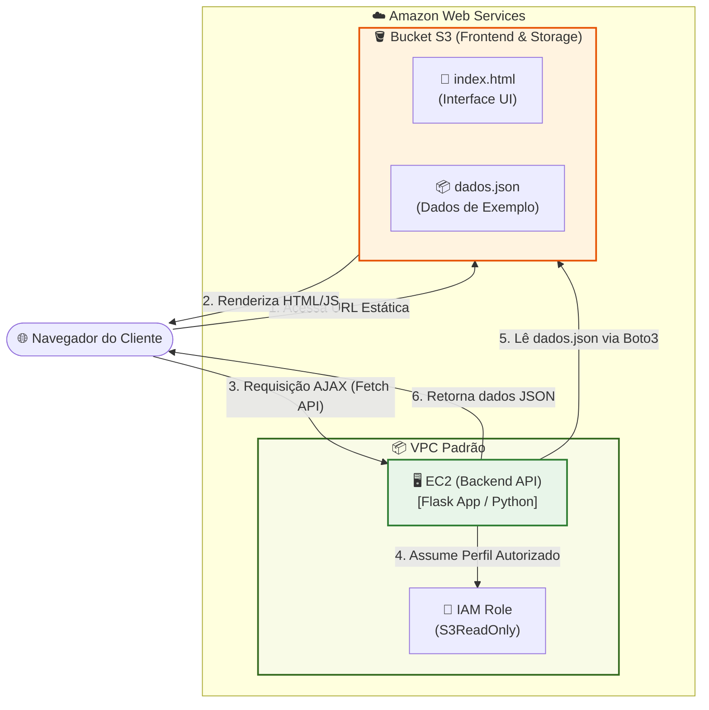

# 🟢 Aula 19: Amazon S3 — Hospedagem Estática e Integração com EC2

**Disciplina:** Cloud Computing (Cód. 14189)  
**Curso:** Inteligência Artificial e Ciência de Dados — Uniube  
**Semana:** 14 | Quarta-feira, 27/05/2026  
**Professor:** Romualdo Mathias Filho  
**Tipo:** 🔬 Prática  
**Tópicos:** [[Amazon_S3]], Hospedagem Estática, Bucket Policies, Integração Frontend-Backend, [[EC2]], [[Terraform]], Armazenamento de Objetos, IAM Roles.

---

> [!INFO] 🎯 Visão Geral da Aula & Recursos
> **Nesta aula prática, você vai dominar o Amazon S3 (Simple Storage Service) hospedando um frontend estático de alta performance diretamente no S3 e conectando-o a uma API rodando na EC2. A API lerá dinamicamente dados do S3 usando uma IAM Role (sem chaves no código).**
> 
> * **O que você vai dominar:**
>   - Criar Buckets S3 e gerenciar armazenamento de objetos (arquivos).
>   - Habilitar e configurar **Static Website Hosting** no S3 para hospedar um frontend moderno.
>   - Configurar o backend em Python (Flask) na EC2 para ler dados do S3 via SDK (`boto3`) de forma segura.
>   - Configurar uma **IAM Role** de leitura para que a EC2 acesse o S3 sem credenciais hardcoded.
>   - Automatizar a criação do ecossistema completo usando **Terraform**.
> * **Pré-requisitos:** Conta AWS Academy ativa, Terraform 1.x instalado, e editor de código (VS Code).
> * **📂 Recursos Adicionais para Download:**
>   - [Repositório de Exemplos AWS S3 Oficial](https://github.com/awsdocs/amazon-s3-developer-guide)
>   - [[../../40_Recursos/Cheatsheet_S3_CLI.pdf|Cheatsheet de Comandos AWS CLI para S3 (PDF)]]
>   - [🌐 Visualizar Versão HTML Premium (Slides)](file:///a:/OneDrive/organizacao/Uniube/10_Acao/Uniube/Cloud_Computing/Aula%2013.5%20-%20Pratica%20-%20Amazon%20S3%20-%20Hospedagem%20Estatica%20e%20Integra%20com%20EC2.html)

---

## 🎯 Objetivo da Aula

Ao final desta aula, os alunos serão capazes de:
- **Provisionar** e configurar buckets no Amazon S3 com permissões de acesso públicas adequadas.
- **Hospedar** uma página web estática e responsiva diretamente no S3.
- **Implementar** uma IAM Role associada à EC2 para obter credenciais temporárias do S3.
- **Desenvolver** scripts que realizam leitura de arquivos no S3 utilizando Python/Boto3.
- **Automatizar** toda a infraestrutura e o deploy de arquivos usando **Terraform**.

---

## 🔄 Revisão Rápida (5 min)

| **Conceito (Aulas Anteriores)** | **Conexão com a Aula de Hoje** |
| :--- | :--- |
| Instâncias EC2 ([[Aula 08 - Lancando Instancias EC2 AWS CLI e Terraform]]) | Usamos a EC2 para hospedar nosso servidor de aplicação. Hoje a EC2 atuará estritamente como **API de backend**, desacoplada da camada visual (frontend). |
| VPC e Segurança de Rede ([[Aula 13 - Pratica - VPC Completa e Isolamento de Banco de Dados com Terraform]]) | Protegemos subnets e portas. Hoje permitimos que a EC2 acesse o S3 por meio de uma **IAM Role**, garantindo o mínimo acesso à internet. |
| Teoria de Segurança ([[Aula 13 - Seguranca na Nuvem]]) | Entendemos o IAM. Hoje aplicamos de forma prática uma permissão de leitura de bucket para a instância computacional. |

> 💡 **O salto de hoje:** Até agora, colocávamos o frontend HTML/CSS e o backend de banco na mesma máquina EC2. Se o site recebia muito acesso, a máquina caía. Hoje implementamos a **Arquitetura Desacoplada (Serverless Frontend)**: a interface do usuário roda no S3 (com escalabilidade infinita e custo quase zero), e a computação pesada fica isolada na EC2.

---

## 📌 1. Arquitetura do Lab: O Casamento de S3 e EC2 [Teoria ⏳ 10 min]

O **Amazon S3** é um **armazenamento de objetos baseado em chaves e valores**. Cada arquivo é um *objeto* associado a uma *chave* (caminho lógico) e armazenado em um container chamado *bucket*. 

Por ser um sistema distribuído altamente escalável, a AWS nos permite expor um bucket como um **servidor web estático**. Qualquer arquivo HTML, CSS ou JS colocado nele é renderizado diretamente pelo navegador do cliente final.

### Como as peças interagem hoje:



1. **Frontend (S3):** O usuário acessa o link do S3 e baixa o `index.html`. 
2. **Backend (EC2):** O código Javascript do `index.html` faz uma chamada assíncrona (Fetch) para a API na EC2.
3. **Storage (S3):** A API do backend consome arquivos de dados do mesmo S3 (ou de outro bucket) para enviar as respostas ao cliente.

> [!NOTE] 💼 Pergunta de Entrevista
> **Por que eu deveria usar o Amazon S3 para hospedar meu site institucional em vez de uma instância EC2 rodando Apache ou Nginx?**
> 
> **Resposta Esperada:** Hospedar no S3 elimina a necessidade de gerenciar servidores (sem patches do S.O., sem atualizações de runtime). O S3 oferece escalabilidade nativa ilimitada (suporta picos de tráfego extremos sem necessidade de Auto Scaling) e durabilidade projetada de 99.999999999% (11 noves). Financeiramente, o S3 custa uma fração do valor de uma EC2 ativa 24/7, pois você paga apenas pelas requisições e pelo armazenamento físico utilizado.

---

## 📌 2. Parte 1 — Criação Manual e Hospedagem Estática — ⏱️ ~25 min

Vamos primeiro construir os componentes manualmente usando o Console AWS para entender os botões e parâmetros estruturais do S3.

---

### Passo 1: Criar o Bucket no S3

1. No Console AWS, pesquise por **S3** e clique em **Create bucket**.
2. Preencha os campos iniciais:
   - **Bucket name:** `uniube-s3-lab-seu-nome` (Lembre-se: os nomes de buckets S3 são globais e devem ser exclusivos na internet!).
   - **AWS Region:** `us-east-1` (Norte da Virgínia).
3. **Object Ownership:** Deixe marcado **ACLs disabled (recommended)**.
4. **Block Public Access settings for this bucket:** 
   - ⚠️ Desmarque a opção **Block *all* public access**. 
   - Marque a caixa de aviso embaixo confirmando que você sabe que este bucket se tornará público: *"I acknowledge that the current settings may result in this bucket and the objects within becoming public."*
   - *Por que desmarcar?* Porque para o S3 hospedar um site aberto para qualquer pessoa na internet, os objetos dele precisam ser legíveis por navegadores externos.
5. Clique em **Create bucket** no final da tela.

---

### Passo 2: Escrever e Fazer o Upload do Frontend (`index.html`)

No seu computador, crie uma pasta local e salve um arquivo chamado `index.html` com o código abaixo (uma interface bonita em Dark Mode que faz a chamada para o nosso backend):

```html
<!DOCTYPE html>
<html lang="pt-BR">
<head>
    <meta charset="UTF-8">
    <meta name="viewport" content="width=device-width, initial-scale=1.0">
    <title>Amazon S3 & EC2 Integration Lab</title>
    <link href="https://fonts.googleapis.com/css2?family=Outfit:wght@300;400;600;700&family=Inter:wght@300;400;600&display=swap" rel="stylesheet">
    <style>
        :root {
            --bg-dark: #0d1117;
            --card-bg: #161b22;
            --border-color: #30363d;
            --accent-blue: #58a6ff;
            --accent-green: #3fb950;
            --text-main: #c9d1d9;
        }
        body {
            background-color: var(--bg-dark);
            color: var(--text-main);
            font-family: 'Inter', sans-serif;
            margin: 0;
            padding: 40px 20px;
            display: flex;
            justify-content: center;
            align-items: center;
            min-height: 80vh;
        }
        .container {
            max-width: 600px;
            width: 100%;
            background-color: var(--card-bg);
            border: 1px solid var(--border-color);
            border-radius: 12px;
            padding: 30px;
            box-shadow: 0 8px 24px rgba(0, 0, 0, 0.5);
            text-align: center;
        }
        h1 {
            font-family: 'Outfit', sans-serif;
            color: white;
            margin-bottom: 5px;
            font-size: 2rem;
        }
        .badge {
            background-color: rgba(88, 166, 255, 0.15);
            color: var(--accent-blue);
            padding: 4px 10px;
            border-radius: 20px;
            font-size: 0.8rem;
            font-weight: 600;
            border: 1px solid rgba(88, 166, 255, 0.3);
            display: inline-block;
            margin-bottom: 20px;
        }
        p {
            line-height: 1.6;
            margin-bottom: 25px;
        }
        .btn {
            background-color: var(--accent-green);
            color: white;
            border: none;
            padding: 12px 24px;
            border-radius: 6px;
            font-size: 1rem;
            font-weight: 600;
            cursor: pointer;
            transition: all 0.2s ease;
            box-shadow: 0 4px 12px rgba(63, 185, 80, 0.3);
        }
        .btn:hover {
            transform: translateY(-2px);
            opacity: 0.9;
        }
        .result-box {
            margin-top: 30px;
            padding: 15px;
            background-color: rgba(255, 255, 255, 0.03);
            border: 1px dashed var(--border-color);
            border-radius: 6px;
            text-align: left;
            font-family: monospace;
            min-height: 100px;
            white-space: pre-wrap;
            overflow-x: auto;
        }
        .input-group {
            margin-bottom: 20px;
        }
        input {
            width: 80%;
            padding: 10px;
            background-color: rgba(0,0,0,0.2);
            border: 1px solid var(--border-color);
            border-radius: 6px;
            color: white;
            text-align: center;
        }
    </style>
</head>
<body>
    <div class="container">
        <span class="badge">AWS Cloud Integration</span>
        <h1>Hospedado no Amazon S3 🪣</h1>
        <p>Esta página web estática está rodando diretamente de um bucket S3 com durabilidade extrema. Ela se comunica de forma assíncrona com o backend dinâmico na EC2.</p>
        
        <div class="input-group">
            <input type="text" id="api-url" placeholder="http://IP_PUBLICO_DA_EC2/api/dados">
        </div>
        
        <button class="btn" onclick="buscarDados()">Fazer Chamada ao Backend (EC2)</button>
        
        <div class="result-box" id="result">Aguardando chamada...</div>
    </div>

    <script>
        function buscarDados() {
            const urlInput = document.getElementById('api-url').value;
            const resultBox = document.getElementById('result');
            
            if(!urlInput) {
                resultBox.innerText = 'Erro: Por favor, insira a URL da API da EC2.';
                return;
            }
            
            resultBox.innerText = 'Carregando dados da EC2...';
            
            fetch(urlInput)
                .then(response => {
                    if (!response.ok) throw new Error('Erro de conexão ou rota inválida');
                    return response.json();
                })
                .then(data => {
                    resultBox.innerText = JSON.stringify(data, null, 2);
                })
                .catch(err => {
                    resultBox.innerText = `Erro ao conectar na EC2:\n${err.message}\n\nGotcha comum:\n1. O IP da EC2 mudou?\n2. O Security Group da EC2 liberou a porta 80?\n3. O CORS está ativo no backend?`;
                });
        }
    </script>
</body>
</html>
```

#### Upload no Console:
1. Abra o bucket criado no painel do S3.
2. Clique em **Upload** → **Add files** e escolha o arquivo `index.html`.
3. Clique em **Upload** no final da página.

---

### Passo 3: Escrever e Fazer o Upload do arquivo de dados (`dados.json`)

Para que a nossa API na EC2 possa consumir dados diretamente do S3 sem hardcoding, crie o arquivo `dados.json` localmente e suba-o no mesmo bucket S3:

```json
{
  "nome_disciplina": "Cloud Computing",
  "codigo": "14189",
  "aula": "13.5",
  "status_integracao": "100% Saudavel",
  "mensagem": "Parabens! Este JSON foi lido dinamicamente do S3 Bucket por meio de uma IAM Role anexada a EC2!",
  "produtos_demonstracao": [
    {"id": 1, "nome": "AWS S3 Bucket", "tipo": "Object Storage", "preco": "Gratuito (Free Tier)"},
    {"id": 2, "nome": "AWS EC2 Instance", "tipo": "IaaS Compute", "preco": "$0.0116/hora"},
    {"id": 3, "nome": "Terraform", "tipo": "Infrastructure as Code", "preco": "Open Source"}
  ]
}
```

---

### Passo 4: Configurar a Política do Bucket (Bucket Policy) para Acesso Público

Por padrão, mesmo que tenhamos liberado acesso público no nível do bucket, cada arquivo interno continua privado. Precisamos aplicar uma política em JSON para conceder leitura pública apenas para o conteúdo web.

1. Dentro da página do seu bucket, acesse a aba **Permissions**.
2. Desça até a seção **Bucket policy** e clique em **Edit**.
3. Copie o JSON abaixo e cole na caixa de texto (substitua o termo `uniube-s3-lab-seu-nome` pelo nome exato do seu bucket):

```json
{
    "Version": "2012-10-17",
    "Statement": [
        {
            "Sid": "PublicReadGetObject",
            "Effect": "Allow",
            "Principal": "*",
            "Action": "s3:GetObject",
            "Resource": "arn:aws:s3:::uniube-s3-lab-seu-nome/index.html"
        }
    ]
}
```
> 💡 **Nota de Segurança:** Concedemos acesso de leitura pública **apenas** para o arquivo `index.html`. O arquivo `dados.json` permanecerá privado! Ele só poderá ser lido internamente pela nossa instância EC2 por meio de uma **IAM Role**. Isso é o **Princípio do Menor Privilégio**.

4. Clique em **Save changes**.

---

### Passo 5: Habilitar o Hospedagem de Site Estático

1. No menu superior do seu bucket, acesse a aba **Properties**.
2. Desça até a última seção: **Static website hosting** e clique em **Edit**.
3. Configure como a seguir:
   - **Static website hosting:** Selecione **Enable**.
   - **Hosting type:** Marque **Host a static website**.
   - **Index document:** Escreva `index.html`.
4. Clique em **Save changes**.
5. Na aba **Properties**, desça até o final de novo. Na caixa de *Static website hosting*, você verá o campo **Bucket website endpoint**.
6. Copie esse endereço e cole no seu navegador.
7. **Sucesso!** A página deve carregar perfeitamente a partir da infraestrutura interna do S3.

---

## 📌 3. Parte 2 — Conectando o Backend (EC2) com a API Flask — ⏱ "25 min

Agora vamos levantar a EC2 para atuar como o backend dinâmico que o frontend estático irá consumir.

---

### Passo 1: Lançar a Instância EC2 com IP Público

1. No Console AWS, acesse o painel **EC2** → **Launch instance**.
   - **Name:** `EC2-Backend-API`
   - **AMI:** Amazon Linux 2023.
   - **Instance type:** `t2.micro`.
   - **Key Pair:** Selecione uma chave válida ou crie sem chave se usar o Instance Connect.
2. Em **Network settings**:
   - VPC: Use a padrão (ou customizada).
   - Auto-assign public IP: **Enable**.
   - Security Group: **Create security group**.
     - Liberar porta **`22 (SSH)`** da sua origem.
     - Liberar porta **`80 (HTTP)`** de **Anywhere (0.0.0.0/0)** ← Necessário para o Javascript do cliente no navegador poder consumir a API.
3. Clique em **Launch instance**.

---

### Passo 2: Criar a IAM Role de Segurança (Acesso ao S3)

Para que a nossa instância EC2 possa ler o arquivo `dados.json` no S3 de forma segura e sem chaves codificadas no código, precisamos criar e associar uma IAM Role:

1. Pesquise por **IAM** no Console AWS e entre no painel.
2. No menu lateral esquerdo, clique em **Roles** → **Create role**.
3. Escolha **AWS Service** → **EC2** no campo *Service or use case*. Clique em **Next**.
4. Na barra de pesquisa de políticas, busque por **`AmazonS3ReadOnlyAccess`**. Marque a caixa ao lado dessa política e clique em **Next**.
5. Dê um nome à Role: `EC2-S3-Read-Role`.
6. Clique em **Create role** no final da página.
7. Volte no painel da **EC2**, selecione a sua instância `EC2-Backend-API` → clique em **Actions** (Ações) → **Security** (Segurança) → **Modify IAM role**.
8. Escolha `EC2-S3-Read-Role` na lista suspensa e clique em **Update IAM role**.

---

### Passo 3: Configurar o Código Backend com Flask, CORS e Boto3

Conecte na sua EC2 via SSH (ou EC2 Instance Connect) e execute os passos a seguir:

1. Atualize a máquina e instale o Python3 e o gerenciador de pacotes:
   ```bash
   sudo dnf update -y
   sudo dnf install python3-pip -y
   ```
2. Instale as bibliotecas necessárias para rodar nossa API REST, o SDK da AWS e liberar o CORS:
   ```bash
   sudo pip3 install flask flask-cors boto3
   ```
3. Crie um arquivo Python para a nossa API chamado `app.py`:
   ```bash
   nano app.py
   ```
4. Cole o código a seguir (este backend consome o bucket S3 via `boto3` usando a identidade da IAM Role associada à EC2):

```python
import boto3
import json
from flask import Flask, jsonify
from flask_cors import CORS
from botocore.exceptions import NoCredentialsError, ClientError

app = Flask(__name__)
# O CORS é vital. Sem ele, o navegador do usuário bloqueia a chamada vinda do S3 para a EC2.
CORS(app)

# ⚠️ SUBSTITUA PELO NOME DO SEU BUCKET CRIADO NO PASSO 1!
BUCKET_NAME = "uniube-s3-lab-seu-nome"
FILE_KEY = "dados.json"

@app.route('/api/dados', methods=['GET'])
def obter_dados():
    try:
        # Inicializa o cliente S3 do Boto3 sem passar chaves ou senhas!
        # Ele herda automaticamente as credenciais temporárias da IAM Role anexada à EC2.
        s3 = boto3.client('s3', region_name='us-east-1')
        
        objeto = s3.get_object(Bucket=BUCKET_NAME, Key=FILE_KEY)
        conteudo = objeto['Body'].read().decode('utf-8')
        dados_s3 = json.loads(conteudo)
        
        return jsonify({
            "status": "Online",
            "servidor": "Amazon EC2 Instance",
            "data_center": "us-east-1 (N. Virginia)",
            "origem_dados": f"Lido do S3: {BUCKET_NAME}/{FILE_KEY}",
            "conteudo_s3": dados_s3
        })
    except NoCredentialsError:
        return jsonify({
            "status": "Erro de Credenciais",
            "erro": "Nao foi possivel localizar credenciais da AWS.",
            "ajuda": "Voce associou a IAM Role 'EC2-S3-Read-Role' a sua instancia EC2?"
        }), 403
    except ClientError as e:
        return jsonify({
            "status": "Erro de Acesso ao S3",
            "erro": str(e),
            "ajuda": f"Certifique-se de que o arquivo '{FILE_KEY}' existe no bucket '{BUCKET_NAME}'."
        }), 404
    except Exception as e:
        return jsonify({
            "status": "Erro Inesperado",
            "erro": str(e)
        }), 500

if __name__ == '__main__':
    # Roda na porta 80 padrão HTTP
    app.run(host='0.0.0.0', port=80)
```
5. Salve o arquivo (`Ctrl+O`, `Enter` e saia com `Ctrl+X`).
6. Execute o servidor Flask com permissão de superusuário (necessário para a porta 80):
   ```bash
   sudo python3 app.py
   ```
7. Verifique se o backend está ativo acessando no seu navegador: `http://IP_PUBLICO_DA_EC2/api/dados`. O JSON dinâmico contendo as informações lidas do S3 deve aparecer na tela.

---

### Passo 4: Testar a Integração Total (Wow-Effect)

1. Volte na aba onde a página estática do S3 está rodando.
2. No campo de texto da página web, cole a URL exata da sua API na EC2:
   `http://IP_PUBLICO_DA_EC2/api/dados`
3. Clique em **Fazer Chamada ao Backend (EC2)**.
4. **Pronto!** O resultado retornado pela EC2 (que foi lido dinamicamente de forma privada e segura do S3) é renderizado no frontend do S3 de forma rápida e responsiva!

---

## 📌 4. Parte 3 — Automatizando o Ecossistema com Terraform — ⏱️ ~25 min

Agora vamos codificar essa arquitetura de forma limpa para eliminar todo o processo manual.

Crie uma pasta local chamada `terraform-s3-integration` e adicione os seguintes arquivos:

### 4.1 `provider.tf`
```hcl
terraform {
  required_providers {
    aws = {
      source  = "hashicorp/aws"
      version = "~> 5.0"
    }
  }
}

provider "aws" {
  region = "us-east-1"
}
```

### 4.2 `main.tf`
```hcl
# 1. Geração de sufixo aleatório para garantir nome exclusivo global do S3
resource "random_id" "sufixo" {
  byte_length = 4
}

# 2. Bucket S3 para o Frontend & Armazenamento
resource "aws_s3_bucket" "frontend" {
  bucket        = "uniube-s3-frontend-${random_id.sufixo.hex}"
  force_destroy = true # Permite deletar o bucket com arquivos ao fazer destroy
}

# 3. Desativação do bloqueio de acesso público ao S3
resource "aws_s3_bucket_public_access_block" "public_control" {
  bucket = aws_s3_bucket.frontend.id

  block_public_acls       = false
  block_public_policy     = false
  ignore_public_acls      = false
  restrict_public_buckets = false
}

# 4. Habilitação do Static Website Hosting no bucket
resource "aws_s3_bucket_website_configuration" "hosting" {
  bucket = aws_s3_bucket.frontend.id

  index_document {
    suffix = "index.html"
  }
}

# 5. Política de Leitura Pública em JSON (Apenas para o index.html!)
resource "aws_s3_bucket_policy" "allow_public_access" {
  depends_on = [aws_s3_bucket_public_access_block.public_control]
  bucket     = aws_s3_bucket.frontend.id

  policy = jsonencode({
    Version = "2012-10-17"
    Statement = [
      {
        Sid       = "PublicReadGetObject"
        Effect    = "Allow"
        Principal = "*"
        Action    = "s3:GetObject"
        Resource  = "${aws_s3_bucket.frontend.arn}/index.html"
      }
    ]
  })
}

# 6. Upload automático do index.html para o bucket
resource "aws_s3_object" "index" {
  bucket       = aws_s3_bucket.frontend.id
  key          = "index.html"
  source       = "index.html"
  content_type = "text/html"
}

# 6.2 Upload automático do dados.json para o bucket
resource "aws_s3_object" "dados" {
  bucket       = aws_s3_bucket.frontend.id
  key          = "dados.json"
  source       = "dados.json"
  content_type = "application/json"
}

# 7. Security Group da EC2 (Libera HTTP 80 para chamadas do AJAX do cliente)
resource "aws_security_group" "backend_sg" {
  name        = "backend-api-sg"
  description = "Acesso HTTP porta 80 e SSH"

  ingress {
    from_port   = 22
    to_port     = 22
    protocol    = "tcp"
    cidr_blocks = ["0.0.0.0/0"]
  }

  ingress {
    from_port   = 80
    to_port     = 80
    protocol    = "tcp"
    cidr_blocks = ["0.0.0.0/0"]
  }

  egress {
    from_port   = 0
    to_port     = 0
    protocol    = "-1"
    cidr_blocks = ["0.0.0.0/0"]
  }
}

# 7.5. AMI mais recente do Amazon Linux 2023
data "aws_ami" "amazon_linux_2023" {
  most_recent = true
  owners      = ["amazon"]

  filter {
    name   = "name"
    values = ["al2023-ami-2023.*-x86_64"]
  }
}

# 8. IAM Role de Leitura de S3 para a EC2
resource "aws_iam_role" "ec2_s3_role" {
  name = "uniube-ec2-s3-read-role-${random_id.sufixo.hex}"

  assume_role_policy = jsonencode({
    Version = "2012-10-17"
    Statement = [
      {
        Action = "sts:AssumeRole"
        Effect = "Allow"
        Principal = {
          Service = "ec2.amazonaws.com"
        }
      }
    ]
  })
}

# 8.2 Anexar política gerenciada do S3 à Role
resource "aws_iam_role_policy_attachment" "s3_read_attach" {
  role       = aws_iam_role.ec2_s3_role.name
  policy_arn = "arn:aws:iam::aws:policy/AmazonS3ReadOnlyAccess"
}

# 8.3 Criar o Instance Profile exigido pela EC2
resource "aws_iam_instance_profile" "ec2_profile" {
  name = "uniube-ec2-s3-profile-${random_id.sufixo.hex}"
  role = aws_iam_role.ec2_s3_role.name
}

# 9. Instância EC2 configurada e com a Role vinculada
resource "aws_instance" "backend" {
  ami                         = data.aws_ami.amazon_linux_2023.id
  instance_type               = "t2.micro"
  vpc_security_group_ids      = [aws_security_group.backend_sg.id]
  associate_public_ip_address = true
  iam_instance_profile        = aws_iam_instance_profile.ec2_profile.name

  # Script Bash que instala dependências e inicia o app com o nome do bucket injetado
  user_data = <<-EOF
    #!/bin/bash
    dnf update -y
    dnf install python3-pip -y
    pip3 install flask flask-cors boto3
    
    # Criar o script da API Flask de forma integrada
    cat <<'INNER_EOF' > /home/ec2-user/app.py
    import boto3
    import json
    from flask import Flask, jsonify
    from flask_cors import CORS
    
    app = Flask(__name__)
    CORS(app)
    
    # Injetado automaticamente pelo Terraform!
    BUCKET_NAME = "${aws_s3_bucket.frontend.id}"
    FILE_KEY = "dados.json"
    
    @app.route('/api/dados', methods=['GET'])
    def obter_dados():
        try:
            s3 = boto3.client('s3', region_name='us-east-1')
            objeto = s3.get_object(Bucket=BUCKET_NAME, Key=FILE_KEY)
            conteudo = objeto['Body'].read().decode('utf-8')
            dados_s3 = json.loads(conteudo)
            
            return jsonify({
                "status": "Online via Terraform IaC",
                "servidor": "AWS EC2 automatizada",
                "origem_dados": f"Lido de forma segura do S3: {BUCKET_NAME}/{FILE_KEY}",
                "conteudo_s3": dados_s3
            })
        except Exception as e:
            return jsonify({
                "status": "Erro de Acesso",
                "erro": str(e)
            }), 500
            
    if __name__ == '__main__':
        app.run(host='0.0.0.0', port=80)
    INNER_EOF

    # Inicia a API REST em segundo plano
    python3 /home/ec2-user/app.py > /home/ec2-user/flask.log 2>&1 &
  EOF

  tags = {
    Name = "EC2-Backend-IaC"
  }
}
```

### 4.3 `outputs.tf`
```hcl
output "s3_website_url" {
  value       = aws_s3_bucket_website_configuration.hosting.website_endpoint
  description = "Acesse este link para ver seu site estático no S3"
}

output "ec2_api_url" {
  value       = "http://${aws_instance.backend.public_ip}/api/dados"
  description = "Copie e cole este endereço no campo de texto do frontend"
}
```

---

### Executando a automação:

No terminal da sua pasta local (onde o `index.html`, `dados.json` e os arquivos `.tf` estão salvos):

1. **Inicializar:**
   ```bash
   terraform init
   ```
2. **Aplicar:**
   ```bash
   terraform apply -auto-approve
   ```
3. Aguarde o provisionamento terminar. Ao final, copie o link de saída `s3_website_url`, cole no seu navegador, insira a URL `ec2_api_url` no painel e clique no botão.
4. **Wow-Effect completo!** Toda a infraestrutura, permissões lógicas de IAM Role, deploy de arquivos de dados e código criados e integrados automaticamente em menos de **2 minutos**.

---

## 📌 5. Limpeza Obrigatória — ⏱️ ~5 min

> 🚨 **Cuidado:** Não deixe os laboratórios abertos. Ao terminar a aula prática, exclua toda a infraestrutura para não estourar seu orçamento do AWS Academy.

No seu terminal local, execute:
```bash
terraform destroy -auto-approve
```

---

## 📋 Resumo Estrutural

| **Conceito / Recurso** | **Definição e Aplicação Prática em Uma Frase** |
| :--- | :--- |
| **Amazon S3** | Serviço de armazenamento de objetos altamente escalável, projetado para durabilidade extrema de arquivos lógicos. |
| **Static Website Hosting** | Funcionalidade do S3 que expõe o conteúdo do bucket como um servidor HTTP leve para arquivos estáticos (HTML/CSS/JS). |
| **Bucket Policy** | Documento em formato JSON que define as permissões de acesso (quem pode ler, escrever ou excluir) a nível de bucket. |
| **CORS** | Mecanismo de segurança dos navegadores que bloqueia scripts em um site de acessarem recursos de outro domínio, a menos que autorizado explicitamente pelo backend. |
| **IAM Role** | Perfil lógico que concede credenciais AWS temporárias a serviços (como a EC2) para evitar o uso de senhas ou chaves estáticas no código. |

---
## 📄 Artigo de Aprofundamento

- [Amazon S3 — Documentação de Hospedagem de Sites Estáticos](https://docs.aws.amazon.com/AmazonS3/latest/userguide/WebsiteHosting.html)
  > *Roteiro completo de como mapear domínios próprios, configurar tratamento de erros de rota e otimizar acessos HTTP usando o S3.*

- [Entendendo o CORS e as chamadas Cross-Origin](https://developer.mozilla.org/pt-BR/docs/Web/HTTP/CORS)
  > *Documentação oficial da MDN detalhando o funcionamento de segurança de compartilhamento de recursos no navegador, leitura indispensável para qualquer programador full stack.*

---

## 📚 Referências Bibliográficas

- **BRIKMAN, Yevgeniy**, *Terraform: Up & Running*. 3ª ed. O'Reilly Media, 2022. **(Capítulo 3 — Terraform State, pp. 88–105)**
- **ANTUNES, Jonathan Lamim**, *Amazon AWS: descomplicando a computação em nuvem*. 1ª ed. São Paulo: Casa do Código, 2016. **(Capítulo 4 — Armazenamento no S3, pp. 62–85)**
- **AWS Official Documentation**, *Amazon Simple Storage Service User Guide*. Seattle: AWS Press, 2024. **(Seção: Website Hosting, pp. 110–135)**

---
*Última atualização: 2026-05-27 | Status: publicado*
