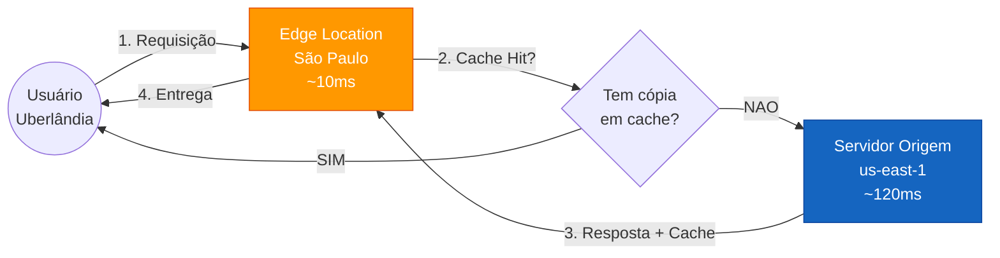
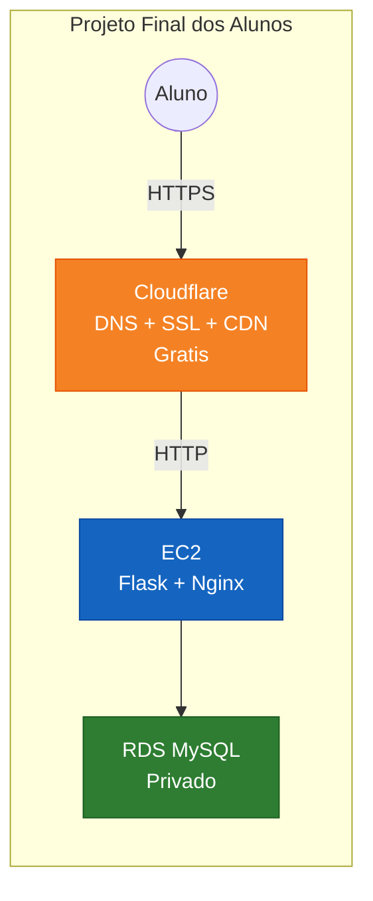
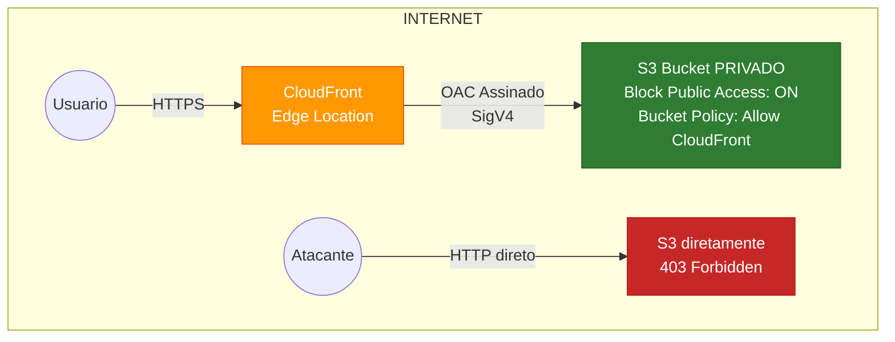
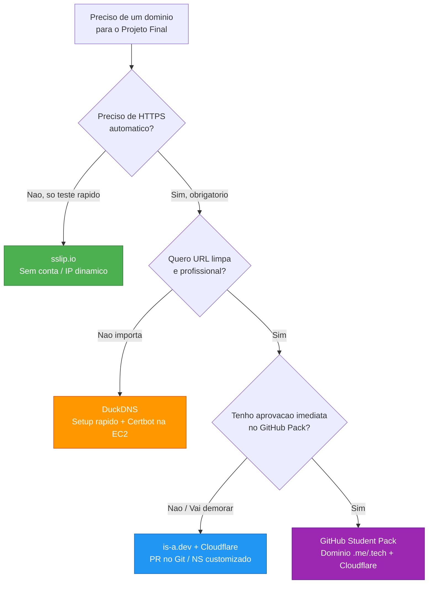

# 🟢 Aula 20: CDN, Amazon CloudFront e Distribuição Global de Conteúdo

**Disciplina:** Cloud Computing (Cód. 14189)  
**Curso:** Inteligência Artificial e Ciência de Dados — Uniube  
**Semana:** 15 | Terça-feira, 03/06/2026  
**Professor:** Romualdo Mathias Filho  
**Tipo:** 📘 Teórica  
**Tópicos:** Zero Trust, CDN e Edge Computing, Amazon CloudFront, Origin Access Control (OAC), HTTPS/TLS, DNS Gratuito para o Projeto Final.

---

> [!INFO] 🎯 Visão Geral da Aula & Recursos
> **Entenda por que grandes empresas como Netflix, Spotify e Mercado Livre não servem conteúdo diretamente dos seus servidores — e como a arquitetura de CDN que elas usam é a mesma que vocês vão aplicar no Projeto Final com o Cloudflare.**
> 
> * **O que você vai dominar:**
>   - A arquitetura de CDN (Content Delivery Network) e por que ela reduz latência global de segundos para milissegundos.
>   - O papel do HTTPS/TLS na segurança de dados em trânsito e como obtê-lo gratuitamente via Cloudflare ou AWS.
>   - O mecanismo de Origin Access Control (OAC) do CloudFront para proteger buckets S3 privados.
>   - **Como obter um domínio DNS gratuito** para o Projeto Final da disciplina.
> * **Pré-requisitos:** Conceitos de Amazon S3, Bucket Policies e VPC vistos nas aulas anteriores.
> * **📂 Recursos Adicionais para Download:**
>   - [🌐 Documentação Oficial do Amazon CloudFront](https://docs.aws.amazon.com/cloudfront/)
>   - [🌐 sslip.io — DNS Gratuito Baseado em IP](https://sslip.io)
>   - [🎓 GitHub Student Developer Pack](https://education.github.com/pack)

---

## 🎯 Objetivo da Aula

Ao final desta aula, os alunos serão capazes de:
- **Explicar** a arquitetura de uma CDN e por que ela é indispensável em aplicações globais de produção.
- **Diferenciar** o papel do CloudFront (AWS) e do Cloudflare (terceiro) como camadas de distribuição e segurança.
- **Descrever** como o Origin Access Control (OAC) protege buckets S3 privados atrás de uma CDN.
- **Configurar** um domínio DNS gratuito para utilizar no Projeto Final da disciplina.

---

## 🔄 Revisão Rápida (5 min)

| **Conceito (Aulas Anteriores)** | **Conexão com a Aula de Hoje** |
| :--- | :--- |
| Static Website Hosting no S3 ([[Aula 18 - Teorica - Amazon S3 e Armazenamento de Objetos]]) | O S3 pode hospedar frontends, mas o endpoint público é HTTP sem criptografia e sem cache global. Hoje entenderemos como a CDN resolve isso. |
| IAM Roles e Bucket Policies ([[Aula 17 - Seguranca na Nuvem]]) | As políticas de acesso do S3 são a base para entender como o OAC do CloudFront obtém permissão para ler objetos de um bucket **privado**. |
| Cloudflare no Projeto Final ([[Aula 23 - Projeto Final - Deploy de Aplicacao Completa em Nuvem]]) | O Projeto Final usa Cloudflare como CDN + DNS + SSL. Hoje vocês vão entender **por que** essa arquitetura funciona e quais são as alternativas. |

---

## 📌 1. O Problema: Por que Servidores Sozinhos Não Bastam? [Teoria ⏳ 10 min]

Imagine a seguinte situação: a aplicação do seu grupo no Projeto Final está rodando em uma EC2 na região `us-east-1` (Virgínia, EUA). Um aluno em Uberlândia acessa o site. O que acontece?

```
[Uberlândia] ──── 8.000 km ────→ [us-east-1 Virginia]
                  ~120ms RTT
                  × 10 requisições (HTML + CSS + JS + imagens)
                  = ~1.2 segundos só de latência de rede
```

Agora imagine que a Netflix servisse seus vídeos assim — cada frame viajando 8.000 km. **Seria inviável.** A solução é **não servir do servidor original**. Em vez disso, copiar o conteúdo para pontos próximos do usuário.

### O Conceito de CDN (Content Delivery Network)

Uma CDN é uma **rede global de servidores de cache** (chamados *Edge Locations* ou *PoPs — Points of Presence*) estrategicamente posicionados em dezenas de cidades ao redor do mundo. Quando o usuário faz uma requisição:

1. A requisição vai para o **Edge Location mais próximo** (ex: São Paulo), não para o servidor original.
2. Se o Edge já tem uma cópia em cache do arquivo → **responde imediatamente** (cache hit).
3. Se não tem → busca no servidor original, entrega ao usuário **e guarda uma cópia** para as próximas requisições (cache miss → cache fill).

> **Figura 1 — Fluxo de requisição com CDN (Cache Hit vs Cache Miss)**



### Números Reais de Performance

| Métrica | Sem CDN (direto da EC2) | Com CDN (Edge SP) |
| :--- | :--- | :--- |
| Latência para Uberlândia | ~120ms | ~10ms |
| Tempo de carregamento (10 arquivos) | ~1.2s | ~100ms |
| Custo de banda na EC2 | $0.09/GB | $0.085/GB (CloudFront) |
| Resistência a pico de tráfego | Limitada (1 servidor) | Global (centenas de edges) |

> [!NOTE] 💼 Pergunta de Entrevista
> **Por que empresas como Netflix e Spotify investem bilhões em CDN própria em vez de usar apenas servidores centrais?**
> 
> **Resposta Esperada:** Além da latência, a CDN resolve o problema de **throughput de banda**. Um servidor central com 10 Gbps de link não consegue servir simultaneamente milhões de streams de vídeo 4K. A CDN distribui essa carga entre centenas de servidores de borda. A Netflix, por exemplo, opera sua própria CDN chamada **Open Connect**, posicionando servidores físicos dentro dos ISPs (provedores de internet) brasileiros como Vivo e Claro, eliminando o tráfego intercontinental completamente.

---

## 📌 2. Amazon CloudFront vs Cloudflare: Duas CDNs, Mesma Filosofia [Teoria ⏳ 15 min]

Os dois serviços que vocês precisam conhecer para a disciplina são o **Amazon CloudFront** (nativo da AWS) e o **Cloudflare** (serviço independente, usado no Projeto Final).

### Comparativo Direto

| Característica | Amazon CloudFront | Cloudflare |
| :--- | :--- | :--- |
| **Tipo** | CDN nativa da AWS | CDN independente (qualquer provedor) |
| **Edge Locations** | ~450+ globais | ~310+ globais |
| **HTTPS/SSL** | Certificado via ACM (gratuito) | Certificado automático (gratuito) |
| **Integração com S3** | Nativa (OAC) | Não — precisa de servidor intermediário |
| **Plano gratuito** | Paga por uso (Free Tier: 1TB/mês no 1º ano) | Plano Free ilimitado para sites pessoais |
| **DNS incluso** | Não (precisa do Route 53 — pago) | Sim — DNS autoritativo gratuito |
| **Proteção DDoS** | AWS Shield Standard (incluso) | Proteção DDoS inclusa no plano Free |
| **Ideal para** | Arquiteturas 100% AWS | Projetos com domínio próprio em qualquer provedor |

### Por que o Projeto Final usa Cloudflare?

A resposta é **custo zero + simplicidade**:

> **Figura 2 — Arquitetura do Projeto Final: Cloudflare como CDN/DNS/SSL**



O Cloudflare faz **três coisas de graça** que sem ele custariam dinheiro ou trabalho:
1. **DNS autoritativo** — resolve o domínio do grupo para o IP da EC2
2. **Certificado HTTPS automático** — o cadeado verde no navegador, sem configurar nada na EC2
3. **Cache de arquivos estáticos** — CSS, JS e imagens são servidos do edge mais próximo

> [!WARNING] ⚠️ Gotcha de Infraestrutura
> **O proxy laranja do Cloudflare esconde o IP real da EC2.** Quando o aluno ativa o ícone de nuvem laranja (☁️ Proxied) no painel DNS do Cloudflare, o IP público da EC2 não fica exposto na internet. Isso é uma camada de segurança essencial — atacantes não conseguem fazer ataques DDoS diretos contra a EC2 porque não sabem o IP real. **Nunca desative o proxy** a menos que esteja debugando problemas de conexão.

---

## 📌 3. HTTPS, TLS e o Cadeado Verde [Teoria ⏳ 10 min]

Todo site moderno **obrigatoriamente** usa HTTPS. Mas o que ele faz tecnicamente?

### HTTP vs HTTPS

| Aspecto | HTTP | HTTPS |
| :--- | :--- | :--- |
| Porta padrão | 80 | 443 |
| Dados em trânsito | Texto puro (legível por qualquer roteador) | Criptografado com TLS |
| Certificado digital | Não requer | Requer certificado X.509 |
| SEO (Google) | Penalizado | Favorecido |
| Confiança do usuário | ⚠️ "Não seguro" | 🔒 Cadeado verde |

### Como funciona o TLS (simplificado)

```
1. Cliente diz "Olá" ao servidor (Client Hello)
2. Servidor envia seu certificado digital público
3. Cliente verifica se o certificado é válido (autoridade confiável)
4. Ambos negociam uma chave simétrica temporária (handshake)
5. Toda comunicação é criptografada com essa chave
```

### Como obter HTTPS gratuitamente?

| Método | Complexidade | Usado no Projeto? |
| :--- | :--- | :--- |
| **Cloudflare (proxy ativado)** | Zero — automático | ✅ Sim — recomendado |
| **Let's Encrypt + Certbot na EC2** | Médio — instalar e renovar a cada 90 dias | Alternativa |
| **AWS ACM + CloudFront** | Baixo — emissão gratuita, vinculado à CDN | Ambientes 100% AWS |

> [!TIP] 💡 Dica de Produção (Pro-Tip)
> **Em empresas reais, o Cloudflare no modo "Full (Strict)"** exige que a EC2 também tenha um certificado válido (não auto-assinado). Para o Projeto Final, o modo **"Flexible"** é suficiente — o Cloudflare faz HTTPS entre o usuário e ele, e HTTP entre ele e a EC2. Isso é aceitável para projetos acadêmicos, mas em produção seria uma vulnerabilidade no trecho interno.

---

## 📌 4. CloudFront + S3 Privado: A Arquitetura Zero Trust com OAC [Teoria ⏳ 10 min]

Um cenário clássico de arquitetura AWS: você tem imagens e arquivos estáticos no S3, mas **não quer que ninguém acesse o bucket diretamente pela URL do S3**. Quer que todo acesso passe pela CDN (CloudFront), que adiciona cache, HTTPS e controle.

### O Mecanismo: Origin Access Control (OAC)

O OAC é uma identidade que o CloudFront usa para **assinar as requisições** que faz ao S3. O bucket S3 permanece com `Block Public Access` **ativado** (totalmente privado). A Bucket Policy permite acesso **apenas** ao CloudFront:

> **Figura 3 — Arquitetura Zero Trust: CloudFront + OAC + S3 Privado**



### Bucket Policy para OAC (referência)

```json
{
    "Version": "2012-10-17",
    "Statement": [
        {
            "Sid": "AllowCloudFrontOAC",
            "Effect": "Allow",
            "Principal": {
                "Service": "cloudfront.amazonaws.com"
            },
            "Action": "s3:GetObject",
            "Resource": "arn:aws:s3:::meu-bucket-privado/*",
            "Condition": {
                "StringEquals": {
                    "AWS:SourceArn": "arn:aws:cloudfront::ACCOUNT-ID:distribution/DISTRIBUTION-ID"
                }
            }
        }
    ]
}
```

**O que cada campo faz:**
- `Principal: cloudfront.amazonaws.com` → só o serviço CloudFront pode acessar
- `Condition: SourceArn` → apenas **essa distribuição específica** (não qualquer CloudFront de qualquer conta AWS)
- `Block Public Access` continua ativado → nenhum acesso HTTP direto ao bucket é possível

> [!NOTE] 💼 Pergunta de Entrevista
> **Qual a diferença entre OAI (Origin Access Identity) e OAC (Origin Access Control)?**
> 
> **Resposta Esperada:** O OAI é o mecanismo legado (anterior a 2022) onde o CloudFront usava uma identidade especial para acessar o S3. O OAC é o substituto moderno que oferece: (1) suporte a criptografia KMS no bucket, (2) suporte a uploads via PUT/POST pelo CloudFront, (3) assinaturas SigV4 mais seguras, e (4) suporte a buckets em qualquer região. A AWS recomenda migrar todo OAI para OAC.

---

## 📌 5. DNS Gratuito e Integração com Cloudflare 🆓 [Guia Prático ⏳ 20 min]

Para que o Projeto Final de vocês funcione de acordo com a arquitetura exigida, a aplicação web precisa ser acessível por um **domínio público real** na internet, com tráfego criptografado por **HTTPS** e intermediado pelo **Cloudflare**. 

Para resolver o custo de aquisição de domínios, mapeamos **4 opções 100% gratuitas**. Abaixo está o guia comparativo seguido pelo passo a passo de configuração e registro de cada uma.

### Tabela Comparativa de Opções de DNS Gratuito

| Opção | Domínio Resolvido | Integração com Cloudflare | Método de HTTPS | Dificuldade | Recomendado Para |
| :--- | :--- | :--- | :--- | :--- | :--- |
| **1. sslip.io** | `IP.sslip.io` | ❌ Não suportado | Manual via Let's Encrypt | Zero (Sem Conta) | Testes e validações rápidas |
| **2. DuckDNS** | `grupo.duckdns.org` | ❌ Não suportado | Manual via Let's Encrypt (Certbot na EC2) | Fácil | Setup rápido de domínio sem Git |
| **3. is-a.dev** | `grupo.is-a.dev` | ✅ **Sim (via delegação NS)** | Automático pelo Cloudflare (Proxy) | Média (PR no GitHub) | Apresentação final com URL profissional |
| **4. GitHub Pack** | `grupo.me` ou `grupo.tech` | ✅ **Sim (via delegação NS)** | Automático pelo Cloudflare (Proxy) | Lenta (Validação de estudante) | Portfólio de longo prazo e currículo |

---

### 🚀 Passo a Passo das Opções de Registro

#### Opção 1: `sslip.io` — DNS Instantâneo Baseado em IP (Sem Cadastro)
O `sslip.io` funciona como um wildcard DNS automático. Ao acessar uma URL contendo o IP público da sua EC2 separado por traços, ele resolve diretamente para aquele IP.

1. Identifique o IP público da sua EC2 (ex: `54.198.123.45`).
2. Substitua os pontos por traços e adicione `.sslip.io` no final: `54-198-123-45.sslip.io`.
3. Pronto! Você já pode usar esse endereço para acessar sua máquina.

**Teste de resolução no seu terminal local:**
```bash
nslookup 54-198-123-45.sslip.io
# Retorna: 54.198.123.45
```

> [!WARNING] ⚠️ Gotcha de Infraestrutura
> O `sslip.io` não suporta delegação de Nameservers (NS), o que impede seu uso direto dentro do painel do Cloudflare para aproveitar o cache e proxy. Além disso, se você parar e iniciar sua EC2 na AWS, o IP público mudará, o que alterará o seu domínio completo (ex: de `54-198-...` para `3-90-...`).

---

#### Opção 2: `DuckDNS.org` — Subdomínio Grátis com Dynamic DNS
O DuckDNS permite registrar um subdomínio fixo e atualizar o IP de destino via API, excelente para lidar com a mudança de IPs dinâmicos da AWS.

1. Acesse [duckdns.org](https://www.duckdns.org) e conecte-se com sua conta GitHub.
2. Na seção **domains**, escolha o nome do subdomínio do seu grupo (ex: `grupo-alpha-uniube`) e clique em **add domain**.
3. No campo **current ip**, insira o IP público atual da sua EC2 e clique em **update ip**.
4. Teste a conexão acessando `http://grupo-alpha-uniube.duckdns.org` no seu navegador.

**Script de Atualização Automática (Cron Job na EC2):**
Caso queira garantir que o domínio continue funcionando se a EC2 reiniciar e mudar de IP, configure este script na máquina virtual:
```bash
# Abra o editor do crontab
crontab -e

# Adicione a linha abaixo no final do arquivo (substitua pelo seu domínio e token do DuckDNS)
*/5 * * * * curl -s "https://www.duckdns.org/update?domains=grupo-alpha-uniube&token=SEU-TOKEN-AQUI&ip=" > /dev/null
```

**Como obter HTTPS no DuckDNS (Sem Cloudflare):**
Como o DuckDNS não suporta delegação para o Cloudflare, você deve emitir um certificado SSL direto no Nginx da EC2 usando o Certbot (Let's Encrypt):
```bash
# Instalar Certbot e o plugin do Nginx na EC2
sudo apt update
sudo apt install certbot python3-certbot-nginx -y

# Gerar o certificado e configurar o Nginx automaticamente
sudo certbot --nginx -d grupo-alpha-uniube.duckdns.org
```

---

#### Opção 3: `is-a.dev` — Domínio Profissional via Pull Request
A comunidade `is-a.dev` fornece subdomínios gratuitos para estudantes. Como eles permitem configurar registros de Nameservers (NS), você pode gerenciar o domínio inteiramente de dentro do Cloudflare.

1. Crie uma conta gratuita no [Cloudflare](https://dash.cloudflare.com).
2. Clique em **Adicionar um site**, insira o domínio que deseja registrar (ex: `meugrupo.is-a.dev`) e selecione o plano **Free** ($0).
3. O Cloudflare gerará dois Nameservers para você. Anote-os (ex: `clara.ns.cloudflare.com` e `oswald.ns.cloudflare.com`).
4. Faça um **Fork** do repositório oficial [github.com/is-a-dev/register](https://github.com/is-a-dev/register).
5. No seu fork, crie um novo arquivo na pasta `domains/` chamado `meugrupo.json` (substitua pelo nome escolhido).
6. Adicione o seguinte conteúdo apontando para os Nameservers do seu Cloudflare:
```json
{
  "owner": {
    "username": "seu-usuario-github"
  },
  "records": {
    "NS": [
      "clara.ns.cloudflare.com",
      "oswald.ns.cloudflare.com"
    ]
  }
}
```
7. Envie as alterações e abra um **Pull Request (PR)** para o repositório original.
8. Uma esteira automatizada verificará a sintaxe. Após a aprovação do time de mantenedores (geralmente algumas horas), o PR é mesclado e seu domínio é ativado no Cloudflare.

---

#### Opção 4: GitHub Student Developer Pack — Domínio Próprio Completo
O programa de estudantes do GitHub fornece domínios de topo (TLDs reais) sem custos por um ano.

1. Inscreva-se em [education.github.com/pack](https://education.github.com/pack) usando seu e-mail institucional da Uniube (`@uniube.br`) ou comprovante de matrícula.
2. Após aprovação, resgate o voucher de domínio gratuito em um dos parceiros:
   - **Namecheap:** Domínio `.me` grátis por 1 ano.
   - **Name.com:** Domínio `.live`, `.studio` ou `.tech` grátis por 1 ano.
3. Registre o domínio escolhido (ex: `sistema-cloud-grupo.tech`).
4. No painel de controle do registrador (Namecheap/Name.com), acesse as configurações de DNS e altere os Nameservers personalizados para apontarem para o Cloudflare, conforme detalhado no passo a seguir.

---

### ☁️ Como Configurar o Domínio no Cloudflare (Para Opções 3 e 4)

Com o domínio registrado e delegado ao Cloudflare, siga estas etapas para colocá-lo apontando para a sua EC2 com HTTPS ativo:

#### 1. Criar Registro de Apontamento (Registro A)
1. No painel do Cloudflare, selecione o seu domínio.
2. Vá em **DNS** -> **Registros** -> **Adicionar Registro**.
3. Preencha os campos:
   - **Tipo:** `A`
   - **Nome (Host):** `@` (indica o domínio principal, ex: `meugrupo.is-a.dev`)
   - **Endereço IPv4:** O IP público da sua EC2 AWS.
   - **Status do Proxy:** Certifique-se de que a nuvem esteja **Laranja** (Proxied ☁️).
4. Clique em **Salvar**.

#### 2. Configurar o Modo de Criptografia SSL/TLS (Essencial)
Como o Nginx da EC2 na configuração básica de laboratório escuta em HTTP puro na porta 80, precisamos dizer ao Cloudflare como gerenciar a criptografia:

1. No menu lateral do Cloudflare, clique em **SSL/TLS**.
2. Altere o modo de criptografia para **Flexible** (Flexível).
   - **O que isso faz?** O tráfego entre o navegador do usuário e o Cloudflare é criptografado via HTTPS (porta 443). O tráfego do Cloudflare até a EC2 na AWS corre em HTTP (porta 80). Isso concede o cadeado verde sem exigir certificados complexos configurados na máquina virtual.

```
[Navegador] ────── HTTPS (443) ──────→ [Cloudflare Proxy] ────── HTTP (80) ──────→ [EC2 AWS]
```

> [!TIP] 💡 Dica de Produção (Pro-Tip)
> Em ambientes corporativos reais, o modo **Flexible** é considerado inseguro, pois os dados trafegam em texto puro no trecho final (da CDN ao servidor). O padrão de mercado é utilizar o modo **Full (Strict)**, onde tanto o Cloudflare quanto a EC2 possuem certificados válidos (gerados via Cloudflare Origin Certificates ou Let's Encrypt). Para fins acadêmicos no Projeto Final, o modo Flexible é aceito para reduzir a complexidade operacional dos grupos.

---

### 🧠 Resumo de Decisão: Qual Opção Escolher?

> **Figura 4 — Árvore de Decisão: Qual DNS Gratuito Escolher?**



> [!TIP] 💡 Recomendação do Professor
> **Para o Projeto Final, usem is-a.dev + Cloudflare.** É a melhor experiência pedagógica: vocês aprendem como funciona um Pull Request de infraestrutura (GitOps), integram uma CDN líder de mercado (Cloudflare) e entregam uma URL profissional com HTTPS automático para a banca avaliadora.

---

## 📋 Resumo Estrutural

| **Conceito** | **Definição e Aplicação Prática em Uma Frase** |
| :--- | :--- |
| **CDN (Content Delivery Network)** | Rede de servidores de cache globais que entrega conteúdo do ponto mais próximo do usuário, reduzindo latência de ~120ms para ~10ms. |
| **Edge Location** | Servidor de borda da CDN posicionado em uma cidade específica (ex: São Paulo), que armazena cópias cache dos arquivos do servidor original. |
| **Amazon CloudFront** | CDN nativa da AWS com integração direta ao S3 e EC2, ideal para arquiteturas 100% AWS com OAC e ACM. |
| **Cloudflare** | CDN independente com plano gratuito que inclui DNS, HTTPS automático e proteção DDoS — usado no Projeto Final. |
| **Origin Access Control (OAC)** | Mecanismo do CloudFront que assina requisições ao S3 privado, garantindo que apenas a CDN autorizada acesse os objetos (arquitetura Zero Trust). |
| **HTTPS/TLS** | Protocolo de criptografia em trânsito que protege dados entre cliente e servidor, identificado pelo cadeado verde no navegador. |
| **sslip.io / DuckDNS** | Serviços gratuitos de DNS para desenvolvimento e projetos acadêmicos, eliminando a necessidade de comprar domínios. |

---
## 📄 Artigo de Aprofundamento

- [Amazon CloudFront com Origin Access Control (OAC)](https://aws.amazon.com/blogs/networking-and-content-delivery/amazon-cloudfront-introduces-origin-access-control-oac/)
> *Resumo prático: Artigo oficial de lançamento da AWS explicando o papel do OAC na substituição do antigo OAI, com tabelas comparativas detalhando melhorias de segurança, suporte a KMS e assinaturas SigV4.*

- [How Cloudflare Works — Cloudflare Learning Center](https://www.cloudflare.com/learning/what-is-cloudflare/)
> *Resumo prático: Explicação oficial de como o proxy reverso do Cloudflare intercepta e protege o tráfego, incluindo DNS Anycast, proteção DDoS e emissão automática de certificados SSL.*

---

## 📚 Referências Bibliográficas

- **PIPER, Ben; CLINTON, David**, *AWS Certified Solutions Architect Study Guide: Associate (SAA-C03) Exam*. 4. ed. Indianapolis: John Wiley & Sons, 2024. **(Capítulo 6 — CloudFront and Global Content Delivery, pp. 185–210)**
- **ANTUNES, Jonathan Lamim**, *Amazon AWS: descomplicando a computação em nuvem*. 1. ed. São Paulo: Casa do Código, 2016. **(Capítulo 6 — Entrega de Conteúdo e DNS, pp. 105–120)**
- **AWS Official Documentation**, *Amazon CloudFront Developer Guide*. Seattle: AWS Press, 2026. Disponível em: https://docs.aws.amazon.com/cloudfront/. Acesso em: 03 jun. 2026.

---
*Última atualização: 2026-06-03 | Status: publicado*
