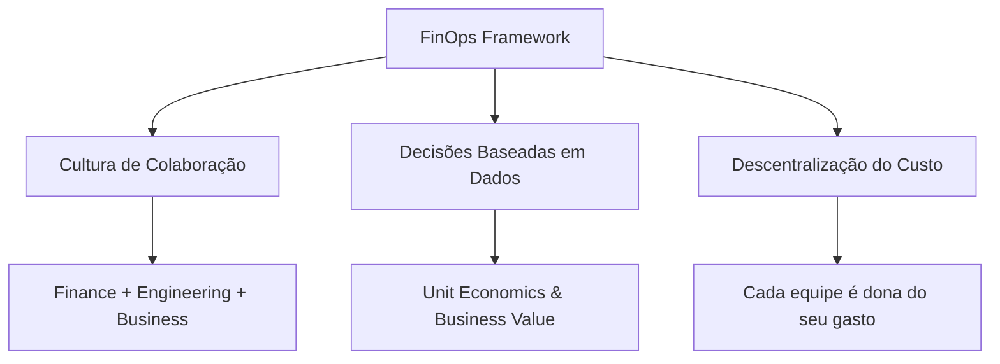
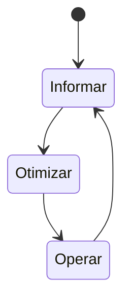
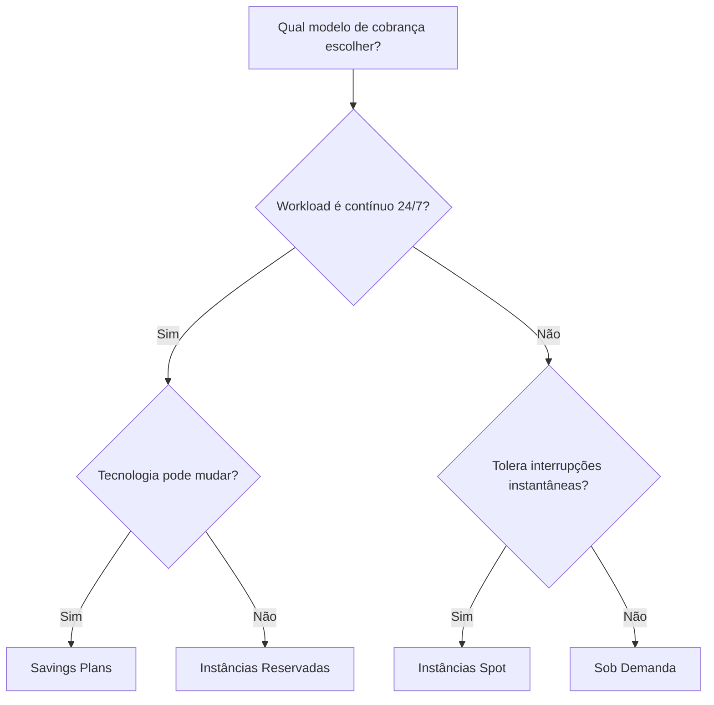

# 🟢 Aula 21: FinOps e Otimização de Custos

**Disciplina:** Cloud Computing (Cód. 14189)  
**Curso:** Inteligência Artificial e Ciência de Dados, Uniube  
**Semana 15** | Sexta-feira, 29/05/2026 | Prof. Romualdo Mathias Filho  
**Tipo:** 📘 Teórica (Sexta-feira)  
**Eixo:** 5 — Segurança e FinOps  
**AWS Academy:** Módulo 2.7 — Faturamento e Suporte  

---

💬 *"Na computação tradicional, o desperdício é invisível porque o hardware já está pago. Na nuvem, cada erro arquitetural ou servidor ocioso é cobrado por segundo. Economizar na nuvem não é apenas cortar custos: é maximizar o valor de cada centavo investido em tecnologia."*

---

## 🎯 Objetivo da Aula

Ao final desta aula, o aluno será capaz de:
- **Explicar** os fundamentos e o ciclo de vida do framework FinOps (Informar, Otimizar, Operar)
- **Diferenciar** os modelos de precificação da AWS (On-Demand, Reserved Instances, Savings Plans e Spot Instances)
- **Identificar** oportunidades de otimização de custos através do *rightsizing* e da eliminação de ociosidade
- **Utilizar** ferramentas de observabilidade financeira da AWS como o Cost Explorer, AWS Budgets e a AWS Pricing Calculator

---

## 🔄 Revisão Rápida (5 min)

| **Conceito (Aula Anterior)** | **Conexão com hoje** |
| --- | --- |
| [[Aula 12 - Terraform na Pratica - IaC com Lightsail e EC2]] | O Terraform nos permite criar recursos rapidamente. Hoje veremos como etiquetar (tag) e monitorar o custo de tudo o que provisionamos via IaC. |
| [[Aula 13 - Pratica - VPC Completa e Isolamento de Banco de Dados com Terraform]] | O isolamento de subnets privadas protege nossos bancos de dados. Mas e se esquecermos esses bancos e NAT Gateways ligados? Hoje aprenderemos a rastrear e evitar desperdícios em redes e banco de dados. |
| [[Aula 13 - Seguranca na Nuvem]] | A segurança aplica o princípio do menor privilégio. Em FinOps, aplicamos um princípio análogo: o menor provisionamento necessário para garantir desempenho sem carregar "peso morto" financeiro. |

---

## 📌 1. O que é FinOps?

**FinOps** (uma fusão de *Financial* e *DevOps*) é uma disciplina de gerenciamento financeiro de nuvem em evolução e uma prática cultural que permite que as organizações obtenham o máximo valor comercial coordenando engenharia, finanças e tecnologia. (FINOPS FOUNDATION, 2024)

Diferente do modelo tradicional de TI, onde a infraestrutura é um investimento de capital fixo (**Capex**), a nuvem opera sob um modelo de despesa operacional variável (**Opex**). Isso significa que qualquer desenvolvedor ou cientista de dados com permissão de acesso pode, com poucos cliques ou comandos IaC, gerar milhares de dólares de custo em minutos.

### O Ciclo de Vida FinOps

A prática do FinOps é um processo contínuo e iterativo composto por três fases principais:

1. **Informar (Inform):** Esta fase inicial foca em dar **visibilidade** aos gastos. Sem entender para onde o dinheiro está indo, é impossível economizar. Envolve alocação de custos, tagging preciso, monitoramento, relatórios em tempo real e previsão de orçamentos (*forecasting*).
2. **Otimizar (Optimize):** Uma vez que a visibilidade foi estabelecida, as equipes procuram oportunidades de economia. Isso envolve:
   - **Rightsizing:** Redimensionar recursos subutilizados (ex.: trocar uma instância `m5.2xlarge` com 5% de uso de CPU por uma `t3.medium`).
   - **Compromissos:** Adquirir descontos baseados em compromissos de longo prazo (Reserved Instances e Savings Plans).
   - **Eliminação de desperdício:** Excluir discos isolados (EBS órfãos), IPs elásticos não utilizados e instâncias esquecidas.
3. **Operar (Operate):** Integrar o FinOps no cotidiano da organização. As equipes passam a avaliar continuamente se as metas de custos estão sendo atingidas e se o valor de negócio gerado compensa o gasto em nuvem. Governança, alertas automatizados de custos e políticas de desligamento automático em fins de semana são estabelecidos nesta fase.

### Princípios Fundamentais do FinOps (FinOps Foundation)

- **As equipes precisam colaborar:** Engenharia, Finanças e Negócios trabalham juntos.
- **O valor de negócio impulsiona as decisões:** O foco não é apenas gastar menos, mas maximizar o valor gerado (ex.: gastar mais na Black Friday é justificado se o faturamento triplicar).
- **Todos assumem a responsabilidade pelo uso da nuvem:** O desenvolvedor que cria o recurso é responsável pela sua fatura.
- **Os relatórios de FinOps devem ser acessíveis e oportunos:** Feedback rápido evita surpresas no fim do mês.
- **Uma equipe centralizada impulsiona o FinOps:** Um time especialista (CCoE - Cloud Center of Excellence) governa e auxilia as demais equipes.
- **Aproveite o modelo de custo variável da nuvem:** Pague apenas pelo que usa e reduza a capacidade sempre que a demanda cair.

---

## 📌 2. Modelos de Cobrança e Otimização na AWS

Para otimizar custos, precisamos entender as opções que a AWS oferece para a contratação de computação (Amazon EC2). (ANTUNES, 2016, p. 185)

### Comparativo de Modelos de Cobrança EC2

| **Modelo de Cobrança** | **Desconto Típico** | **Caso de Uso Recomendado** | **Flexibilidade** |
| --- | --- | --- | --- |
| **Sob Demanda (On-Demand)** | 0% (Base) | Cargas de trabalho imprevisíveis, novos projetos, testes rápidos | Máxima (paga por segundo, sem compromisso) |
| **Instâncias Reservadas (RI)** | Até 72% | Servidores de banco de dados e aplicações legadas rodando 24/7 | Baixa (contrato de 1 ou 3 anos para família/zona) |
| **Savings Plans** | Até 72% | Workloads estáveis com flexibilidade de migração de tecnologia | Média (compromisso de gasto por hora de computação) |
| **Instâncias Spot** | Até 90% | Treinamento de modelos de IA, processamento em lote, CI/CD pipelines | Baixíssima (a AWS pode tomar a máquina de volta com aviso de 2 min) |

### O que é o *Rightsizing* (Redimensionamento)?

Rightsizing é o processo de analisar o desempenho e a capacidade dos recursos em nuvem e alterá-los para o tamanho ideal com base nos requisitos reais. (KOLBE JÚNIOR, 2020, p. 68)

💡 **Exemplo prático brasileiro (Caso iFood):**  
Imagine que o time de dados do iFood rodava um algoritmo de recomendação em uma instância `c5.4xlarge` (16 vCPUs, 32 GB RAM) que custa aproximadamente **US$ 680/mês**. Ao analisar o CloudWatch, os engenheiros notaram que o uso máximo de CPU nunca passava de 12% e o consumo de RAM estabilizava em 6 GB.
- **Ação:** Fizeram o *rightsizing* da instância para uma `t3.medium` (2 vCPUs, 4 GB RAM) atrelada a uma GPU leve, ou simplesmente migraram para uma `c5.large` (2 vCPUs, 4 GB RAM) custando **US$ 85/mês**.
- **Resultado:** Uma economia de **87.5% no custo** sem qualquer degradação perceptível no tempo de resposta da recomendação para os clientes finais.

### O perigo do "Peso Morto" na Redes e Armazenamento

Muitas empresas focam apenas em desligar instâncias EC2, esquecendo recursos satélites que continuam cobrando mesmo com a máquina desligada:
- **EBS Volumes Órfãos:** Ao excluir uma EC2, se a opção "Delete on termination" não estiver marcada no Terraform, o disco EBS continua ativo e cobrando por GB/mês.
- **Elastic IPs (EIPs) Não Associados:** A AWS não cobra por IPs elásticos associados a instâncias ativas. Porém, se a instância for desligada ou excluída e o IP continuar reservado na sua conta, ele gera uma cobrança por hora de ociosidade.
- **NAT Gateways ociosos:** Um NAT Gateway na VPC custa cerca de **US$ 32/mês** apenas por estar ativo, além do custo por GB trafegado. Esquecê-lo ativo em uma conta de testes pode estourar o orçamento do laboratório rapidamente.

---

## 📌 3. Ferramentas AWS para Gestão de Custos

A AWS oferece um ecossistema completo para monitorar, alertar e planejar gastos em nuvem. (AWS, 2024)

### 📊 1. AWS Cost Explorer
O Cost Explorer é a ferramenta visual de análise de custos na AWS. Ele permite visualizar gráficos históricos de gastos categorizados por serviço, região, tags personalizadas ou tipos de cobrança.
- **Uso em IA/Dados:** Permite descobrir exatamente quanto o treinamento de um modelo específico de Deep Learning custou filtrando pela tag do projeto (ex.: `Project: LLM-Treino`).

### 🚨 2. AWS Budgets e Billing Alarms
Permite configurar limites de orçamento mensais ou diários e disparar alertas via e-mail ou integração com chat (Slack/Teams) quando o custo real ou *previsto* ultrapassar a meta estabelecida.
- **Configuração de segurança:** Para evitar surpresas desagradáveis, todo arquiteto em nuvem deve configurar um alerta de segurança para gastos acima de **US$ 5.00** em ambientes de teste e laboratórios acadêmicos.

### 🧮 3. AWS Pricing Calculator
Uma ferramenta web pública que permite planejar e estimar o custo mensal de toda a arquitetura antes mesmo de escrever a primeira linha de código ou Terraform.
- **Link:** [calculator.aws](https://calculator.aws/)

---

## 📋 Resumo Estrutural

| **Conceito** | **Definição em Uma Frase** |
| --- | --- |
| **FinOps** | Prática cultural e operacional que une Finanças e Engenharia para maximizar o valor de negócio gerado pelo investimento em nuvem. |
| **Capex vs Opex** | Transição de grandes investimentos em ativos físicos (Capex) para custos operacionais variáveis pagos pelo uso real (Opex). |
| **Rightsizing** | Processo de redimensionar recursos subutilizados para o tamanho ideal, eliminando o superdimensionamento. |
| **Instâncias Spot** | Instâncias com até 90% de desconto que aproveitam a capacidade ociosa da AWS, mas podem ser interrompidas a qualquer momento. |
| **Savings Plans** | Modelo de desconto flexível baseado no compromisso de gasto mínimo por hora (ex.: US$ 10/hora de computação). |
| **AWS Budgets** | Ferramenta que dispara alertas automatizados quando os custos ultrapassam os limites orçamentários definidos. |

---

%%
## ❓ Banco de Questões

> 🔒 Esta seção é visível apenas no Obsidian do professor. Não publicada.

### Questão 1: Prática (Múltipla Escolha — Nível: Intermediário)
**Estudo de Caso:** A startup brasileira *PixExpress* processa transações de pagamentos Pix em massa. O volume de transações é extremamente previsível: picos gigantescos de segunda a sexta, das 8h às 18h, e tráfego quase nulo de madrugada. Hoje, eles rodam 10 instâncias EC2 `m5.xlarge` ligadas 24/7 sob demanda.

Como analista de FinOps, qual das seguintes estratégias combinadas geraria a **maior economia de custos** mantendo o sistema 100% operacional sem downtime nos horários de pico?

- [ ] A) Migrar todas as 10 instâncias para o modelo de Instâncias Spot para aproveitar o desconto de 90% a qualquer momento do dia.
- [ ] B) Comprar Savings Plans de computação equivalentes a 10 instâncias 24/7 para garantir o desconto de 72% sobre a capacidade total do ano.
- [x] C) Configurar um Auto Scaling Group acionado por horário (Scheduled Scaling) para manter apenas 2 instâncias ativas de madrugada e 10 instâncias ativas no horário comercial, atrelando a capacidade mínima estável de 2 instâncias a um Savings Plan de 1 ano. ✅
- [ ] D) Manter todas as instâncias em On-Demand para garantir a máxima flexibilidade de migração caso a tecnologia Pix mude para blockchain.

**Justificativa:** O PixExpress possui tráfego previsível por horário. A melhor abordagem une a elasticidade e o compromisso: a infraestrutura deve contrair de madrugada (desligando 8 instâncias que seriam ociosas) e expandir no horário comercial. As 2 instâncias básicas que nunca desligam (24/7) devem receber cobertura de Savings Plans para obter o desconto de longo prazo. A opção A (Spot) é perigosa pois pode sofrer interrupção sob alta demanda comercial, o que inviabilizaria o Pix. A opção B é desperdício de compromisso, pois pagaríamos por 8 instâncias desligadas/ociosas de madrugada.

---

### Questão 2: Prática (Múltipla Escolha — Nível: Básico)
**Enunciado:** Um estudante da Uniube subiu uma arquitetura com o Terraform contendo instâncias EC2, banco de dados RDS e um NAT Gateway. Ao fim do laboratório, ele executou `terraform destroy` no terminal de sua máquina. Porém, devido a um erro de conexão com a internet, o comando falhou no meio do processo sem excluir o NAT Gateway. 

Qual das seguintes ferramentas da AWS seria **crítica** para alertar o aluno precocemente antes que o NAT Gateway consumisse todos os seus créditos acadêmicos mensais de US$ 100?

- [ ] A) AWS Cost Explorer, pois ele detecta anomalias de faturamento de forma preditiva.
- [ ] B) AWS Trusted Advisor, que exclui automaticamente recursos caros esquecidos ativos.
- [x] C) AWS Budgets, configurado com um orçamento máximo mensal de US$ 10.00 e envio de e-mails diários de alerta ao atingir 80% do limite. ✅
- [ ] D) Amazon CloudWatch Alarm monitorando a métrica `CPUUtilization` da instância EC2.

**Justificativa:** O AWS Budgets é o serviço ideal para gerenciar o controle financeiro preventivo, permitindo definir limites (ex: US$ 10) e enviar alertas baseados em gastos reais ou previstos. O Cost Explorer permite visualizar gastos mas não envia alertas proativos por e-mail no modelo de budget. O Trusted Advisor indica recomendações mas não exclui recursos automaticamente. Alertas de CPU da EC2 não monitoram o custo do NAT Gateway, que continuará cobrando taxas fixas por hora de ociosidade na rede mesmo com a EC2 desligada.

---

### Questão 3: Teórica (Dissertativa — Nível: Avançado)
**Enunciado:** A fintech brasileira *NuConta* está passando por uma reestruturação cultural para implementar os conceitos do framework FinOps em suas squads de Ciência de Dados e IA. Os times utilizam clusters dinâmicos do Amazon EMR (Spark) e notebooks Amazon SageMaker para treinar modelos de risco de crédito, gerando faturas expressivas que assustaram o departamento financeiro.

Com base nas três fases do ciclo de vida FinOps (**Informar, Otimizar, Operar**), estruture uma proposta com **uma ação prática** que as squads de dados devem realizar em cada uma das fases para restabelecer a governança financeira sem impactar o desenvolvimento dos modelos preditivos.

**Resposta esperada:**
Para restabelecer a governança dos custos com pipelines de dados na NuConta, as seguintes ações integradas devem ser aplicadas em cada fase do ciclo FinOps:
1. **Informar (Visibilidade):** Implementar uma política obrigatória de alocação de custos por meio de tags do sistema. Todo cluster EMR ou instância do SageMaker deve ser criada via Terraform contendo as tags `Squad`, `Projeto` e `Ambiente` (ex.: `Squad: Risco-Credito`, `Projeto: Score-PF`). Isso permitirá extrair relatórios granulares no AWS Cost Explorer para entender qual squad e qual projeto está gerando o pico de custos.
2. **Otimizar (Redução de desperdício):** Otimizar o provisionamento de recursos através do *rightsizing* dos clusters EMR. Atrelar o processamento pesado a instâncias EC2 do tipo **Spot** (família R ou C) para as máquinas de processamento paralelo do Spark, obtendo até 90% de desconto. As máquinas master do cluster, que gerenciam a fila e não podem sofrer interrupção, continuam em instâncias On-Demand cobertas por Savings Plans. Para o SageMaker, programar o desligamento automático de instâncias de notebooks que permaneçam ociosas (sem comandos no kernel Jupyter) por mais de 30 minutos.
3. **Operar (Governança contínua):** Configurar um **AWS Budget** customizado para o time de Risco de Crédito com o teto de US$ 500/mês. Integrar os alarmes via Amazon SNS com o canal de comunicação do time no Slack. Se o faturamento real ou previsto cruzar 80% do valor limite, a squad recebe o alerta e avalia se precisa pausar treinamentos experimentais ou solicitar ampliação justificada de orçamento com base no valor de negócio estimado para o modelo preditivo em desenvolvimento.

---
%%

## 📄 Artigo de Aprofundamento

- [FinOps Framework — O Padrão Central de Gerenciamento de Custos na Nuvem](https://framework.finops.org/)
> *Resumo prático: O framework oficial mantido pela FinOps Foundation que detalha as capacidades técnicas, personas e modelos de maturidade necessários para estruturar o controle financeiro de ambientes em nuvem pública.*

---

## 📚 Referências Bibliográficas e Citações

- ANTUNES, Jonathan Lamim. *Amazon AWS: descomplicando a computação em nuvem*. Casa do Código, 2016. **(Capítulo 7 — Faturamento, Previsibilidade e Alertas de Custos, pp. 182–195)**
- KOLBE JÚNIOR, Armando. *Computação em nuvem*. Contentus, 2020. **(Capítulo 4 — Gestão Financeira, TCO e Retorno de Investimento, pp. 62–75)**
- MARINESCU, Dan C. *Cloud Computing: Theory and Practice*. 2nd ed. Morgan Kaufmann, 2017. **(Chapter 9 — Cloud Economics, SLAs and Pricing Models, pp. 312–329)**
- AWS. *AWS Billing and Cost Management User Guide* (online). **(AWS Budgets and Cost Explorer sections, pp. 45–60)**

---
*Última atualização: 2026-05-20 | Status: publicado*
